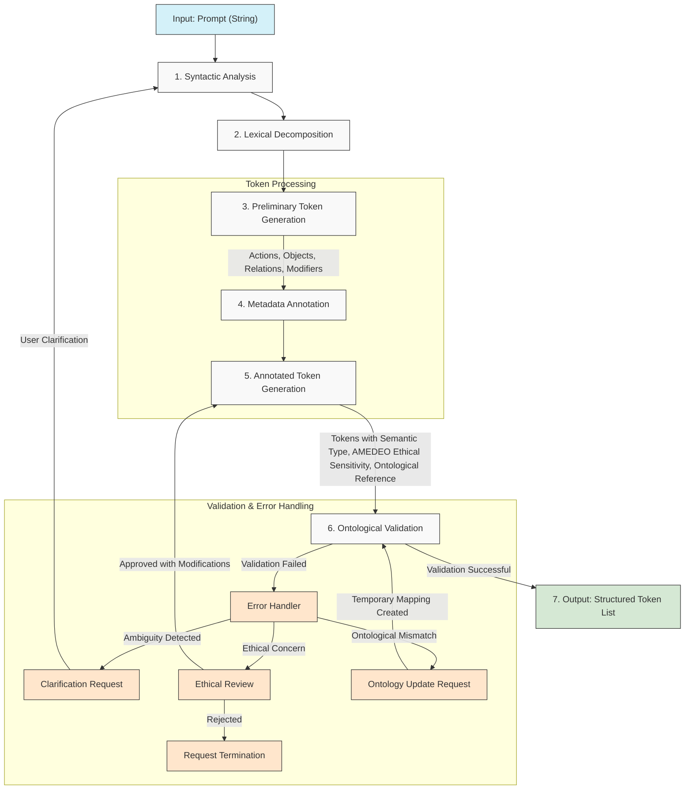

### Prompt Processing Pipeline

## GenAI Proposal Status Disclaimer

*This diagram is a GenAI-generated proposal and has not been validated by domain experts. The representation of the prompt processing pipeline is conceptual and may require refinement or correction by specialists in natural language processing and ontological systems. The AMEDEO framework referenced is theoretical and would need formal definition and implementation.*

