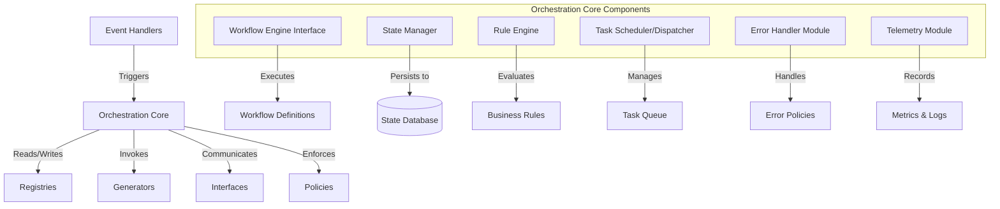
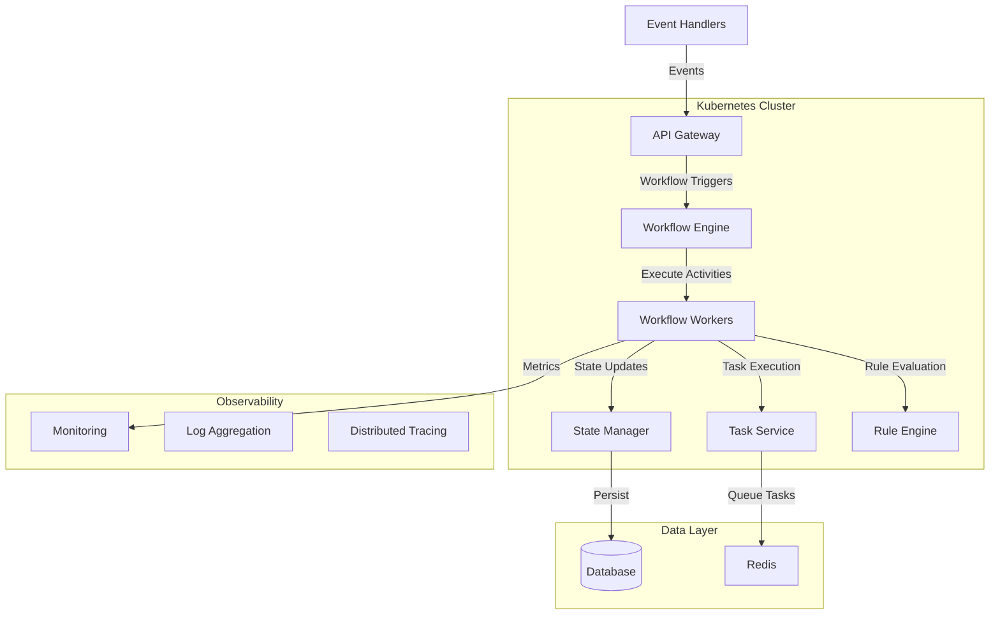

### COAFI Orchestration Core - Architecture & Implementation Guide

*GenAI Proposal Status: This document outlines a proposed architecture and implementation approach for the COAFI Orchestration Core based on the provided description. This is an AI-generated proposal and should be reviewed by domain experts before implementation.*

## Architecture Overview

The COAFI Orchestration Core serves as the central nervous system of your platform, coordinating workflows, managing state, and ensuring reliable execution across the entire system. Based on your description, I've developed a comprehensive architecture that addresses the core requirements while maintaining flexibility for future expansion.



## Core Components Design

### 1. Workflow Engine Interface

This component provides an abstraction layer over the underlying workflow engine technology, allowing for potential replacement without affecting the rest of the system.

```typescript
// src/workflow-engine/interface.ts
export interface WorkflowDefinition {
  id: string;
  name: string;
  version: string;
  steps: WorkflowStep[];
  triggers: WorkflowTrigger[];
  policies: string[];
}

export interface WorkflowStep {
  id: string;
  name: string;
  type: 'task' | 'subworkflow' | 'decision' | 'parallel';
  action: string;
  parameters: Record<string, any>;
  dependencies: string[];
  retryPolicy?: RetryPolicy;
  timeoutSeconds?: number;
}

export interface WorkflowEngineInterface {
  // Workflow management
  registerWorkflow(definition: WorkflowDefinition): Promise<void>;
  unregisterWorkflow(workflowId: string, version?: string): Promise<void>;
  
  // Workflow execution
  startWorkflow(workflowId: string, input: Record<string, any>, options?: WorkflowOptions): Promise<string>;
  getWorkflowStatus(executionId: string): Promise<WorkflowExecutionStatus>;
  terminateWorkflow(executionId: string, reason?: string): Promise<void>;
  
  // Task management
  completeTask(taskToken: string, result?: any): Promise<void>;
  failTask(taskToken: string, error: Error): Promise<void>;
  
  // Signals and queries
  signalWorkflow(executionId: string, signalName: string, payload?: any): Promise<void>;
  queryWorkflow(executionId: string, queryName: string, args?: any): Promise<any>;
}
```

### 2. State Manager

Responsible for persisting and retrieving workflow state, ensuring resilience and recoverability.

```typescript
// src/state/manager.ts
export interface StateManager {
  // State operations
  saveState(executionId: string, state: WorkflowState): Promise<void>;
  getState(executionId: string): Promise<WorkflowState | null>;
  updateState(executionId: string, updates: Partial<WorkflowState>): Promise<WorkflowState>;
  deleteState(executionId: string): Promise<void>;
  
  // Checkpointing
  createCheckpoint(executionId: string): Promise<string>;
  restoreFromCheckpoint(checkpointId: string): Promise<WorkflowState>;
  
  // Queries
  findExecutions(query: StateQuery): Promise<WorkflowExecutionSummary[]>;
  getExecutionHistory(executionId: string): Promise<WorkflowEvent[]>;
}

export interface WorkflowState {
  executionId: string;
  workflowId: string;
  workflowVersion: string;
  status: WorkflowStatus;
  input: Record<string, any>;
  output?: Record<string, any>;
  currentSteps: StepState[];
  variables: Record<string, any>;
  startTime: string;
  updateTime: string;
  endTime?: string;
  metadata: Record<string, any>;
}
```

### 3. Rule Engine

Evaluates complex business rules or policies during workflow execution.

```typescript
// src/rules/engine.ts
export interface RuleEngine {
  // Rule management
  registerRule(rule: Rule): Promise<void>;
  unregisterRule(ruleId: string): Promise<void>;
  
  // Rule evaluation
  evaluateRule(ruleId: string, facts: Record<string, any>): Promise<RuleEvaluationResult>;
  evaluateRules(ruleIds: string[], facts: Record<string, any>): Promise<Record<string, RuleEvaluationResult>>;
  
  // Rule queries
  getRulesByCategory(category: string): Promise<Rule[]>;
  getRuleById(ruleId: string): Promise<Rule | null>;
}

export interface Rule {
  id: string;
  name: string;
  description: string;
  category: string;
  condition: string | RuleCondition;
  actions: RuleAction[];
  priority: number;
  enabled: boolean;
}
```

### 4. Task Scheduler/Dispatcher

Manages the execution order and concurrency of tasks within workflows.

```typescript
// src/tasks/scheduler.ts
export interface TaskScheduler {
  // Task scheduling
  scheduleTask(task: Task): Promise<string>;
  scheduleTaskWithDelay(task: Task, delaySeconds: number): Promise<string>;
  scheduleCronTask(task: Task, cronExpression: string): Promise<string>;
  
  // Task management
  cancelTask(taskId: string): Promise<boolean>;
  getTaskStatus(taskId: string): Promise<TaskStatus>;
  
  // Batch operations
  scheduleTasks(tasks: Task[]): Promise<string[]>;
  cancelTasks(taskIds: string[]): Promise<boolean[]>;
}

export interface TaskDispatcher {
  // Task dispatching
  dispatchTask(task: Task): Promise<TaskResult>;
  dispatchTasks(tasks: Task[], concurrency?: number): Promise<TaskResult[]>;
  
  // Worker management
  registerWorker(workerId: string, capabilities: string[]): Promise<void>;
  unregisterWorker(workerId: string): Promise<void>;
  getWorkerStatus(workerId: string): Promise<WorkerStatus>;
}
```

### 5. Error Handler Module

Ensures reliable execution of workflows, manages retries for transient errors, and handles escalations.

```typescript
// src/errors/handler.ts
export interface ErrorHandler {
  // Error handling
  handleError(error: Error, context: ErrorContext): Promise<ErrorHandlingResult>;
  
  // Retry management
  shouldRetry(error: Error, context: RetryContext): Promise<boolean>;
  calculateNextRetryDelay(attempt: number, error: Error, context: RetryContext): Promise<number>;
  
  // Escalation
  escalateError(error: Error, context: EscalationContext): Promise<void>;
  
  // Error policies
  registerErrorPolicy(policy: ErrorPolicy): Promise<void>;
  getErrorPolicy(errorType: string, contextType: string): Promise<ErrorPolicy | null>;
}

export interface ErrorPolicy {
  id: string;
  errorTypes: string[];
  contextTypes: string[];
  maxRetries: number;
  retryStrategy: RetryStrategy;
  escalationThreshold: EscalationThreshold;
  actions: ErrorAction[];
}
```

### 6. Telemetry Module

Collects and records metrics and logs for monitoring and observability.

```typescript
// src/telemetry/module.ts
export interface TelemetryModule {
  // Metrics
  recordMetric(name: string, value: number, labels?: Record<string, string>): Promise<void>;
  incrementCounter(name: string, labels?: Record<string, string>): Promise<void>;
  observeHistogram(name: string, value: number, labels?: Record<string, string>): Promise<void>;
  
  // Logs
  logInfo(message: string, context?: Record<string, any>): Promise<void>;
  logWarning(message: string, context?: Record<string, any>): Promise<void>;
  logError(message: string, context?: Record<string, any>): Promise<void>;
  
  // Traces
  startTrace(name: string, context?: Record<string, any>): Promise<string>;
  endTrace(traceId: string, context?: Record<string, any>): Promise<void>;
}
```

## Workflow Engine Technology Comparison

Based on your requirements, here's a comparison of potential workflow engine technologies:

| Feature | Temporal | Argo Workflows | AWS Step Functions | Custom State Machine
|-----|-----|-----|-----|-----
| **Durability** | High (event sourcing) | High (Kubernetes native) | High (AWS managed) | Depends on implementation
| **Scalability** | Excellent | Good (K8s limits) | Excellent | Depends on implementation
| **Language Support** | Multiple SDKs | YAML/JSON | JSON | Custom (any)
| **Hosting** | Self-hosted or cloud | Kubernetes | AWS only | Self-hosted
| **Monitoring** | Built-in + exporters | K8s tooling | AWS CloudWatch | Custom
| **Versioning** | Built-in | Limited | Limited | Custom
| **Complex Workflows** | Excellent | Good | Good | Depends on implementation
| **Development Effort** | Medium | Low | Low | High
| **Operational Complexity** | Medium | Medium (K8s) | Low | High


### Recommendation: Temporal

For the COAFI Orchestration Core, I recommend **Temporal** as the workflow engine for the following reasons:

1. **Durability & Reliability**: Temporal's event sourcing architecture ensures workflows can survive infrastructure failures
2. **Developer Experience**: Strong TypeScript/JavaScript SDK with type safety
3. **Flexibility**: Can be self-hosted or used as a managed service
4. **Advanced Features**: Native support for complex patterns like saga, child workflows, and signals
5. **Community & Support**: Growing community and commercial support options


## Implementation Approach

### 1. Temporal Workflow Engine Implementation

```typescript
// src/workflow-engine/temporal-engine.ts
import { 
  Client, 
  Connection, 
  WorkflowClient 
} from '@temporalio/client';
import { 
  WorkflowEngineInterface, 
  WorkflowDefinition, 
  WorkflowOptions 
} from './interface';

export class TemporalWorkflowEngine implements WorkflowEngineInterface {
  private client: WorkflowClient;
  
  constructor(connectionOptions: Connection.Options) {
    const connection = new Connection(connectionOptions);
    this.client = new Client({
      connection,
      namespace: 'coafi'
    });
  }
  
  async registerWorkflow(definition: WorkflowDefinition): Promise<void> {
    // In Temporal, workflows are registered at worker startup
    // This method would update a registry of known workflows
    await this.workflowRegistry.registerWorkflow(definition);
  }
  
  async startWorkflow(
    workflowId: string, 
    input: Record<string, any>, 
    options?: WorkflowOptions
  ): Promise<string> {
    const workflowInfo = await this.workflowRegistry.getWorkflow(workflowId);
    
    if (!workflowInfo) {
      throw new Error(`Workflow ${workflowId} not found`);
    }
    
    const handle = await this.client.start(workflowInfo.name, {
      args: [input],
      taskQueue: options?.taskQueue || 'coafi-default',
      workflowId: `${workflowId}-${Date.now()}`,
      searchAttributes: {
        coafiWorkflowId: [workflowId],
        coafiTriggerType: [input.triggerType || 'manual']
      }
    });
    
    return handle.workflowId;
  }
  
  async getWorkflowStatus(executionId: string): Promise<WorkflowExecutionStatus> {
    const handle = this.client.getHandle(executionId);
    const description = await handle.describe();
    
    return {
      executionId,
      status: this.mapTemporalStatus(description.status.name),
      startTime: description.startTime.toISOString(),
      endTime: description.closeTime?.toISOString(),
      workflowType: description.workflowType.name
    };
  }
  
  // Additional method implementations...
}
```

### 2. PostgreSQL State Manager Implementation

```typescript
// src/state/postgres-state-manager.ts
import { Pool } from 'pg';
import { StateManager, WorkflowState, StateQuery } from './manager';

export class PostgresStateManager implements StateManager {
  private pool: Pool;
  
  constructor(connectionString: string) {
    this.pool = new Pool({
      connectionString
    });
  }
  
  async saveState(executionId: string, state: WorkflowState): Promise<void> {
    const client = await this.pool.connect();
    
    try {
      await client.query('BEGIN');
      
      await client.query(
        `INSERT INTO workflow_states 
         (execution_id, workflow_id, workflow_version, status, input, variables, start_time, update_time, metadata)
         VALUES ($1, $2, $3, $4, $5, $6, $7, $8, $9)
         ON CONFLICT (execution_id) DO UPDATE
         SET status = $4, variables = $6, update_time = $8, metadata = $9`,
        [
          executionId,
          state.workflowId,
          state.workflowVersion,
          state.status,
          JSON.stringify(state.input),
          JSON.stringify(state.variables),
          state.startTime,
          state.updateTime,
          JSON.stringify(state.metadata)
        ]
      );
      
      // Save current steps
      await client.query(
        `DELETE FROM workflow_steps WHERE execution_id = $1`,
        [executionId]
      );
      
      for (const step of state.currentSteps) {
        await client.query(
          `INSERT INTO workflow_steps
           (execution_id, step_id, step_name, status, start_time, end_time, result)
           VALUES ($1, $2, $3, $4, $5, $6, $7)`,
          [
            executionId,
            step.id,
            step.name,
            step.status,
            step.startTime,
            step.endTime || null,
            step.result ? JSON.stringify(step.result) : null
          ]
        );
      }
      
      await client.query('COMMIT');
    } catch (error) {
      await client.query('ROLLBACK');
      throw error;
    } finally {
      client.release();
    }
  }
  
  // Additional method implementations...
}
```

### 3. Rule Engine Implementation

```typescript
// src/rules/json-rules-engine.ts
import { Engine } from 'json-rules-engine';
import { RuleEngine, Rule, RuleEvaluationResult } from './engine';

export class JsonRulesEngine implements RuleEngine {
  private engine: Engine;
  private ruleRegistry: Map<string, Rule>;
  
  constructor() {
    this.engine = new Engine();
    this.ruleRegistry = new Map();
  }
  
  async registerRule(rule: Rule): Promise<void> {
    this.ruleRegistry.set(rule.id, rule);
    
    // Convert to json-rules-engine format
    const engineRule = {
      conditions: this.parseCondition(rule.condition),
      event: {
        type: rule.id,
        params: {
          actions: rule.actions,
          priority: rule.priority
        }
      },
      priority: rule.priority
    };
    
    this.engine.addRule(engineRule);
  }
  
  async evaluateRule(ruleId: string, facts: Record<string, any>): Promise<RuleEvaluationResult> {
    const rule = this.ruleRegistry.get(ruleId);
    
    if (!rule) {
      throw new Error(`Rule ${ruleId} not found`);
    }
    
    // Create a new engine instance with just this rule
    const singleRuleEngine = new Engine();
    singleRuleEngine.addRule({
      conditions: this.parseCondition(rule.condition),
      event: {
        type: rule.id,
        params: {
          actions: rule.actions,
          priority: rule.priority
        }
      }
    });
    
    const results = await singleRuleEngine.run(facts);
    
    return {
      ruleId,
      satisfied: results.events.length > 0,
      actions: results.events.length > 0 ? rule.actions : [],
      facts
    };
  }
  
  // Additional method implementations...
  
  private parseCondition(condition: string | any): any {
    if (typeof condition === 'string') {
      return JSON.parse(condition);
    }
    return condition;
  }
}
```

### 4. Task Scheduler Implementation

```typescript
// src/tasks/redis-task-scheduler.ts
import { createClient } from 'redis';
import { TaskScheduler, Task, TaskStatus } from './scheduler';

export class RedisTaskScheduler implements TaskScheduler {
  private client: ReturnType<typeof createClient>;
  private readonly taskQueue = 'coafi:tasks:queue';
  private readonly taskSet = 'coafi:tasks:set';
  private readonly delayedTasksKey = 'coafi:tasks:delayed';
  
  constructor(redisUrl: string) {
    this.client = createClient({ url: redisUrl });
    this.client.connect();
  }
  
  async scheduleTask(task: Task): Promise<string> {
    const taskId = task.id || `task-${Date.now()}-${Math.random().toString(36).substring(2, 9)}`;
    const taskWithId = { ...task, id: taskId };
    
    // Store task details
    await this.client.hSet(
      `coafi:task:${taskId}`,
      {
        id: taskId,
        type: task.type,
        payload: JSON.stringify(task.payload),
        status: 'scheduled',
        createdAt: Date.now().toString(),
        priority: (task.priority || 0).toString()
      }
    );
    
    // Add to queue
    await this.client.zAdd(this.taskQueue, {
      score: task.priority || 0,
      value: taskId
    });
    
    // Add to set of all tasks
    await this.client.sAdd(this.taskSet, taskId);
    
    return taskId;
  }
  
  async scheduleTaskWithDelay(task: Task, delaySeconds: number): Promise<string> {
    const taskId = task.id || `task-${Date.now()}-${Math.random().toString(36).substring(2, 9)}`;
    const taskWithId = { ...task, id: taskId };
    
    // Store task details
    await this.client.hSet(
      `coafi:task:${taskId}`,
      {
        id: taskId,
        type: task.type,
        payload: JSON.stringify(task.payload),
        status: 'delayed',
        createdAt: Date.now().toString(),
        executeAt: (Date.now() + delaySeconds * 1000).toString(),
        priority: (task.priority || 0).toString()
      }
    );
    
    // Add to delayed tasks sorted set with score as execution time
    await this.client.zAdd(this.delayedTasksKey, {
      score: Date.now() + delaySeconds * 1000,
      value: taskId
    });
    
    // Add to set of all tasks
    await this.client.sAdd(this.taskSet, taskId);
    
    return taskId;
  }
  
  // Additional method implementations...
}
```

## Workflow Definition Example

```typescript
// examples/content-generation-workflow.ts
import { proxyActivities } from '@temporalio/workflow';
import { ContentGenerationActivities } from './activities';

// Define activity interfaces
const activities = proxyActivities<ContentGenerationActivities>({
  startToCloseTimeout: '10 minutes',
});

export interface ContentGenerationInput {
  contentType: string;
  parameters: Record<string, any>;
  metadata: {
    requestId: string;
    userId: string;
    priority: number;
  };
}

export interface ContentGenerationResult {
  contentId: string;
  contentUrl: string;
  generationStats: {
    startTime: string;
    endTime: string;
    tokensGenerated: number;
  };
}

export async function contentGenerationWorkflow(
  input: ContentGenerationInput
): Promise<ContentGenerationResult> {
  // 1. Validate input parameters
  const validationResult = await activities.validateContentParameters(
    input.contentType,
    input.parameters
  );
  
  if (!validationResult.valid) {
    throw new Error(`Invalid parameters: ${validationResult.errors.join(', ')}`);
  }
  
  // 2. Check user permissions
  const permissionResult = await activities.checkUserPermissions(
    input.metadata.userId,
    `generate:${input.contentType}`
  );
  
  if (!permissionResult.granted) {
    throw new Error(`Permission denied: ${permissionResult.reason}`);
  }
  
  // 3. Generate content
  const generationResult = await activities.generateContent(
    input.contentType,
    input.parameters
  );
  
  // 4. Store content in repository
  const storageResult = await activities.storeContent(
    generationResult.content,
    input.contentType,
    input.metadata
  );
  
  // 5. Update registry
  await activities.updateRegistry(
    'content',
    storageResult.contentId,
    {
      contentType: input.contentType,
      parameters: input.parameters,
      metadata: input.metadata,
      contentUrl: storageResult.contentUrl,
      generationStats: generationResult.stats
    }
  );
  
  // 6. Notify subscribers
  await activities.notifyContentGenerated(
    storageResult.contentId,
    input.metadata.requestId
  );
  
  // Return result
  return {
    contentId: storageResult.contentId,
    contentUrl: storageResult.contentUrl,
    generationStats: {
      startTime: generationResult.stats.startTime,
      endTime: generationResult.stats.endTime,
      tokensGenerated: generationResult.stats.tokensGenerated
    }
  };
}
```

## Error Handling Strategy

The COAFI Orchestration Core should implement a comprehensive error handling strategy:

1. **Error Classification**:

1. Transient errors (network issues, temporary service unavailability)
2. Permanent errors (invalid input, permission denied)
3. System errors (bugs, unexpected exceptions)


2. **Retry Policies**:

1. Exponential backoff with jitter for transient errors
2. Circuit breaker pattern for dependent services
3. Dead letter queues for failed tasks after max retries


3. **Error Recovery**:

1. Checkpoint-based recovery for long-running workflows
2. Compensation actions for partial failures
3. Manual intervention capabilities for critical workflows


4. **Monitoring & Alerting**:

1. Real-time error dashboards
2. Escalation paths based on error severity
3. Error trend analysis


## Deployment Architecture



## Implementation Roadmap

1. **Phase 1: Core Infrastructure (Weeks 1-2)**

1. Set up Temporal server infrastructure
2. Implement basic WorkflowEngineInterface adapter
3. Create initial database schema for state management


2. **Phase 2: Basic Workflow Support (Weeks 3-4)**

1. Implement workflow registration and execution
2. Develop basic activity implementations
3. Create simple workflow definitions


3. **Phase 3: State Management & Resilience (Weeks 5-6)**

1. Implement robust state management
2. Add error handling and retry policies
3. Develop checkpoint/recovery mechanisms


4. **Phase 4: Advanced Features (Weeks 7-8)**

1. Implement rule engine integration
2. Add task scheduling capabilities
3. Develop monitoring and observability


5. **Phase 5: Integration & Testing (Weeks 9-10)**

1. Integrate with Event_Handlers
2. Connect to Generators and Registries
3. Comprehensive testing and performance tuning


## Conclusion

The COAFI Orchestration Core design presented here provides a robust foundation for managing complex workflows across your platform. By leveraging Temporal as the workflow engine and implementing the additional components described, you'll have a resilient, scalable system capable of handling sophisticated orchestration requirements.

Key advantages of this approach include:

- Clear separation of concerns between components
- Flexibility to replace or upgrade individual components
- Strong error handling and resilience capabilities
- Scalable architecture that can grow with your needs


Next steps would be to prioritize the implementation roadmap based on your immediate needs and begin with the core infrastructure setup.
