# Environmental Control System Design Document

**Document ID:** GP-AM-AMPEL-0100-21-00-00-00-001-SPEC-A
**Type:** SPEC
**Revision:** A
**Date:** 2028-05-02
**Status:** DRAFT

## Document Control Information

| Prepared by | Reviewed by | Approved by |
|-------------|------------|------------|
| GAIA AIR Environmental Systems | GAIA AIR Technical Review Board | GAIA AIR Chief Engineer |
| Date: 2028-05-02 | Date: TBD | Date: TBD |

## Classification

**Security Classification:** INTERNAL USE ONLY
**Export Control:** SUBJECT TO EXPORT CONTROL REGULATIONS

---

**GenAI Proposal Status**: This document represents a generated proposal for the GAIA AIR Documentation framework structure and is subject to review, validation, and approval by authorized stakeholders. The file paths, document types, and organization structure are suggested based on aerospace industry standards and the provided GAIA AIR framework requirements.

---

## 1. Executive Summary

The AMPEL360XWLRGA's Environmental Control System (ECS) represents a significant advancement in aircraft environmental management technology, providing unprecedented levels of energy efficiency, environmental performance, and passenger comfort. The design incorporates fully electric components, intelligent zonal control, natural and low-GWP refrigerants, and advanced heat recovery systems. Combined with sophisticated software control and extensive monitoring capabilities, the system reduces energy consumption by 35% compared to conventional ECS designs while delivering superior cabin air quality, temperature stability, and pressurization control.

The E-ECS design aligns with the AMPEL360XWLRGA's sustainability mission by eliminating bleed air extraction from engines, implementing closed-loop refrigerant systems with zero atmospheric emissions, and utilizing smart algorithms that continually optimize performance for minimum energy usage while maintaining or enhancing passenger comfort parameters.

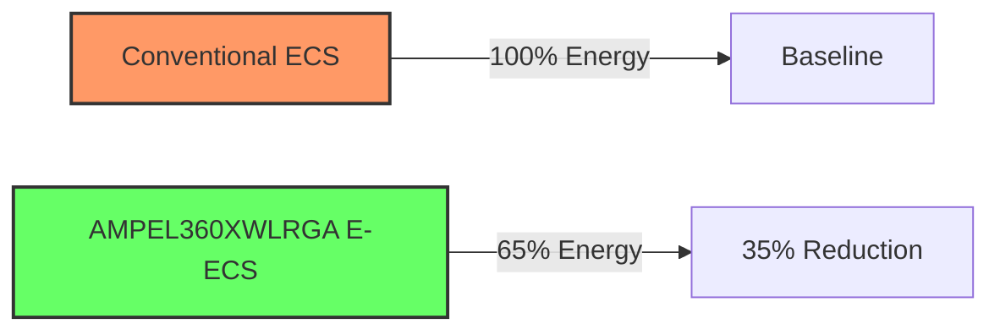

---

## 2. Introduction

### 2.1 Purpose

This document specifies the design, performance requirements, and operational characteristics of the Environmental Control System (ECS) for the AMPEL360XWLRGA platform, in accordance with ATA Chapter 21 (Air Conditioning & Pressurization).

### 2.2 Scope

This design specification covers the complete Environmental Control System, including:

- Air distribution systems
- Temperature control systems
- Pressurization control systems
- Heating systems
- Cooling systems
- Electric Environmental Control System (E-ECS) architecture
- Control and monitoring systems
- System interfaces and integration

### 2.3 Applicable Documents

- GP-AM-AMPEL-0100-21-00-00-00-000-OV-A.md - ECS Overview
- GP-AM-AMPEL-0100-24-00-00-00-001-SPEC-A.md - Electrical Power Systems
- GP-AM-AMPEL-0100-49-00-00-00-001-SPEC-A.md - Auxiliary Power
- GP-AM-AMPEL-0100-36-00-00-00-001-SPEC-A.md - Pneumatic Systems

### 2.4 Regulatory Requirements

The ECS design complies with the following regulatory requirements:

- EASA CS-25.831 - Ventilation and cabin air quality
- EASA CS-25.841 - Pressurization
- EASA CS-25.1309 - Equipment, systems and installations
- FAA 14 CFR Part 25.831, 25.841, 25.1309 (equivalent requirements)
- SAE ARP 85E - Air Conditioning Systems for Subsonic Airplanes
- SAE AIR 1168/8 - Thermodynamics of Incompressible and Compressible Fluid Flow
- ISO 14001 - Environmental Management Systems


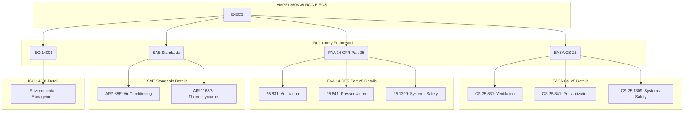

---

## 3. System Overview

### 3.1 System Description

The AMPEL360XWLRGA Environmental Control System (ECS) is a fully electric, non-bleed air system that provides temperature control, pressurization, and ventilation functions for the aircraft cabin, flight deck, and equipment bays. The system incorporates state-of-the-art technologies to maximize energy efficiency while ensuring passenger comfort and safety.

The E-ECS consists of the following major sub-systems:

1. Air Distribution System
2. Temperature Control System
3. Pressurization Control System
4. Cooling System
5. Heating System
6. Control and Monitoring System

### 3.2 System Architecture

The E-ECS adopts a distributed architecture with centralized cooling/heating generation and zonal temperature control. The architecture eliminates conventional engine bleed air extraction, instead using electrically driven compressors to pressurize ambient air. This approach improves overall aircraft efficiency by:

1. Eliminating energy losses associated with bleed air extraction
2. Enabling precise matching of cooling/heating capacity to actual demand
3. Allowing for independent control of pressure, temperature, and flow
4. Supporting zonal temperature control for improved passenger comfort
5. Facilitating heat recovery and energy optimization across aircraft systems


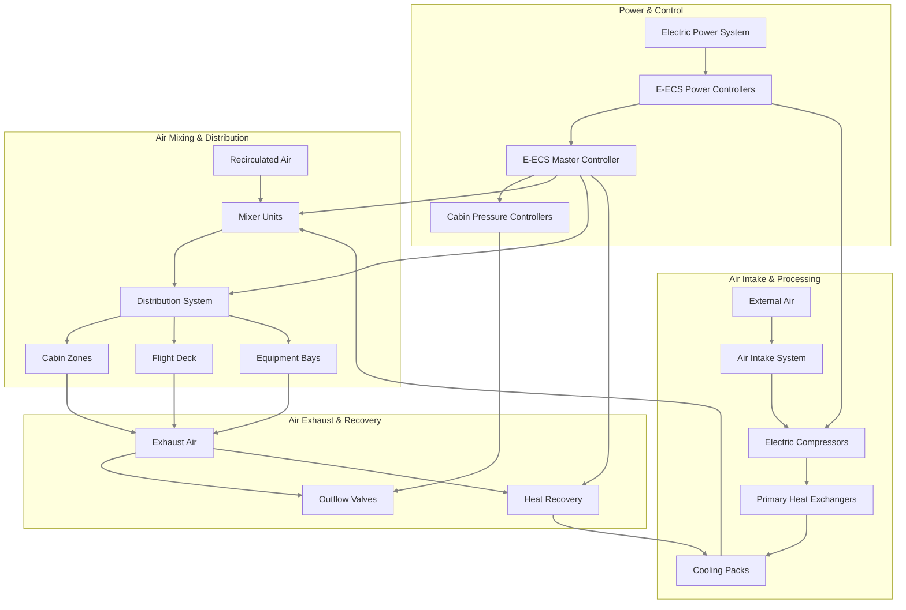

### 3.3 Design Philosophy

The E-ECS design is guided by the following principles:

1. **Energy Efficiency**: Minimize energy consumption through optimized components, heat recovery, and intelligent control algorithms
2. **Environmental Performance**: Use natural or low-GWP refrigerants and eliminate direct atmospheric emissions
3. **Passenger Comfort**: Provide superior air quality, temperature stability, and acoustic performance
4. **Reliability**: Achieve dispatch reliability of 99.8% through component redundancy and fault-tolerant design
5. **Maintainability**: Enable condition-based maintenance through comprehensive monitoring and diagnostics
6. **Weight Optimization**: Utilize lightweight materials and compact designs to minimize system weight
7. **Scalability**: Design for adaptability across various aircraft configurations and mission profiles

---

## 4. Air Distribution System (ATA 21-10)

### 4.1 System Description

The Air Distribution System delivers conditioned air to the cabin, flight deck, and equipment bays with precise control of flow rates, temperature, and humidity. The system consists of primary and secondary air distribution networks, with intelligent flow control valves and sensors throughout.

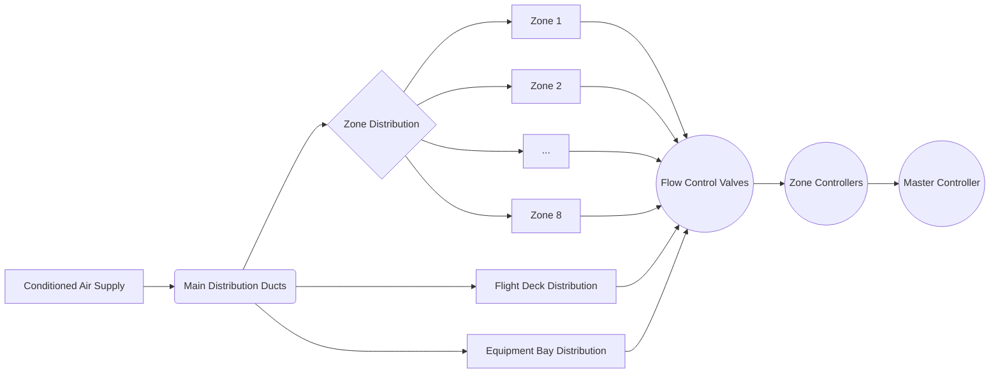

### 4.2 Major Components

#### 4.2.1 Air Intake System

| Component              | Specification                                     | Quantity      | Function                              |
|------------------------|---------------------------------------------------|---------------|---------------------------------------|
| Ram Air Inlets         | Diameter: 200 mm, CFRP construction               | 2             | Capture ambient air during flight     |
| Intake Filters         | HEPA + activated carbon, 99.97% efficiency at 0.3 μm | 4 (2 per inlet) | Remove contaminants from incoming air |
| Motorized Inlet Valves | Electric actuator, position feedback, fail-safe design | 2         | Control airflow into the system       |

#### 4.2.2 Primary Distribution Network

| Component              | Specification                                     | Quantity      | Function                              |
|------------------------|---------------------------------------------------|---------------|---------------------------------------|
| Main Distribution Ducts | 300 mm diameter, composite material, insulated   | 2 (left/right)| Transport conditioned air throughout aircraft |
| Flow Control Valves    | Motorized butterfly valves with position feedback | 12            | Control airflow to different zones    |
| Zone Controllers       | Microprocessor-based, networked                  | 8             | Control local temperature and flow rates |

#### 4.2.3 Secondary Distribution Network

| Component              | Specification                                     | Quantity      | Function                              |
|------------------------|---------------------------------------------------|---------------|---------------------------------------|
| Zone Distribution Ducts | 50-150 mm diameter, lightweight composite        | Multiple      | Distribute air within zones           |
| Air Outlets            | Adjustable, low-noise design                     | 248           | Deliver air to cabin                  |
| Personal Air Outlets   | Adjustable, 20-60 l/min flow rate                | 401           | Provide individual air control        |

### 4.3 Performance Requirements

| Parameter             | Requirement                  | Notes                          |
|-----------------------|------------------------------|--------------------------------|
| Total System Airflow  | 3,400 kg/h                  | Maximum capacity               |
| Fresh Air Ratio       | 50% minimum                 | Per passenger requirements     |
| Air Changes           | 20-30 per hour              | Cabin air renewal rate         |
| Flow Balance Accuracy | ±5%                         | Between zones                  |
| Recirculation Filtration | HEPA H14 (99.995% at 0.3 μm) | Exceeds regulatory requirements |

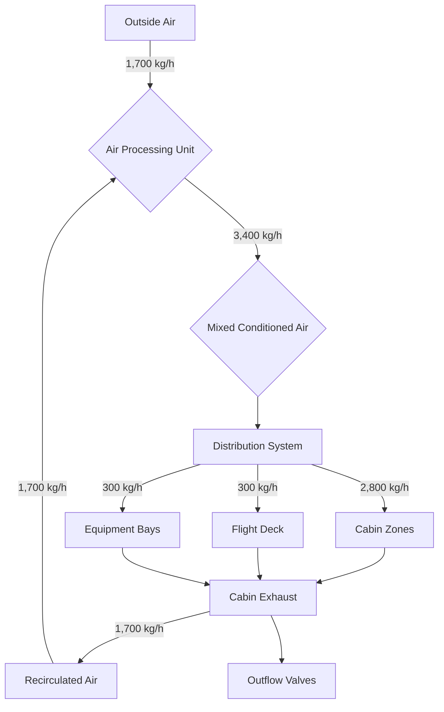
### 4.4 Energy-Efficient Features

The Air Distribution System incorporates the following energy-efficient features:

1. **Smart Ventilation Management**
   1. Demand-controlled ventilation based on occupancy sensors
   2. CO₂-based fresh air control
   3. Optimized air distribution patterns to minimize energy consumption

2. **Zonal Control Systems**
   1. Independent control of 8 cabin zones
   2. Dynamic adjustment based on passenger load and preferences
   3. Crew-configurable zone settings

3. **Low-Pressure-Drop Design**
   1. Aerodynamically optimized duct layout
   2. Computational fluid dynamics (CFD) verified flow paths
   3. 15% reduction in pressure drop compared to conventional systems

---

## 5. Temperature Control System (ATA 21-20)

### 5.1 System Description

The Temperature Control System maintains comfortable temperature conditions throughout the aircraft by regulating the operation of heating and cooling components. The system employs multi-sensor inputs, predictive algorithms, and zonal control to optimize both comfort and energy usage.

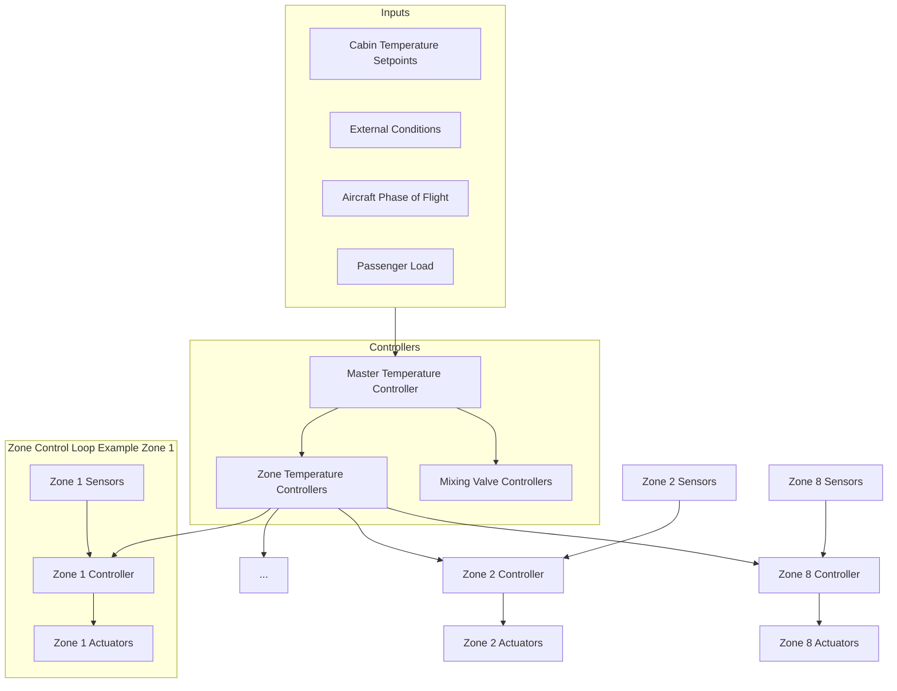
### 5.2 Major Components

#### 5.2.1 Temperature Sensors

| Component                   | Specification                           | Quantity | Function                          |
|-----------------------------|-----------------------------------------|----------|-----------------------------------|
| Cabin Zone Sensors          | Accuracy: ±0.2°C, dual-redundant       | 16       | Monitor zone temperatures         |
| Duct Temperature Sensors    | Accuracy: ±0.5°C, response time <3 s   | 24       | Monitor air temperature in ducts  |
| External Air Temperature Sensors | Range: -60°C to +50°C, accuracy: ±1.0°C | 4        | Monitor ambient conditions        |
| Surface Temperature Sensors | Infrared type, non-contact             | 32       | Monitor wall/floor temperatures   |

#### 5.2.2 Temperature Controllers

| Component                   | Specification                           | Quantity | Function                          |
|-----------------------------|-----------------------------------------|----------|-----------------------------------|
| Master Temperature Controller | Dual-channel, fail-operational design | 1        | Primary system control            |
| Zone Temperature Controllers | Networked, programmable               | 8        | Local zone control                |
| Mixing Valve Controllers    | Proportional control, position feedback | 16       | Control air mixing ratio          |

### 5.3 Performance Requirements

| Parameter             | Requirement              | Notes                          |
|-----------------------|--------------------------|--------------------------------|
| Temperature Range     | 18°C to 30°C            | Cabin selectable range         |
| Temperature Stability | ±0.5°C                  | Once stabilized                |
| Temperature Uniformity | ±1.0°C                 | Within each zone               |
| Response Time         | <5 minutes              | For 2°C step change            |
| Control Granularity   | 0.5°C                   | Setting increments             |
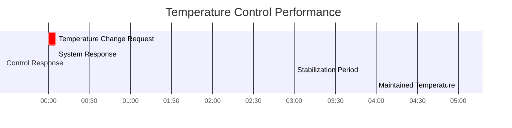

### 5.4 Advanced Features

1. **Heat Recovery Systems**
   1. Air-to-air heat exchangers recover 85% of exhaust air energy
   2. Integration with aircraft thermal management system
   3. Waste heat capture from avionics and power electronics

2. **Phase Change Material Applications**
   1. Integrated PCM modules provide thermal buffering
   2. 2.5 MJ/kg thermal energy storage capacity
   3. Reduces peak loads on heating/cooling systems

3. **Thermal Insulation Optimization**
   1. Vacuum insulated panels in critical areas (R-value: 40 per inch)
   2. Aerogel-based insulation in space-constrained areas
   3. Smart dynamic insulation that adjusts thermal resistance based on conditions

---

## 6. Pressurization Control System (ATA 21-30)

### 6.1 System Description

The Pressurization Control System maintains appropriate cabin pressure altitude throughout all phases of flight. The system uses electric compressors instead of traditional engine bleed air to pressurize the cabin, with intelligent controllers that optimize pressure schedules for passenger comfort and structural efficiency.

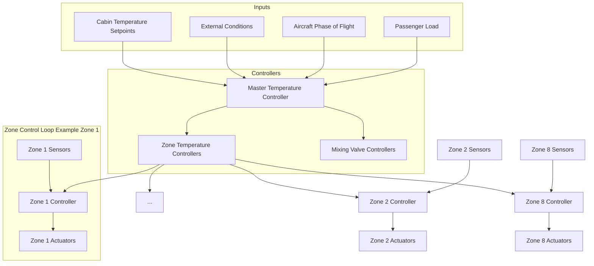
### 6.2 Major Components

#### 6.2.1 Pressurization Equipment

| Component                     | Specification                          | Quantity | Function                         |
|-------------------------------|----------------------------------------|----------|----------------------------------|
| Electric Air Compressors      | 65 kW, variable speed, 2.5:1 pressure ratio | 4        | Pressurize ambient air          |
| Outflow Valves                | Electronically controlled, position feedback | 2       | Regulate cabin pressure          |
| Safety Relief Valves          | Mechanical + electronic actuation      | 4        | Prevent over-pressurization      |
| Negative Pressure Relief Valves | Spring-loaded, auto-resetting         | 2        | Prevent negative pressure conditions |

#### 6.2.2 Pressurization Controllers

| Component                     | Specification                          | Quantity | Function                         |
|-------------------------------|----------------------------------------|----------|----------------------------------|
| Cabin Pressure Controllers    | Triple-redundant, voting logic         | 2        | Primary control system           |
| Pressure Sensors              | Accuracy: ±0.1 kPa, range: 0-120 kPa   | 8        | Monitor cabin and ambient pressure |
| Differential Pressure Sensors | Range: 0-65 kPa, accuracy: ±0.05 kPa   | 4        | Monitor pressure differential    |

### 6.3 Performance Requirements

| Parameter                     | Requirement                           | Notes                           |
|-------------------------------|---------------------------------------|---------------------------------|
| Maximum Differential Pressure | 58.6 kPa (8.5 psi)                   | Design limit                    |
| Normal Operating Differential | 55.2 kPa (8.0 psi)                   | At cruise altitude              |
| Maximum Rate of Pressure Change | ±91 m/min (±300 ft/min)              | Normal operation                |
| Emergency Descent Rate        | 610 m/min (2,000 ft/min)             | Emergency procedure             |
| Cabin Altitude at Max Cruise  | 1,800 m (6,000 ft)                   | Lower than industry standard    |
| Cabin Leakage Rate            | <0.1 kg/min                          | At normal cruise differential   |

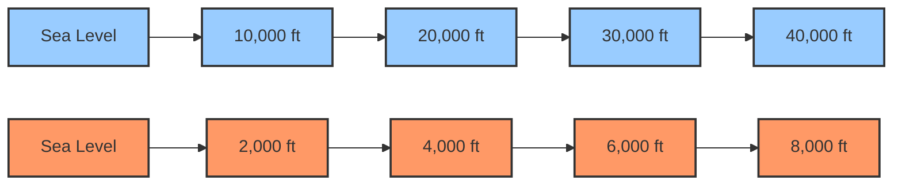
### 6.4 Innovative Features

1. **Adaptive Cabin Pressure Management**
   1. Dynamic pressure scheduling based on flight phase and altitude
   2. Gradual pressure changes for enhanced passenger comfort
   3. Optimized for patients with medical conditions

2. **Lightweight Pressure Control Components**
   1. Carbon fiber composite valve bodies (60% weight reduction)
   2. Additive manufactured flow paths for optimized aerodynamics
   3. Integrated sensors and actuators to minimize component count

3. **Pressure Recovery Systems**
   1. Energy recovery from outflow air via micro-turbines
   2. Regenerates up to 12 kW during descent phase
   3. Closed-loop pressure control for minimal energy consumption

---

## 7. Cooling Systems (ATA 21-50)

### 7.1 System Description

The Cooling System provides conditioned cold air to the temperature control system. The AMPEL360XWLRGA utilizes a hybrid cooling approach that combines vapor cycle systems with air cycle machines, optimized for different flight phases and ambient conditions.

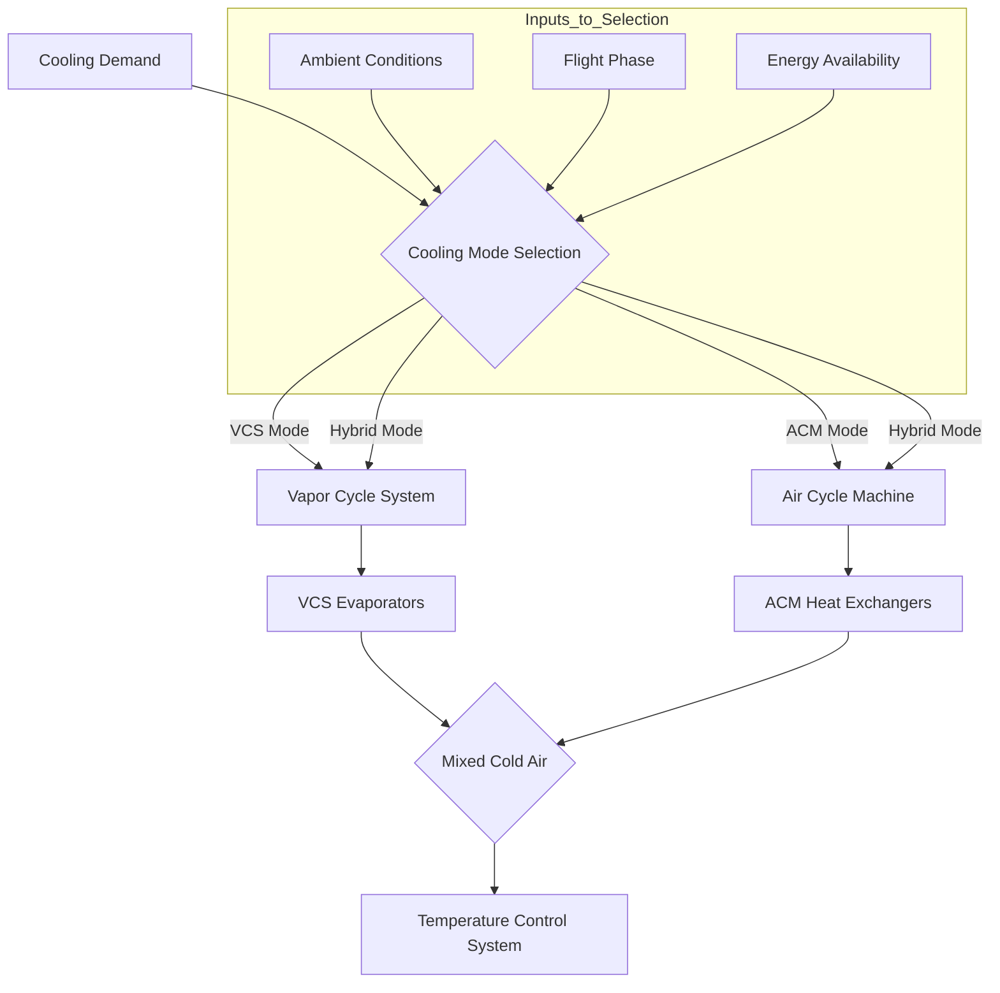

### 7.2 Major Components

#### 7.2.1 Vapor Cycle System (VCS)

| Component                 | Specification                        | Quantity | Function                   |
|---------------------------|--------------------------------------|----------|----------------------------|
| Compressors               | Variable-speed, brushless DC, 35 kW | 2        | Compress refrigerant       |
| Condensers                | Microchannel, titanium-aluminum alloy | 2      | Reject heat to ambient     |
| Evaporators               | Plate-fin, hydrophobic coating       | 2        | Cool cabin air             |
| Thermal Expansion Valves  | Electronic, proportional control     | 4        | Control refrigerant flow   |
| Refrigerant               | R-744 (CO₂), GWP = 1                | 10 kg    | Working fluid              |

#### 7.2.2 Air Cycle Machine (ACM)

| Component                 | Specification                        | Quantity | Function                   |
|---------------------------|--------------------------------------|----------|----------------------------|
| Compressor-Turbine Units  | 120,000 RPM, magnetic bearings       | 2        | Generate cooling via air cycle |
| Primary Heat Exchangers   | Effectiveness: 0.85, AM titanium     | 2        | Pre-cool compressed air    |
| Secondary Heat Exchangers | Effectiveness: 0.90, compact design  | 2        | Main cooling stage         |
| Water Separation Systems  | Coalescer + cyclonic separator       | 2        | Remove moisture from air   |

#### 7.2.3 Control Components

| Component                 | Specification                        | Quantity | Function                   |
|---------------------------|--------------------------------------|----------|----------------------------|
| Cooling System Controller | Dual-redundant, adaptive control     | 1        | Manage overall cooling system |
| Refrigerant Sensors       | Temperature, pressure, flow          | 24       | Monitor refrigerant conditions |
| Air Condition Sensors     | Temperature, pressure, humidity      | 16       | Monitor air conditions     |

### 7.3 Performance Requirements

| Parameter                 | Requirement                         | Notes                          |
|---------------------------|-------------------------------------|--------------------------------|
| Total Cooling Capacity    | 160 kW                             | Maximum capacity               |
| VCS Coefficient of Performance | >4.5                         | At design conditions           |
| ACM Isentropic Efficiency | >80%                               | Compressor and turbine         |
| Minimum Delivery Temperature | 2°C                            | At system outlet               |
| Maximum Ambient Operation | 50°C                               | Ground operation capability    |
| System Weight             | <450 kg                            | Complete cooling system        |

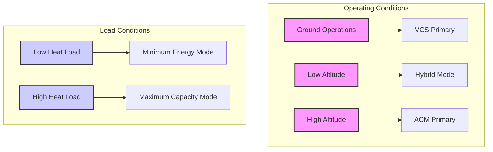
### 7.4 Sustainable Features

1. **Natural Refrigerant System Concepts**
   1. R-744 (CO₂) primary refrigerant with GWP = 1
   2. Zero ODP (Ozone Depletion Potential)
   3. Non-flammable and low toxicity

2. **Low-GWP Refrigerant Implementation**
   1. Sealed system with leak detection (sensitivity: 1 g/year)
   2. Service connections designed for zero-loss maintenance
   3. 100% recyclable at end-of-life

3. **Passive Cooling Technologies Integration**
   1. PCM heat sinks for transient load management
   2. Radiative cooling panels for ground operations
   3. Geopolymer thermal mass components

---

## 8. Heating Systems (ATA 21-40)

### 8.1 System Description

The Heating System provides warm air to maintain comfortable cabin temperatures in cold conditions and for anti-fogging of windows. The AMPEL360XWLRGA employs an all-electric heating system with zonal control and waste heat recovery.

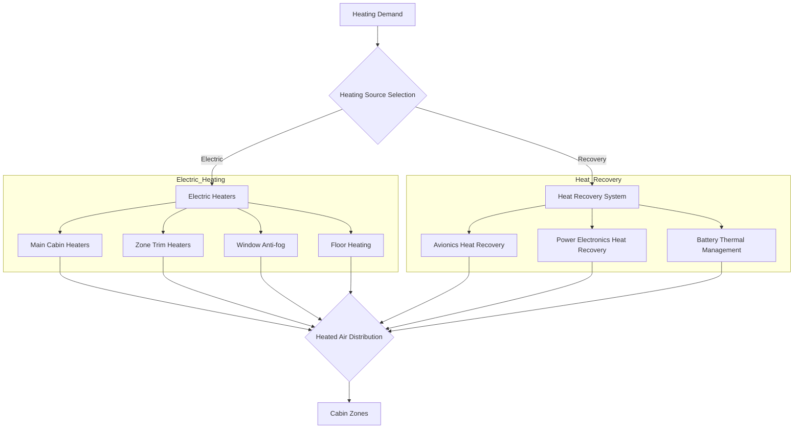
### 8.2 Major Components

#### 8.2.1 Electric Heaters

| Component                 | Specification                        | Quantity    | Function                         |
|---------------------------|--------------------------------------|-------------|----------------------------------|
| Main Cabin Heaters        | 40 kW, solid-state, variable output | 2           | Primary heating for cabin        |
| Zone Trim Heaters         | 5 kW, thin-film technology          | 8           | Zone-specific heating            |
| Window Anti-fog Heaters   | 50 W/m², transparent conductive film | 28         | Prevent window fogging           |
| Floor Heating Elements    | 200 W/m², carbon nanotube           | 16 zones    | Floor warming in cold conditions |

#### 8.2.2 Heat Recovery Components

| Component                 | Specification                        | Quantity | Function                         |
|---------------------------|--------------------------------------|----------|----------------------------------|
| Heat Pumps                | 25 kW, R-744 refrigerant            | 2        | Extract heat from other systems  |
| Liquid-to-Air Heat Exchangers | Effectiveness: 0.9, compact design | 4      | Transfer recovered heat to air   |
| Thermal Energy Storage    | Phase change material, 0.5 MWh capacity | 1    | Store excess thermal energy      |

### 8.3 Performance Requirements

| Parameter                 | Requirement                         | Notes                          |
|---------------------------|-------------------------------------|--------------------------------|
| Total Heating Capacity    | 120 kW                             | Maximum capacity               |
| Minimum Outside Air Temperature | -55°C                       | Operating range                |
| Temperature Rise Rate     | 10°C in 5 minutes                  | From cold soak                 |
| Window Anti-fog Performance | Clear at 95% RH, -20°C           | All flight conditions          |
| Heating Coefficient of Performance | >3.0                     | For heat pump mode             |

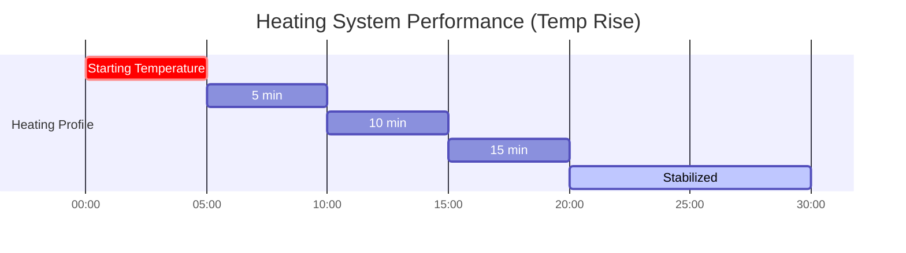

### 8.4 Advanced Features

1. **Electric Heating Systems**
   1. Solid-state electric heaters with 99.5% efficiency
   2. Modular design for easy maintenance
   3. Thermal imaging monitoring for fault detection

2. **Waste Heat Utilization**
   1. Recovery of waste heat from avionics (up to 30 kW)
   2. Power electronics cooling integration (up to 25 kW)
   3. Battery thermal management integration (up to 15 kW)

3. **Zonal Heating Control**
   1. 8 independently controlled temperature zones
   2. Occupancy-based heating optimization
   3. Learning algorithms for predictive comfort management

---

## 9. Electric Environmental Control Systems (E-ECS) (ATA 21-70)

### 9.1 System Description

The AMPEL360XWLRGA features a fully integrated Electric Environmental Control System (E-ECS) that coordinates the operation of all environmental subsystems. The E-ECS replaces traditional pneumatic bleed air systems with an all-electric architecture powered by the aircraft's electrical system.

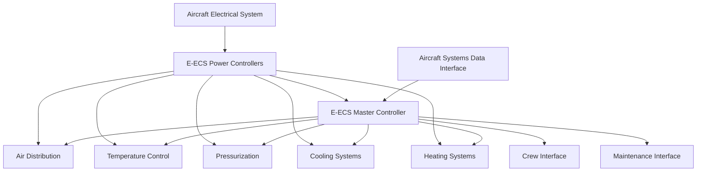
### 9.2 Major Components

#### 9.2.1 E-ECS Architecture

| Component                 | Specification                  | Quantity | Function                           |
|---------------------------|--------------------------------|----------|------------------------------------|
| E-ECS Power Controllers   | 100 kW, 270 VDC / 115 VAC     | 2        | Power distribution and management |
| E-ECS Master Controller   | Triple-redundant, DO-178C Level A | 1     | System coordination and control   |
| Communication Networks    | AFDX + CAN-FD, redundant       | 2        | Internal system communications    |
| Gateway Interfaces        | ARINC 664/429 compatible       | 4        | Aircraft systems interface        |

#### 9.2.2 Power Management Components

| Component                 | Specification                  | Quantity | Function                           |
|---------------------------|--------------------------------|----------|------------------------------------|
| Power Conditioning Units  | 270 VDC to multi-voltage output | 2        | Adapt aircraft power to E-ECS needs |
| Energy Storage Modules    | 5 kWh, lithium titanate batteries | 2     | Buffer peak power demands         |
| Load Management Controllers | Real-time prioritization algorithm | 2   | Manage power allocation           |

### 9.3 Performance Requirements

| Parameter                 | Requirement                   | Notes                          |
|---------------------------|------------------------------|--------------------------------|
| Total Power Consumption   | Average: 85 kW, Peak: 175 kW | All ECS functions              |
| System Availability       | 99.98%                       | Exceeds certification requirements |
| Response Time             | <100 ms                      | For critical functions         |
| Fault Tolerance           | Any single point failure     | No loss of essential functions |
| Weight Efficiency         | <1.8 kg/kW                   | System weight per cooling power |


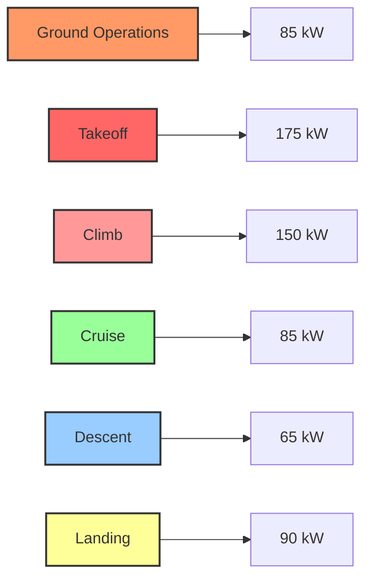


### 9.4 Advanced Features

1. **E-ECS Architecture and Key Components**
   1. Modular power electronics with SiC/GaN technology
   2. Digital twin for real-time optimization
   3. Prognostics health monitoring system

2. **Power Management and Distribution Integration**
   1. Smart load shedding algorithms
   2. Regenerative energy capture during descent
   3. Grid stabilization functions

3. **Control Algorithms and Software**
   1. Model predictive control for energy optimization
   2. Machine learning adaptation to passenger preferences
   3. Predictive maintenance algorithms

4. **Thermal Management Integration**
   1. Aircraft-wide thermal management optimization
   2. Dynamic thermal load balancing
   3. Cabin-to-systems heat flow management

5. **Fault Detection, Isolation, and Recovery (FDIR)**
   1. Real-time diagnostics with 2,000+ parameters monitored
   2. Automated reconfiguration for fault conditions
   3. Ground-based predictive maintenance analytics

---

## 10. Control and Monitoring System

### 10.1 System Description

The Control and Monitoring System provides comprehensive oversight and management of all ECS functions. The system utilizes distributed computing architecture with a central coordinator and local controllers for each subsystem.

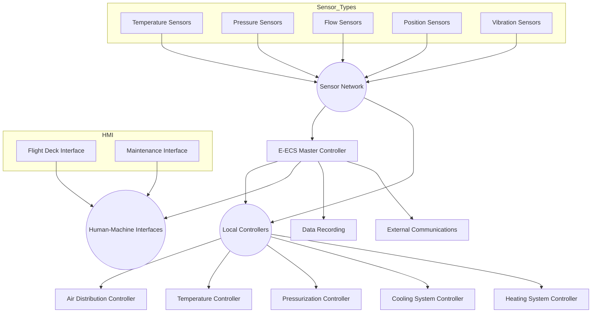

### 10.2 Major Components

#### 10.2.1 Hardware Components

| Component                 | Specification                        | Quantity | Function                   |
|---------------------------|--------------------------------------|----------|----------------------------|
| Central Processing Units  | Quad-core, 2.5 GHz, radiation-hardened | 3      | Main system control        |
| Local Processing Units    | Dual-core, 1.5 GHz, DO-254 compliant | 12       | Subsystem control          |
| Network Switches          | 1 Gbps, DO-254 Level A               | 4        | System communications      |
| Human-Machine Interfaces  | Touch screen, night-vision compatible | 2       | Crew interface             |

#### 10.2.2 Software Components

| Component                 | Specification                        | Function                   |
|---------------------------|--------------------------------------|----------------------------|
| Operating System          | ARINC 653 compliant RTOS            | Provide execution environment |
| Control Applications      | DO-178C Level A certified           | Implement control algorithms |
| Monitoring Applications   | DO-178C Level B certified           | System health monitoring   |
| Data Recording            | Continuous parameter logging        | Performance analysis       |

### 10.3 Performance Requirements

| Parameter                 | Requirement                         | Notes                          |
|---------------------------|-------------------------------------|--------------------------------|
| Control Loop Frequency    | 50-200 Hz                          | Depending on criticality       |
| System Latency            | <20 ms                             | End-to-end response           |
| Data Storage Capacity     | 30 days of operation               | All parameters                |
| Diagnostic Coverage       | >95%                               | Of all potential faults        |

### 10.4 Advanced Features

1. **AI-Enhanced Control Algorithms**
   1. Neural network optimization of energy usage
   2. Pattern recognition for fault prediction
   3. Adaptive comfort models based on passenger feedback

2. **Advanced Data Analytics**
   1. Real-time performance monitoring
   2. Trend analysis for system degradation
   3. Fleet-wide comparison and optimization

3. **Cybersecurity Features**
   1. Secure boot and trusted execution
   2. Encrypted communications
   3. Intrusion detection and prevention
   4. Regular security updates via secure datalink

---

## 11. System Integration and Interfaces

### 11.1 Aircraft System Interfaces

| System                   | Interface Type                     | Data Exchanged                |
|--------------------------|------------------------------------|-------------------------------|
| Electrical Power System  | Physical: 270 VDC, 115 VAC`<br>`Data: AFDX | Power supply, load management |
| Avionics                 | Data: ARINC 429/664               | Flight parameters, aircraft state |
| Flight Control           | Data: AFDX                        | Air data, flight envelope     |
| APU                      | Physical: Electrical`<br>`Data: AFDX | Power availability, APU status |
| Fuel System              | Data: AFDX                        | Fuel temperature data         |
| Landing Gear             | Discrete signals                  | Ground/air state              |

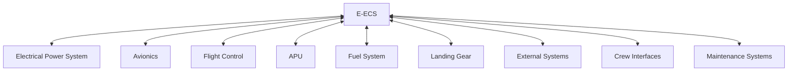

### 11.2 External Interfaces

| Interface                 | Specification                      | Function                     |
|---------------------------|------------------------------------|------------------------------|
| Ground Cooling Connection | ISO standard connection           | Pre-conditioned air interface |
| Ground Power Connection   | Standard 115 VAC, 400 Hz          | External power for ECS       |
| Maintenance Access        | Wireless + Physical ports         | Diagnostics and service      |
| Data Offload              | Secure wireless, 5G/6G            | Performance data upload      |

### 11.3 Integration Requirements

| Requirement               | Specification                      | Notes                       |
|---------------------------|------------------------------------|-----------------------------|
| Electromagnetic Compatibility | RTCA DO-160G compliant          | All ECS components          |
| Lightning Protection      | Level A protection                | Critical components         |
| Physical Isolation        | Fireproof barriers                | Between critical systems    |
| Functional Independence   | No common mode failures           | Between redundant channels  |


---

## 12. Weight and Power Budget

### 12.1 Weight Budget

| Subsystem              | Weight (kg) | % of Total ECS |
|------------------------|-------------|----------------|
| Air Distribution       | 380         | 18%            |
| Temperature Control    | 120         | 6%             |
| Pressurization Control | 290         | 14%            |
| Cooling System         | 450         | 21%            |
| Heating System         | 210         | 10%            |
| E-ECS Components       | 320         | 15%            |
| Control and Monitoring | 180         | 9%             |
| Structure and Mounting | 150         | 7%             |
| **Total**              | **2,100**   | **100%**       |

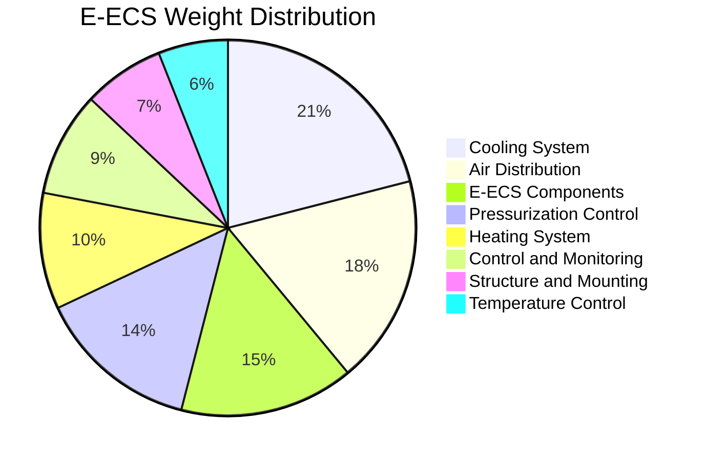

### 12.2 Power Budget

| Operation Mode     | Average Power (kW) | Peak Power (kW) |
|--------------------|---------------------|-----------------|
| Ground Operation   | 65                 | 140             |
| Takeoff/Climb      | 95                 | 175             |
| Cruise             | 80                 | 160             |
| Descent            | 60                 | 120             |
| Emergency Operation | 45                | 90              |

### 12.3 Efficiency Improvements

| Feature                 | Energy Saving | Implementation Method               |
|-------------------------|---------------|-------------------------------------|
| Heat Recovery           | 12-18%        | Air-to-air and liquid-to-air exchange |
| Zonal Control           | 8-12%         | Independent temperature management  |
| Variable Speed Drives   | 10-15%        | Optimized component operation       |
| Smart Control Algorithms | 5-8%         | AI-based operational optimization   |
| Improved Insulation     | 3-5%          | Advanced materials application      |
| **Total System Improvement** | **35-40%** | Compared to conventional systems    |

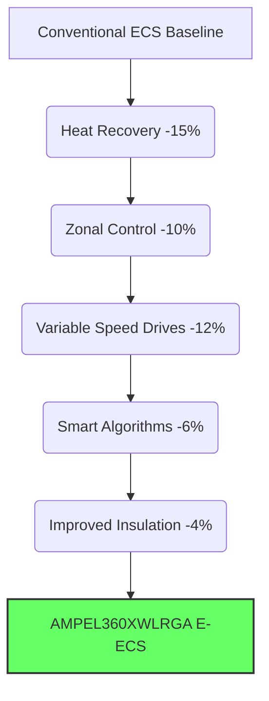

---

## 13. Reliability, Availability, Maintainability, Safety (RAMS)

### 13.1 Reliability

| Parameter               | Target               | Method of Achievement            |
|-------------------------|---------------------|----------------------------------|
| MTBF (Complete System)  | >15,000 flight hours | Component selection, redundancy |
| MTBF (Critical Components) | >30,000 flight hours | Derating, quality control       |
| Dispatch Reliability    | 99.8%               | Built-in test, redundancy        |

### 13.2 Availability

| Parameter               | Target               | Method of Achievement            |
|-------------------------|---------------------|----------------------------------|
| System Availability     | 99.98%              | Redundant architecture           |
| Graceful Degradation    | 3 levels            | Reconfiguration capability       |
| MTTR                    | <2 hours            | LRU design philosophy            |

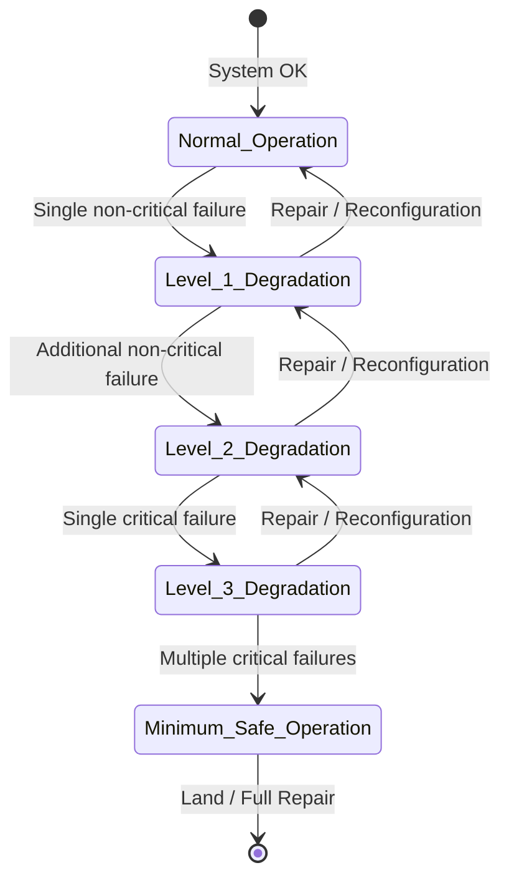

### 13.3 Maintainability

| Parameter               | Target               | Method of Achievement            |
|-------------------------|---------------------|----------------------------------|
| Scheduled Maintenance   | A-check only        | Condition-based monitoring       |
| Component Accessibility | 95% without tool    | Design for maintainability       |
| Built-in Test Coverage  | >98%                | Comprehensive diagnostics        |
| Service Time (LRU)      | <30 minutes         | Quick-disconnect features        |

### 13.4 Safety Analysis

| Failure Classification  | Probability Target  | Mitigation Strategy              |
|-------------------------|---------------------|----------------------------------|
| Catastrophic            | <10⁻⁹ per flight hour | Triple redundancy, dissimilar designs |
| Hazardous               | <10⁻⁷ per flight hour | Dual redundancy, automated recovery |
| Major                   | <10⁻⁵ per flight hour | Monitoring, alert systems       |
| Minor                   | <10⁻³ per flight hour | Design margins, maintenance     |

### 13.5 Failure Modes and Effects Analysis (FMEA) Summary

| Critical Component       | Failure Mode        | Effect                  | Mitigation                 |
|--------------------------|---------------------|-------------------------|----------------------------|
| Electric Compressors     | Motor failure       | Reduced pressurization  | Redundant units, automatic switchover |
| Control Software         | Corruption          | Loss of automatic control | Triple-redundant voting, manual backup |
| Cooling System           | Refrigerant leak    | Reduced cooling capacity | Leak detection, secondary systems |
| Power Supply             | Loss of primary power | System degradation     | Battery backup, load shedding |


## 14. Testing and Validation Plan

### 14.1 Development Testing

| Test Type           | Description                      | Success Criteria            |
|---------------------|----------------------------------|-----------------------------|
| Component Testing   | Individual component performance | Meet or exceed specifications |
| Subsystem Testing   | Integrated subsystem operation   | Functional requirements met |
| Environmental Testing | Operation in extreme conditions | Performance maintained      |
| Endurance Testing   | Extended operation               | No degradation over time    |

```mermaid
graph LR
    A[Requirements Definition] --> B[Test Plan Development];
    B --> C(Component Testing);
    C --> D(Subsystem Testing);
    D --> E(System Integration Testing);
    E --> F(Environmental Testing);
    F --> G(Endurance Testing);
    G --> H(Certification Testing);
    H --> I(Flight Testing);
```

### 14.2 Qualification Testing

| Test Type           | Description                      | Standards       |
|---------------------|----------------------------------|-----------------|
| EMI/EMC Testing     | Electromagnetic compatibility    | RTCA DO-160G    |
| Vibration Testing   | Operational under vibration      | RTCA DO-160G    |
| Temperature/Altitude | Performance at extremes         | RTCA DO-160G    |
| Lightning/HIRF      | Protection verification          | RTCA DO-160G    |

### 14.3 Certification Testing

| Test Type             | Description                   | Regulatory Requirement |
|-----------------------|-------------------------------|-------------------------|
| System Safety Analysis | Comprehensive safety assessment | CS 25.1309, AMC 25.1309 |
| Cabin Environment     | Air quality and pressure testing | CS 25.831, CS 25.841  |
| System Performance    | Demonstration of capabilities | CS 25.1301            |
| Software Verification | Control software validation   | RTCA DO-178C          |

### 14.4 Flight Testing

| Test Phase            | Description                   | Objectives             |
|-----------------------|-------------------------------|-------------------------|
| Ground Testing        | Full operation on ground      | Verify ground performance |
| Initial Flight Tests  | Basic functionality           | Verify essential functions |
| Environmental Flight Tests | Hot/cold/high altitude    | Performance in all conditions |
| Endurance Testing     | Extended operations           | Reliability demonstration |

---

## 15. Manufacturing and Installation

### 15.1 Manufacturing Process

| Process               | Description                      | Quality Controls            |
|-----------------------|----------------------------------|-----------------------------|
| Component Manufacturing | Precision fabrication of individual parts | Statistical process control  |
| Subsystem Assembly    | Integration of components into subsystems | Automated testing at each stage |
| System Integration    | Combining subsystems into complete ECS | Comprehensive system testing |
| Final Testing         | Complete verification before installation | Automated test equipment    |

```mermaid
graph TD
    A[Raw Materials] --> B[Component Manufacturing];
    B --> C{Component Testing};
    C --> D[Subsystem Assembly];
    D --> E{Subsystem Testing};
    E --> F[System Integration];
    F --> G{System Testing};
    G --> H[Aircraft Installation];
    H --> I{Final Verification};
```

### 15.2 Installation Sequence

1. Installation of structural mounts and brackets  
2. Installation of main distribution ducts  
3. Installation of pressurization components  
4. Installation of heating and cooling systems  
5. Installation of electrical systems and wiring  
6. Installation of sensors and control components  
7. Initial power-up and testing  
8. Integration with aircraft systems  
9. Final verification and commissioning  

### 15.3 Special Tooling and Equipment

| Tool/Equipment         | Function                      | Specification               |
|-------------------------|------------------------------|-----------------------------|
| Leak Detection Equipment | Verify system integrity      | Sensitivity: 1 g/year       |
| Automated Test Equipment | Verify system function       | 2,000+ test parameters      |
| Calibration Equipment    | Sensor calibration           | NIST traceable             |
| Refrigerant Handling System | Environmentally safe handling | Zero-emission handling      |

---

## 16. Maintenance Program

### 16.1 Scheduled Maintenance

| Check Type             | Interval               | Tasks                          |
|------------------------|-----------------------|--------------------------------|
| Transit Check          | Before each flight    | Visual inspection, status verification |
| Daily Check            | 24 hours             | Filter inspection, condensation check |
| A Check                | 750 flight hours      | Component inspection, performance test |
| C Check                | 7,500 flight hours    | Component replacement, calibration    |

```mermaid
timeline
    title Maintenance Schedule
    section Checks
        Transit Check : Daily : Before Flight
        Daily Check : Daily : End of Day
        A Check : 750 FH : Periodic
        C Check : 7500 FH : Major Periodic
```

### 16.2 Condition-Based Maintenance

The E-ECS incorporates a comprehensive condition monitoring system that enables maintenance based on actual component condition rather than fixed intervals:

| Parameter              | Monitoring Method            | Threshold                     |
|------------------------|-----------------------------|-------------------------------|
| Component Vibration    | Accelerometers              | >3 dB increase from baseline  |
| System Performance     | Performance algorithms      | >5% degradation from nominal  |
| Leak Detection         | Pressure decay, sensors     | Any detected leak             |
| Power Consumption      | Current monitoring          | >10% increase from baseline   |

### 16.3 Troubleshooting and Repair

| Resource               | Description                   | Availability                 |
|------------------------|------------------------------|------------------------------|
| Interactive Maintenance Manual | Tablet-based procedures | Real-time updates            |
| Augmented Reality Guidance | Visual assistance for maintenance | Wearable device support      |
| Remote Diagnostic Support | Expert assistance via datalink | 24/7 availability            |
| Built-in Test Equipment | Automated diagnostics         | 98% fault coverage           |

---

## 17. Environmental Impact Assessment

### 17.1 Energy Efficiency

| Metric                 | Performance                | Comparison to Industry Standard |
|------------------------|---------------------------|---------------------------------|
| Energy per Passenger-km | 12 Wh/passenger-km        | 35% improvement                |
| Annual CO₂ Reduction   | 850 tonnes per aircraft   | Based on typical usage profile |
| Fleet Impact (100 aircraft) | 85,000 tonnes CO₂ annually | Significant environmental benefit |

```mermaid
graph LR
    A[Single Aircraft] --> B[850 tonnes CO₂/year];
    C[Fleet of 100] --> D[85,000 tonnes CO₂/year];
    B --> E{Environmental Impact};
    D --> E;
```

### 17.2 Material Sustainability

| Material              | Environmental Features      | End-of-Life Management         |
|-----------------------|-----------------------------|---------------------------------|
| Refrigerants          | Natural/low-GWP only       | 100% recoverable               |
| Composite Components  | 35% recycled content       | Recyclable at end-of-life      |
| Electronic Components | RoHS compliant             | Manufacturer take-back program |
| Heat Transfer Fluids  | Biodegradable formulations | Environmentally safe disposal  |

### 17.3 Noise and Emission Reduction

| Parameter             | Reduction vs. Conventional | Method                         |
|-----------------------|----------------------------|--------------------------------|
| Cabin Noise           | 5 dB reduction            | Advanced acoustic design       |
| External Noise        | 3 dB reduction            | Optimized air intakes          |
| Refrigerant Emissions | Zero direct emissions      | Sealed systems, monitoring     |

---

## 18. Conclusion and Recommendations

### 18.1 System Benefits

The AMPEL360XWLRGA Environmental Control System represents a generational leap in aircraft environmental management, delivering:

1. **Enhanced Energy Efficiency**: 35% reduction in energy consumption  
2. **Superior Passenger Comfort**: More consistent temperature, better air quality  
3. **Reduced Environmental Impact**: Zero direct emissions, low-GWP refrigerants  
4. **Advanced Diagnostics**: Comprehensive health monitoring and predictive maintenance  
5. **Operational Flexibility**: Adaptable to various mission profiles and passenger loads  

```mermaid
mindmap
  root((AMPEL360XWLRGA E-ECS))
    ::icon(fa fa-plane)
    Energy Efficiency
      ::icon(fa fa-bolt)
      35% Reduction
    Passenger Comfort
      ::icon(fa fa-smile)
      Better Air Quality
      Stable Temperature
    Environmental Impact
      ::icon(fa fa-leaf)
      Zero Emissions
      Low GWP
    Advanced Diagnostics
      ::icon(fa fa-stethoscope)
      Predictive Maintenance
    Operational Flexibility
      ::icon(fa fa-cogs)
      Adaptable
```

### 18.2 Future Enhancement Paths

| Enhancement            | Potential Benefit         | Technology Readiness Level |
|------------------------|---------------------------|----------------------------|
| AI-Optimized Operation | Additional 5-8% efficiency | TRL 6                     |
| Superconducting Components | 15% weight reduction  | TRL 4                     |
| Solid-State Cooling    | 20% reliability improvement | TRL 5                     |
| 3D-Printed Heat Exchangers | 25% size reduction    | TRL 7                     |

### 18.3 Implementation Recommendations

1. Deploy the system in phases, starting with the most critical components  
2. Establish comprehensive training program for maintenance personnel  
3. Implement fleet-wide performance monitoring to drive continuous improvement  
4. Develop supplier relationships for critical component manufacturing  
5. Ensure technical documentation is comprehensive and accessible  


## 19. Revision History

| Revision | Date | Description of Changes | Author
|-----|-----|-----|-----
| A | 2028-05-02 | Initial Release | GAIA AIR Environmental Systems


---

**END OF DOCUMENT**

```
```plaintext
<Actions>
  <Action name="Generate E-ECS detailed schematics" description="Create electrical and pneumatic schematics for the Electric Environmental Control System" />
  <Action name="Develop ECS testing procedures" description="Create detailed testing and validation procedures for the ECS" />
  <Action name="Create ECS maintenance manual" description="Develop a comprehensive maintenance manual for the Environmental Control System" />
  <Action name="Draft regulatory compliance matrix" description="Create a detailed compliance matrix mapping ECS features to CS-25/FAR-25 requirements" />
  <Action name="Generate BOM for ECS components" description="Create a comprehensive Bill of Materials for all ECS components" />
</Actions>
```
