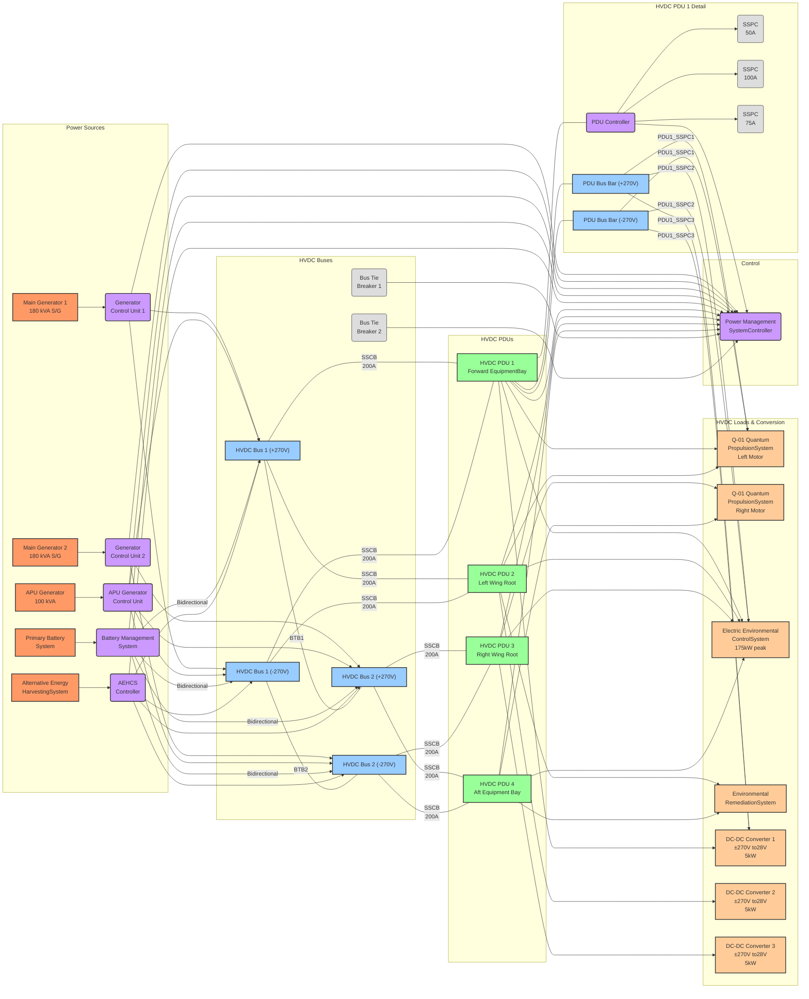
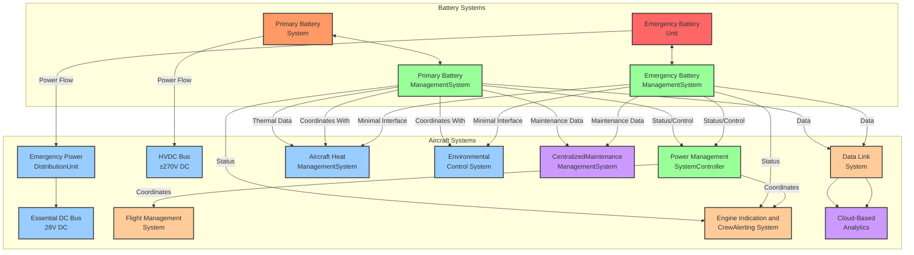
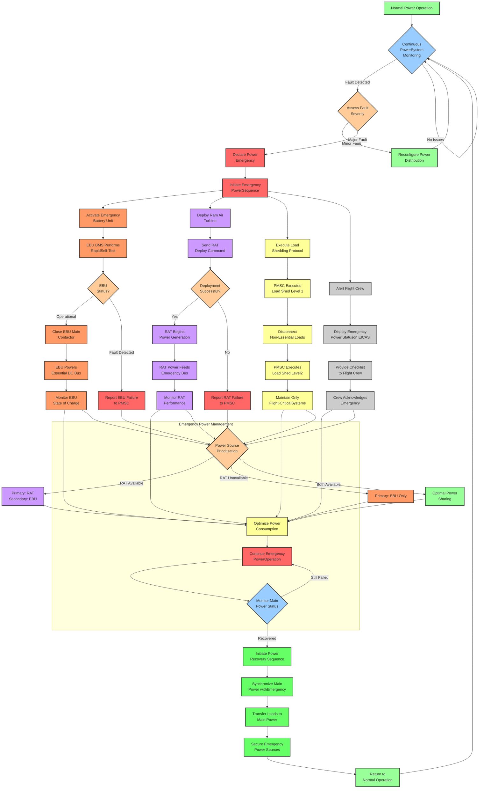
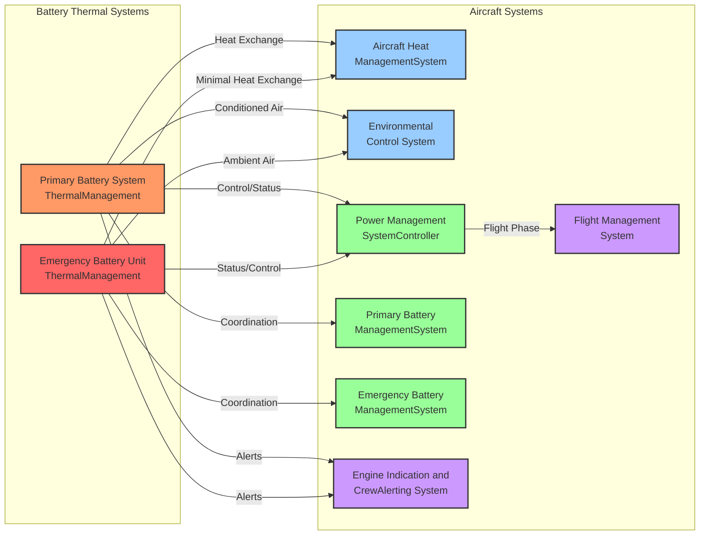

## Electrical Power Systems Design Document for AMPEL360XWLRGA

**GenAI Proposal Status**: This document represents a generated proposal for the GAIA AIR Documentation framework structure and is subject to review, validation, and approval by authorized stakeholders. The file paths, document types, and organization structure are suggested based on aerospace industry standards and the provided GAIA AIR framework requirements.

## Document Overview

I've analyzed the attached TypeScript file containing the detailed specifications for the Electrical Power Systems (ATA 24) of the AMPEL360XWLRGA aircraft. This is a comprehensive technical document that follows the standard ATA chapter structure for aircraft electrical systems documentation.

The document outlines an advanced electrical power system with the following key features:

1. **High-Voltage DC (HVDC) Primary Architecture** - Using ±270V DC bipolar configuration for efficient power distribution
2. **Electric Environmental Control System (E-ECS) Integration** - Supporting the fully electric environmental control system
3. **Advanced Battery Systems** - Including primary and emergency lithium-ion battery systems
4. **Alternative Energy Harvesting** - Incorporating solar panels and fuel cell technology
5. **Intelligent Power Management** - Using advanced controllers and potentially quantum computing elements


## Key System Components

```mermaid
graph TD
    subgraph Power Generation
        MG[Main Generators]
        APUG[APU Generator]
        AES[Alternative Energy Sources]
        PBS[Primary Battery System]
    end

    subgraph "HVDC Distribution Network (±270VDC)"
        HVDCPDU[HVDC Power Distribution Units]
        DCDC[DC-DC Converters]
    end

    subgraph "LVDC Distribution Network (28VDC)"
        LVDCPDU[LVDC Power Distribution Units]
        DCAC[DC-AC Inverters]
    end

    subgraph "AC Distribution (115V AC)"
        ACDist(" ") --- ACInv(DC-AC Inverters)
    end

    subgraph Emergency Power System
        EBU[Emergency Battery Unit]
        RAT[Ram Air Turbine (RAT)]
    end

    subgraph Power Management System
        PMSC[Controller]
    end

    MG --> HVDCPDU
    APUG --> HVDCPDU
    AES --> HVDCPDU
    PBS --> HVDCPDU
    HVDCPDU --> DCDC
    HVDCPDU --> MajorLoads(Major HVDC Loads)
    DCDC --> LVDCPDU
    LVDCPDU --> DCAC
    LVDCPDU --> MajorLoadsLVDC(Major LVDC Loads)
    DCAC --> ACDist
    EBU --> EmergencyPD(Emergency Power Distribution)
    RAT --> EmergencyPD
    PMSC -- Manages --> MG
    PMSC -- Manages --> APUG
    PMSC -- Manages --> AES
    PMSC -- Manages --> PBS
    PMSC -- Manages --> HVDCPDU
    PMSC -- Manages --> LVDCPDU
    PMSC -- Manages --> EmergencyPD

    classDef source fill:#f9f,stroke:#333,stroke-width:2px;
    classDef distribution fill:#9cf,stroke:#333,stroke-width:2px;
    classDef conversion fill:#9f9,stroke:#333,stroke-width:2px;
    classDef emergency fill:#f66,stroke:#333,stroke-width:2px;
    classDef control fill:#c9f,stroke:#333,stroke-width:2px;
    class MG,APUG,AES,PBS source;
    class HVDCPDU,LVDCPDU,EmergencyPD distribution;
    class DCDC,DCAC,ACInv conversion;
    class EBU,RAT emergency;
    class PMSC control;

```

### Power Generation System

The power generation system includes:

- **Main Generators**: Engine-driven starter/generators (180 kVA)
- **APU Generator**: For ground operations and backup power (100 kVA)
- **Alternative Energy Sources**: Solar panels and fuel cell systems
- **Primary Battery System**: High-capacity lithium-ion batteries


### Distribution Networks

The system uses a dual-voltage architecture:

1. **HVDC Network (±270V DC)**:

1. Primary power distribution backbone
2. Supplies high-power systems like propulsion and E-ECS
3. Uses intelligent Power Distribution Units (PDUs)
4. Solid-state circuit breakers for protection


2. **LVDC Network (28V DC)**:

1. Secondary distribution for avionics and lower-power systems
2. Fed by DC-DC converters from the HVDC network
3. Conventional and solid-state protection devices


3. **AC Distribution (115V AC, 400Hz)**:

1. Generated by inverters for specific loads requiring AC power
2. Primarily for galley equipment and legacy systems


### Emergency Power System

The emergency power system includes:

- **Emergency Battery Unit**: 5 kWh LiFePO4 battery providing 60+ minutes of emergency power
- **Ram Air Turbine (RAT)**: Deployable turbine for emergency power generation
- **Emergency Power Distribution**: Dedicated system for critical flight systems


```mermaid
graph TD
    subgraph Emergency Power System
        EBU[Emergency Battery Unit (28V DC)]:::emergency
        RAT[Ram Air Turbine (RAT)]:::emergency
        BMS_E[Battery Management System]:::control
        EPD[Emergency Power Distribution]:::distribution
        RATGen[RAT Generator]:::emergency
    end

    subgraph Critical Loads
        FCC[Critical Flight Controls]:::load
        EA[Essential Avionics]:::load
        EL[Emergency Lighting]:::load
    end

    EBU -- Power --> BMS_E
    EBU -- Power --> EPD
    RAT -- Mechanical Power --> RATGen
    RATGen -- Power --> EPD
    BMS_E -- Status/Control --> EPD
    EPD -- Power --> FCC
    EPD -- Power --> EA
    EPD -- Power --> EL

    classDef emergency fill:#f66,stroke:#333,stroke-width:2px;
    classDef control fill:#9f9,stroke:#333,stroke-width:2px;
    classDef distribution fill:#9cf,stroke:#333,stroke-width:2px;
    classDef load fill:#fc9,stroke:#333,stroke-width:1px;

```

### Control and Monitoring

The system features advanced control and monitoring:

- **Power Management System Controller (PMSC)**: Central "brain" of the electrical system
- **Power Control Units (PCUs)**: Distributed controllers for local power management
- **Solid State Power Controllers**: Advanced electronic circuit protection
- **Quantum Control System**: Advanced optimization algorithms (future capability)
- **Blockchain Verification System**: For secure maintenance and configuration tracking


## Advanced Features

The electrical system incorporates several cutting-edge technologies:

1. **More Electric Aircraft (MEA) Architecture**: Replacing traditional pneumatic and hydraulic systems with electrical equivalents
2. **Solid-State Power Electronics**: Using advanced semiconductor technologies for power conversion and protection
3. **Intelligent Load Management**: Optimizing power distribution based on flight phase and system demands
4. **Predictive Maintenance**: Using data analytics to anticipate failures before they occur
5. **Superconducting Distribution**: Potential future upgrade path for high-power corridors


## Maintenance Approach

The system is designed for:

- **Condition-Based Maintenance**: Using real-time monitoring to determine when maintenance is needed
- **Modular LRU Design**: Allowing quick replacement of failed components
- **Digital Twin Technology**: Comparing real-time performance against expected models
- **Comprehensive Data Logging**: Recording performance parameters for trend analysis


### AMPEL360XWLRGA Electrical System Architecture Diagram

**GenAI Proposal Status**: This document represents a generated proposal for the GAIA AIR Documentation framework structure and is subject to review, validation, and approval by authorized stakeholders. The file paths, document types, and organization structure are suggested based on aerospace industry standards and the provided GAIA AIR framework requirements.

## Complete Electrical System Architecture

```mermaid
graph TD
    subgraph "Power Generation"
        MG1[Main Generator 1\n180 kVA S/G]:::primary
        MG2[Main Generator 2\n180 kVA S/G]:::primary
        APUG[APU Generator\n100 kVA]:::primary
        AES[Alternative Energy\nHarvestingSystem]:::primary
        SP[Solar Panels]:::module
        FC[Fuel Cells]:::module
        PBS[Primary BatterySystem\nLithium-Ion]:::primary
    end

    subgraph "HVDC Distribution (±270V DC)"
        HVDCBus1["HVDC Bus 1\n±270V DC"]:::secondary
        HVDCBus2["HVDC Bus 2\n±270V DC"]:::secondary
        HVPDU1[HVDC PDU 1]:::secondary
        HVPDU2[HVDC PDU 2]:::secondary
        HVPDU3[HVDC PDU 3]:::secondary
        HVPDU4[HVDC PDU 4]:::secondary
    end

    subgraph "Power Conversion"
        DCDC1["DC-DC Converter 1\n±270V to 28V"]:::secondary
        DCDC2["DC-DC Converter 2\n±270V to 28V"]:::secondary
        DCDC3["DC-DC Converter 3\n±270V to 28V"]:::secondary
        DCAC1["DC-AC Inverter 1\n28V DC to 115VAC"]:::secondary
        DCAC2["DC-AC Inverter 2\n28V DC to 115VAC"]:::secondary
        DCAC3["DC-AC Inverter 3\n28V DC to 115VAC"]:::secondary
    end

    subgraph "LVDC Distribution (28V DC)"
        LVDCBus1["LVDC Bus 1\n28V DC"]:::secondary
        LVDCBus2["LVDC Bus 2\n28V DC"]:::secondary
        LVDCPDU1[LVDC PDU 1]:::secondary
        LVDCPDU2[LVDC PDU 2]:::secondary
        EssentialDC["Essential DC Bus\n28V DC"]:::emergency
        LVDCPDU3[LVDC PDU 3]:::secondary
    end

    subgraph "AC Distribution (115V AC, 400Hz)"
        ACBus1["AC Bus 1\n115V AC, 400Hz"]:::secondary
        ACBus2["AC Bus 2\n115V AC, 400Hz"]:::secondary
        EssentialAC["Essential AC Bus\n115V AC, 400Hz"]:::emergency
    end

    subgraph "Emergency Power System"
        EBU[Emergency Battery Unit\n28V DC, 5kWh]:::emergency
        RAT[Ram Air Turbine\nEmergencyGenerator]:::emergency
        EBMS[Emergency Battery\nManagementSystem]:::control
        EPDU[Emergency Power\nDistributionUnit]:::distribution
    end

    subgraph "Control & Monitoring"
        PMSC1[Power Management\nSystemController 1]:::control
        PMSC2[Power Management\nSystemController 2]:::control
        PCU1[Power Control Unit 1]:::control
        PCU2[Power Control Unit 2]:::control
        PCU3[Power Control Unit 3]:::control
        QCS[Quantum Control\nSystem]:::control
        BVS[Blockchain\nVerification System]:::control
    end

    subgraph "Major Electrical Loads"
        PROP[Q-01 Quantum\nPropulsion System]:::loads
        EECS[Electric Environmental\nControlSystem]:::loads
        AV[Avionics]:::loads
        FCtrl[Flight Controls]:::loads
        CAB[Cabin Systems]:::loads
        LGT[Lighting Systems]:::loads
        ERS[Environmental\nRemediationSystem]:::loads
    end

    %% Connections - Power Generation to HVDC
    MG1 --> HVDCBus1
    MG2 --> HVDCBus2
    APUG --> HVDCBus1 & HVDCBus2
    AES --> HVDCBus1 & HVDCBus2
    PBS -- Bidirectional --> HVDCBus1 & HVDCBus2

    %% Connections - HVDC Distribution
    HVDCBus1 <--> HVDCBus2
    HVDCBus1 --> HVPDU1 & HVPDU3
    HVDCBus2 --> HVPDU2 & HVPDU4

    %% Connections - HVDC Loads & Conversion
    HVPDU1 --> PROP & EECS & DCDC1 & ERS
    HVPDU2 --> PROP & EECS & DCDC2 & ERS
    HVPDU3 --> PROP & EECS & DCDC3
    HVPDU4 --> PROP & EECS

    %% Connections - LVDC Distribution
    DCDC1 --> LVDCBus1
    DCDC2 --> LVDCBus2
    DCDC3 --> EssentialDC
    LVDCBus1 <--> LVDCBus2
    LVDCBus1 --> LVDCPDU1
    LVDCBus2 --> LVDCPDU2
    EssentialDC --> LVDCPDU3
    LVDCBus1 --> EssentialDC
    LVDCBus2 --> EssentialDC

    %% Connections - LVDC Loads & Conversion
    LVDCPDU1 --> AV & CAB & LGT & DCAC1
    LVDCPDU2 --> AV & CAB & LGT & DCAC2
    LVDCPDU3 --> FCtrl & AV & LGT & DCAC3

    %% Connections - AC Distribution
    DCAC1 --> ACBus1
    DCAC2 --> ACBus2
    DCAC3 --> EssentialAC
    ACBus1 <--> ACBus2
    ACBus1 --> EssentialAC
    ACBus2 --> EssentialAC

    %% Connections - AC Loads
    ACBus1 --> CAB
    ACBus2 --> CAB
    EssentialAC --> AV & FCtrl

    %% Connections - Emergency Power
    EBU --> EBMS
    EBU --> EPDU
    RAT --> EPDU
    EPDU --> EssentialDC & EssentialAC

    %% Connections - Control
    PMSC1 <--> PMSC2
    PMSC1 & PMSC2 -- Control --> MG1 & MG2 & APUG & AES & PBS & HVPDU1 & HVPDU2 & HVPDU3 & HVPDU4 & LVDCPDU1 & LVDCPDU2 & LVDCPDU3 & EBU & RAT & EBMS & QCS & BVS
    PMSC1 & PMSC2 -- Control --> PCU1 & PCU2 & PCU3

    classDef primary fill:#f96,stroke:#333,stroke-width:2px;
    classDef secondary fill:#9cf,stroke:#333,stroke-width:2px;
    classDef emergency fill:#f66,stroke:#333,stroke-width:2px;
    classDef control fill:#9f9,stroke:#333,stroke-width:2px;
    classDef loads fill:#fc9,stroke:#333,stroke-width:2px;
    classDef module fill:#fc9,stroke:#333,stroke-width:1px;
    classDef distribution fill:#9cf,stroke:#333,stroke-width:2px;

```



## Detailed Component Descriptions

### Power Generation

1. **Main Generators (MG1, MG2)**

1. 180 kVA starter/generators driven by main engines
2. Primary power source during flight
3. Rectified output to ±270V DC


2. **APU Generator**

1. 100 kVA generator driven by Auxiliary Power Unit
2. Primary power source during ground operations
3. Backup power source during certain flight phases


3. **Alternative Energy Harvesting and Control System (AEHCS)**

1. Integrates renewable energy sources
2. Includes solar panels and fuel cell systems
3. Supplements primary power generation


4. **Primary Battery System**

1. High-capacity lithium-ion battery system
2. Provides supplemental power during peak demands
3. Serves as buffer for transient loads


### HVDC Distribution (±270V DC)

1. **HVDC Buses**

1. Primary power distribution backbone
2. Bipolar ±270V DC configuration
3. Redundant bus architecture


2. **HVDC Power Distribution Units (PDUs)**

1. Intelligent power distribution centers
2. Contain solid-state power controllers
3. Provide protection and switching functions


### LVDC Distribution (28V DC)

1. **LVDC Buses**

1. Secondary power distribution network
2. Standard 28V DC for avionics and lower-power systems
3. Includes dedicated Essential DC Bus for critical systems


2. **LVDC Power Distribution Units (PDUs)**

1. Distribute power to lower-voltage systems
2. Contain circuit protection devices
3. Provide local power management


### AC Distribution (115V AC, 400Hz)

1. **AC Buses**

1. Tertiary power distribution for AC loads
2. Standard 115V AC, 400Hz for legacy systems
3. Includes Essential AC Bus for critical AC systems


### Power Conversion

1. **DC-DC Converters**

1. Convert HVDC (±270V) to LVDC (28V)
2. High-efficiency (>93%) isolated converters
3. Provide galvanic isolation between networks


2. **DC-AC Inverters**

1. Convert DC (typically 28V) to AC (115V, 400Hz)
2. Pure sine wave output for sensitive equipment
3. Supply power to AC buses


### Emergency Power System

1. **Emergency Battery Unit**

1. 5 kWh LiFePO4 battery system
2. Provides 60+ minutes of emergency power
3. Powers essential systems during complete power loss


2. **Ram Air Turbine (RAT)**

1. Deployable turbine for emergency power generation
2. Activated automatically during complete power loss
3. Supplements or replaces emergency battery power


3. **Emergency Power Distribution Unit**

1. Manages emergency power sources
2. Provides protection and switching functions
3. Connects to Essential DC and AC buses


### Control & Monitoring

1. **Power Management System Controllers (PMSC)**

1. Dual-redundant central controllers
2. Manage all aspects of power generation and distribution
3. Implement load shedding and power optimization algorithms


2. **Power Control Units (PCUs)**

1. Distributed controllers for local power management
2. Interface between PMSC and local equipment
3. Provide localized control and protection


3. **Quantum Control System (QCS)**

1. Advanced optimization algorithms
2. Enhances power management efficiency
3. Future capability for complex decision-making


4. **Blockchain Verification System (BVS)**

1. Secure record-keeping for system configuration
2. Immutable maintenance history
3. Enhances data integrity for critical systems


### Major Electrical Loads

1. **Q-01 Quantum Propulsion System**

1. Primary propulsion system
2. Major consumer of HVDC power
3. Requires precise power management


2. **Electric Environmental Control System (E-ECS)**

1. Fully electric air conditioning and pressurization
2. Significant power consumer (85kW average, 175kW peak)
3. Critical for passenger comfort and safety


3. **Avionics**

1. Flight management systems
2. Navigation and communication equipment
3. Primarily powered by 28V DC


4. **Flight Controls**

1. Fly-by-wire systems
2. Actuators and control surfaces
3. Critical safety systems with redundant power


5. **Cabin Systems**

1. Passenger amenities
2. Galley equipment (primarily AC powered)
3. Entertainment systems


6. **Lighting Systems**

1. Interior and exterior lighting
2. Emergency lighting (connected to essential buses)
3. Primarily 28V DC powered


7. **Environmental Remediation System (ERS)**

1. Advanced environmental technology
2. Carbon capture or atmospheric purification
3. Powered by HVDC network


## Power Flow During Different Operating Modes

### Normal Operation

- Main Generators provide primary power to HVDC buses
- AEHCS supplements main power generation
- DC-DC converters supply LVDC network
- Inverters supply AC network
- All buses energized with normal loads


### Ground Operation

- APU Generator provides primary power
- Shore power may supplement (not shown)
- Primary Battery may supplement during peak loads
- All buses energized with ground operational loads


### Emergency Operation

- Emergency Battery Unit powers Essential DC Bus
- RAM Air Turbine may supplement or replace battery power
- Only essential buses energized
- Non-essential loads shed automatically
- Critical systems receive priority power allocation


### HVDC and LVDC Distribution Network Schematics

**GenAI Proposal Status**: This document represents a generated proposal for the GAIA AIR Documentation framework structure and is subject to review, validation, and approval by authorized stakeholders. The file paths, document types, and organization structure are suggested based on aerospace industry standards and the provided GAIA AIR framework requirements.

## HVDC Distribution Network (±270V DC)

The High-Voltage DC (HVDC) distribution network forms the primary power backbone of the AMPEL360XWLRGA electrical system. Operating at ±270V DC in a bipolar configuration, it provides significant weight savings and improved efficiency compared to traditional aircraft electrical systems.



### HVDC Network Key Components

1. **Power Sources**

1. **Main Generators (MG1, MG2)**: 180 kVA starter/generators with Generator Control Units (GCUs)
2. **APU Generator**: 100 kVA generator for ground operations and backup
3. **Primary Battery System**: High-capacity lithium-ion battery with Battery Management System (BMS)
4. **Alternative Energy Harvesting System (AEHCS)**: Integrates solar panels and fuel cells


2. **HVDC Buses**

1. **Bipolar Configuration**: +270V and -270V buses with neutral/ground reference
2. **Redundant Architecture**: Two independent bus systems (Bus 1 and Bus 2)
3. **Bus Tie Breakers**: Allow reconfiguration for fault isolation and power sharing


3. **Power Distribution Units (PDUs)**

1. **Strategic Locations**: Forward equipment bay, wing roots, and aft equipment bay
2. **Internal Components**: Bus bars, Solid State Power Controllers (SSPCs), PDU controller
3. **Protection**: Fast-acting Solid State Circuit Breakers (SSCBs) for bus protection


4. **Major HVDC Loads**

1. **Q-01 Quantum Propulsion System**: Primary propulsion motors
2. **Electric Environmental Control System (E-ECS)**: 175kW peak power consumption
3. **Environmental Remediation System (ERS)**: Advanced environmental technology
4. **DC-DC Converters**: Convert HVDC to LVDC for secondary distribution


5. **Control System**

1. **Power Management System Controller (PMSC)**: Central controller for the entire electrical system
2. **Local Controllers**: GCUs, BMS, PDU controllers for distributed control


## LVDC Distribution Network (28V DC)

The Low-Voltage DC (LVDC) distribution network provides 28V DC power to avionics, flight controls, lighting, and other lower-power systems throughout the aircraft.

```mermaid
graph LR
    subgraph "LVDC Sources"
        DCDC1[DC-DC Converter 1\n±270V to28V\n5kW]:::source
        DCDC2[DC-DC Converter 2\n±270V to28V\n5kW]:::source
        DCDC3[DC-DC Converter 3\n±270V to28V\n5kW]:::source
        EBU[Emergency Battery\nUnit\n5kWh]:::emergency
        EBMS[Emergency Battery\nManagementSystem]:::control
        RAT[Ram Air Turbine]:::emergency
        RATCtrl(RAT Controller):::control
        EPDU[Emergency Power\nDistributionUnit]:::pdu
    end

    subgraph "LVDC Buses"
        LVDCBus1["LVDC Bus 1\n28V DC"]:::bus
        LVDCBus2["LVDC Bus 2\n28V DC"]:::bus
        EssentialDC["Essential DC Bus\n28V DC"]:::emergency
        BTB(Bus Tie\nBreaker):::breaker
        EFCB1(Essential\nFeeder CB):::breaker
        EFCB2(Essential\nFeeder CB):::breaker
    end

     subgraph "LVDC PDUs"
        LVPDU1[LVDC PDU 1\nForward Avionics Bay]:::pdu
        LVPDU2[LVDC PDU 2\nAft Avionics Bay]:::pdu
        LVPDU3[LVDC PDU 3\nEssential Systems]:::pdu
    end

     subgraph "AC Power Conversion & Buses"
        INV1[DC-AC Inverter 1\n28V DC to 115VAC\n2kVA]:::load %% Treat as load on DC side
        INV2[DC-AC Inverter 2\n28V DC to 115VAC\n2kVA]:::load %% Treat as load on DC side
        INV3[DC-AC Inverter 3\n28V DC to 115VAC\n1kVA]:::load %% Treat as load on DC side
        ACBus1["AC Bus 1\n115V AC, 400Hz"]:::bus
        ACBus2["AC Bus 2\n115V AC, 400Hz"]:::bus
        EssentialAC["Essential AC Bus\n115V AC, 400Hz"]:::emergency
        ACBTB(AC Bus Tie):::breaker
        ACEFCB1(AC Essential\nFeeder CB):::breaker
        ACEFCB2(AC Essential\nFeeder CB):::breaker
     end

     subgraph "LVDC Loads"
        Load_FMS[Flight Management\nSystem]:::load
        Load_NAV[Navigation\nSystems]:::load
        Load_COM[Communication\nSystems]:::load
        Load_LGT_CAB[Cabin Lighting]:::load
        Load_IFE[In-Flight\nEntertainment]:::load
        Load_FC[Flight Critical\nControl Systems]:::load
        Load_LGT_EMG[Emergency\nLighting]:::load
        Load_COM_EMG[Emergency\nCommunications]:::load
     end

     subgraph "AC Loads"
       Load_GALLEY[Galley Power\nDistribution]:::load
       Load_INSTR_ESS[Essential\nInstruments]:::load
     end

    subgraph Control
       PMSC(Power Management\nSystemController):::control
    end


    %% Connections from Converters to LVDC Buses
    DCDC1 -- CB --- LVDCBus1
    DCDC2 -- CB --- LVDCBus2
    DCDC3 -- CB --- EssentialDC

    %% Emergency Power Connections
    EBU --> EBMS
    EBU -- CB --- EPDU
    RAT --> RATCtrl
    RATCtrl --> EPDU
    EPDU -- CB --- EssentialDC

    %% LVDC Bus Connections
    LVDCBus1 -- BTB --- LVDCBus2
    LVDCBus1 -- EFCB1 --- EssentialDC
    LVDCBus2 -- EFCB2 --- EssentialDC

    %% Connections from LVDC Buses to PDUs
    LVDCBus1 -- CB --- LVPDU1
    LVDCBus2 -- CB --- LVPDU2
    EssentialDC -- CB --- LVPDU3

    %% Connections from PDUs to Loads and Inverters
    LVPDU1 --> Load_FMS & Load_NAV & Load_COM & Load_LGT_CAB & Load_IFE & INV1
    LVPDU2 --> Load_FMS & Load_NAV & Load_COM & Load_LGT_CAB & Load_IFE & INV2
    LVPDU3 --> Load_FC & Load_LGT_EMG & Load_COM_EMG & INV3

    %% Connections from Inverters to AC Buses
    INV1 --> ACBus1
    INV2 --> ACBus2
    INV3 --> EssentialAC

    %% AC Bus Connections
    ACBus1 -- ACBTB --- ACBus2
    ACBus1 -- ACEFCB1 --- EssentialAC
    ACBus2 -- ACEFCB2 --- EssentialAC

    %% Connections from AC Buses to Loads
    ACBus1 --> Load_GALLEY
    ACBus2 --> Load_GALLEY
    EssentialAC --> Load_INSTR_ESS

    %% Connections to PMSC
    DCDC1 & DCDC2 & DCDC3 --> PMSC
    EBU & EBMS & RAT & RATCtrl & EPDU --> PMSC
    LVPDU1 & LVPDU2 & LVPDU3 --> PMSC
    INV1 & INV2 & INV3 --> PMSC
    BTB & EFCB1 & EFCB2 --> PMSC
    ACBTB & ACEFCB1 & ACEFCB2 --> PMSC

    %% PDU Internal Detail Example (for PDU1)
    subgraph LVDC PDU 1 Detail
      PDU1_Bus["PDU Bus Bar (28V DC)"]:::bus
      PDU1_Ctrl(PDU Controller):::control
      PDU1_SSPC1(SSPC\n10A):::breaker
      PDU1_SSPC2(SSPC\n5A):::breaker
      PDU1_SSPC3(SSPC\n15A):::breaker
      PDU1_SSPC4(SSPC\n7A):::breaker
      PDU1_SSPC5(SSPC\n3A):::breaker
    end
    LVPDU1 --- PDU1_Bus & PDU1_Ctrl
    PDU1_Bus -- PDU1_SSPC1 --> Load_FMS
    PDU1_Bus -- PDU1_SSPC1 --> Load_NAV
    PDU1_Bus -- PDU1_SSPC2 --> Load_COM
    PDU1_Bus -- PDU1_SSPC3 --> Load_LGT_CAB
    PDU1_Bus -- PDU1_SSPC4 --> Load_IFE
    PDU1_Bus -- PDU1_SSPC5 --> INV1
    PDU1_Ctrl --> PDU1_SSPC1 & PDU1_SSPC2 & PDU1_SSPC3 & PDU1_SSPC4 & PDU1_SSPC5
    PDU1_Ctrl --> PMSC


    classDef source fill:#f96,stroke:#333,stroke-width:2px;
    classDef bus fill:#9cf,stroke:#333,stroke-width:2px;
    classDef pdu fill:#9f9,stroke:#333,stroke-width:2px;
    classDef load fill:#fc9,stroke:#333,stroke-width:2px;
    classDef control fill:#c9f,stroke:#333,stroke-width:2px;
    classDef breaker fill:#ddd,stroke:#333,stroke-width:1px;
    classDef emergency fill:#f66,stroke:#333,stroke-width:2px;
```

### LVDC Network Key Components

1. **Power Sources**

1. **DC-DC Converters**: Convert ±270V HVDC to 28V LVDC with galvanic isolation
2. **Emergency Battery Unit**: 5 kWh LiFePO4 battery for emergency power
3. **Ram Air Turbine (RAT)**: Deployable emergency generator


2. **LVDC Buses**

1. **Standard Configuration**: 28V DC (industry standard for aerospace)
2. **Redundant Architecture**: Two main buses plus Essential DC Bus
3. **Bus Tie Breakers**: Allow reconfiguration for fault isolation
4. **Essential Feeders**: Connect main buses to Essential DC Bus with protection


3. **Power Distribution Units (PDUs)**

1. **Strategic Locations**: Forward avionics bay, aft avionics bay, essential systems bay
2. **Internal Components**: Bus bars, Solid State Power Controllers (SSPCs), PDU controller
3. **Protection**: Circuit breakers for bus protection, SSPCs for branch circuits


4. **AC Power Generation**

1. **DC-AC Inverters**: Convert 28V DC to 115V AC, 400Hz
2. **AC Buses**: Main AC Bus 1, Main AC Bus 2, Essential AC Bus


5. **Major LVDC Loads**

1. **Avionics**: Flight Management System, Navigation, Communications
2. **Cabin Systems**: Lighting, In-Flight Entertainment
3. **Critical Systems**: Flight Controls, Emergency Lighting, Emergency Communications


6. **Major AC Loads**

1. **Galley Equipment**: Ovens, coffee makers, water heaters
2. **Essential Instruments**: Certain legacy instruments requiring AC power


7. **Control System**

1. **Power Management System Controller (PMSC)**: Central controller for the entire electrical system
2. **Local Controllers**: PDU controllers, Emergency Battery Management System


## Protection and Redundancy Features

### HVDC Protection

1. **Multiple Layers of Protection**

1. **Generator Control Units**: Provide first level of protection at power sources
2. **Solid State Circuit Breakers (SSCBs)**: Fast-acting protection for HVDC buses
3. **Solid State Power Controllers (SSPCs)**: Branch circuit protection within PDUs


2. **Advanced Protection Features**

1. **Arc Fault Detection**: Detects and mitigates arcing faults
2. **I²t Protection**: Intelligent thermal protection based on current and time
3. **Remote Trip Capability**: PMSC can remotely trip breakers for load shedding


### LVDC Protection

1. **Multiple Layers of Protection**

1. **DC-DC Converter Protection**: Output overcurrent and short circuit protection
2. **Circuit Breakers**: Bus protection
3. **Solid State Power Controllers (SSPCs)**: Branch circuit protection within PDUs


2. **Emergency Power Protection**

1. **Isolation Diodes**: Prevent backfeed between emergency power sources
2. **Priority Load Shedding**: Automatic shedding of non-essential loads during emergency


### Redundancy Features

1. **Power Source Redundancy**

1. **Dual Main Generators**: Either can supply essential power needs
2. **Multiple Conversion Paths**: Multiple DC-DC converters from different HVDC sources
3. **Emergency Power Sources**: Both battery and RAT for emergency backup


2. **Distribution Redundancy**

1. **Dual Bus Architecture**: Both HVDC and LVDC have redundant buses
2. **Bus Tie Capability**: Allows power sharing and reconfiguration
3. **Essential Buses**: Dedicated buses for critical systems with multiple feed paths


3. **Control Redundancy**

1. **Dual PMSC Architecture**: Redundant controllers (not shown in detail)
2. **Distributed Intelligence**: Local controllers can operate if central control is lost
3. **Fail-Safe Design**: Systems default to safe state on control failure


### Battery Management System Architecture for AMPEL360XWLRGA

**GenAI Proposal Status**: This document represents a generated proposal for the GAIA AIR Documentation framework structure and is subject to review, validation, and approval by authorized stakeholders. The file paths, document types, and organization structure are suggested based on aerospace industry standards and the provided GAIA AIR framework requirements.

## Overview

The AMPEL360XWLRGA aircraft incorporates two distinct battery systems, each with its own Battery Management System (BMS):

1. **Primary Battery System (PBS)**: High-capacity lithium-ion battery system that interfaces with the HVDC network (±270V DC) to provide supplemental power during normal operations.
2. **Emergency Battery Unit (EBU)**: Independent lithium iron phosphate battery system that provides critical backup power to essential systems during emergency situations.


Both systems feature sophisticated management architectures designed for their specific roles, with appropriate redundancy, protection, and monitoring capabilities.

## Primary Battery System Architecture

```mermaid
graph TD
    subgraph "Primary Battery System"
        BM1[Battery Module 1\n100V, 50Ah]:::module
        BM2[Battery Module 2\n100V, 50Ah]:::module
        BM3[Battery Module 3\n100V, 50Ah]:::module
        BM4[Battery Module 4\n100V, 50Ah]:::module
        BM5[Battery Module 5\n100V, 50Ah]:::module
        BM6[Battery Module 6\n100V, 50Ah]:::module
        MC1(Module Controller 1):::controller
        MC2(Module Controller 2):::controller
        MC3(Module Controller 3):::controller
        MC4(Module Controller 4):::controller
        MC5(Module Controller 5):::controller
        MC6(Module Controller 6):::controller
    end

    subgraph "Primary Battery ManagementSystem"
        BMSC1[BMS Controller 1]:::controller
        BMSC2[BMS Controller 2]:::controller
        SOCEst(State of Charge\nEstimation):::function
        SOHEst(State of Health\nEstimation):::function
        BalCtrl(Cell Balancing\nControl):::function
        ThermProt(Thermal\nProtection):::function
        CurrVoltProt(Current/Voltage\nProtection):::function
        DataLog(Data Logging):::function
        PredAn(Predictive\nAnalytics):::function
    end

    subgraph "Thermal Management System"
        ThermSensors[Temperature\nSensors]:::sensor
        ThermCtrl(Thermal Control\nSystem):::thermal
        CoolingCircuit[Liquid Cooling\nCircuit]:::thermal
        HeatEx[Heat\nExchanger]:::thermal
        Pump[Coolant\nPump]:::thermal
    end

    subgraph "Power Electronics"
        DCDC[DC-DC\nConverter]:::power
        Contactors[Battery\nContactors]:::power
        Fuses[Main\nFuses]:::power
        CurrVoltSens[Current/Voltage\nSensors]:::sensor
        ProtCircuit[Protection\nCircuitry]:::power
    end

    subgraph "External Interfaces"
        HVDC[HVDC Bus\n±270V DC]:::external
        PMSC[Power Management\nSystemController]:::external
        Maint[Maintenance\nDiagnostic Interface]:::external
    end

    %% Module to Controller Connections
    BM1 --> MC1
    BM2 --> MC2
    BM3 --> MC3
    BM4 --> MC4
    BM5 --> MC5
    BM6 --> MC6

    %% Module Controller to BMS Controller Connections
    MC1 & MC2 & MC3 --> BMSC1
    MC4 & MC5 & MC6 --> BMSC2
    BMSC1 <--> BMSC2

    %% BMS Controller Functions
    BMSC1 --> SOCEst & SOHEst & BalCtrl & ThermProt & CurrVoltProt & DataLog & PredAn
    BMSC2 --> SOCEst & SOHEst & BalCtrl & ThermProt & CurrVoltProt & DataLog & PredAn

    %% Thermal Management Connections
    BM1 & BM2 & BM3 & BM4 & BM5 & BM6 -- Temp --> ThermSensors
    ThermSensors --> BMSC1 & BMSC2
    BMSC1 & BMSC2 -- Control --> ThermCtrl
    ThermCtrl -- Controls --> CoolingCircuit
    CoolingCircuit -- Contains --> Pump & HeatEx
    BM1 & BM2 & BM3 & BM4 & BM5 & BM6 -- Cooled by --> CoolingCircuit

    %% Power Electronics Connections
    BM1 & BM2 & BM3 & BM4 & BM5 & BM6 -- Power --> Contactors
    Contactors -- Power --> Fuses
    Fuses -- Power --> DCDC
    DCDC -- Power --> HVDC
    Contactors & Fuses & DCDC -- Monitored by --> CurrVoltSens
    CurrVoltSens --> BMSC1 & BMSC2
    BMSC1 & BMSC2 -- Control --> Contactors & ProtCircuit
    ProtCircuit -- Protects --> BM1 & BM2 & BM3 & BM4 & BM5 & BM6

    %% External Interface Connections
    BMSC1 & BMSC2 -- CAN --> PMSC
    BMSC1 & BMSC2 -- Ethernet --> Maint

    classDef module fill:#f96,stroke:#333,stroke-width:2px;
    classDef controller fill:#9f9,stroke:#333,stroke-width:2px;
    classDef thermal fill:#9cf,stroke:#333,stroke-width:2px;
    classDef power fill:#fc9,stroke:#333,stroke-width:2px;
    classDef external fill:#c9f,stroke:#333,stroke-width:2px;
    classDef sensor fill:#ff9,stroke:#333,stroke-width:1px;
    classDef function fill:#ff9,stroke:#333,stroke-width:1px;

```



### Primary Battery System Specifications

| Parameter | Specification | Notes
|-----|-----|-----
| **Battery Chemistry** | Lithium-Ion (NMC/LTO hybrid) | Optimized for power density and cycle life
| **System Voltage** | ±270V DC | Bipolar configuration
| **Total Capacity** | 30 kWh | 6 modules × 5 kWh each
| **Maximum Discharge Rate** | 10C (300 kW) | Short duration peak power
| **Continuous Discharge Rate** | 3C (90 kW) | Sustained power output
| **Cycle Life** | >3,000 cycles to 80% capacity | At nominal discharge rates
| **Operating Temperature** | -40°C to +60°C | Extended range with active thermal management
| **Weight** | 180 kg | Complete system including BMS and thermal management
| **Cooling System** | Active liquid cooling | Ethylene glycol/water mixture
| **Redundancy Level** | Dual-redundant controllers | N+1 module redundancy


### Primary Battery System Components

#### 1. Battery Modules

- **Configuration**: 6 independent modules, each 100V, 50Ah
- **Cell Arrangement**: 28 cells in series, 4 parallel strings per module
- **Cell Type**: High-power NMC/LTO hybrid cells
- **Monitoring**: Individual cell voltage and temperature monitoring
- **Isolation**: Each module electrically isolated with dedicated contactors
- **Housing**: Lightweight aluminum enclosure with fire-resistant barriers between modules


#### 2. Module Controllers

- **Function**: Monitor and control individual battery modules
- **Capabilities**:

- Cell voltage monitoring (±2mV accuracy)
- Cell temperature monitoring (±1°C accuracy)
- Local cell balancing control
- Fault detection and isolation
- Data collection and preprocessing


- **Redundancy**: Each controller operates independently
- **Communication**: Isolated CAN bus to main BMS controllers


#### 3. Primary Battery Management System (PBMS)

- **Architecture**: Dual-redundant controllers with voting logic
- **Processor**: High-reliability, radiation-tolerant microprocessors
- **Software**: DO-178C Level B certified
- **Key Functions**:

- State of Charge (SOC) estimation using multiple algorithms
- State of Health (SOH) monitoring and prediction
- Cell balancing management
- Thermal management control
- Current and voltage protection
- Comprehensive data logging
- Predictive analytics for maintenance


- **Communication**:

- Dual CAN bus to module controllers
- ARINC 429/825 interface to Power Management System Controller
- Ethernet maintenance port


#### 4. Thermal Management System

- **Type**: Active liquid cooling with redundant pumps
- **Cooling Medium**: Ethylene glycol/water mixture
- **Temperature Sensors**: 4 sensors per module (112 total)
- **Control Strategy**:

- Maintain optimal temperature range (15-35°C)
- Balance temperatures across modules
- Preconditioning for cold weather operations
- Emergency cooling for thermal runaway prevention


- **Heat Exchanger**: Integrated with aircraft thermal management system
- **Pump Redundancy**: Dual pumps with automatic failover


#### 5. Power Electronics

- **DC-DC Converter**: Bidirectional converter for HVDC interface

- Input: 300-400V DC from battery
- Output: ±270V DC to HVDC bus
- Efficiency: >95%
- Galvanic isolation: 1500V


- **Contactors**: High-voltage, high-current contactors with arc suppression
- **Protection**:

- Fast-acting fuses
- Solid-state circuit protection
- Isolation monitoring
- Ground fault detection


### Primary BMS Operating Modes

1. **Normal Operation Mode**

1. Provides supplemental power during high-demand phases
2. Accepts charge during low-demand phases
3. Continuous cell balancing and monitoring
4. Active thermal management


2. **Peak Power Mode**

1. Maximum power output for short durations
2. Enhanced thermal management
3. Temporary suspension of cell balancing
4. Real-time SOC tracking


3. **Charging Mode**

1. Controlled charging from HVDC bus
2. Cell-by-cell balancing
3. Thermal management optimization
4. Charge rate modulation based on temperature


4. **Storage Mode**

1. Maintains optimal charge level (40-60% SOC)
2. Periodic cell balancing
3. Minimal power consumption
4. Regular health checks


5. **Fault Management Mode**

1. Isolation of faulty modules/cells
2. Reconfiguration of available capacity
3. Thermal event containment
4. Graceful degradation


## Emergency Battery Unit Architecture

```mermaid
graph TD
    subgraph "Emergency Battery Unit"
        CG1[Cell Group 1\n28V, 60Ah]:::battery
        CG2[Cell Group 2\n28V, 60Ah]:::battery
        CG3[Cell Group 3\n28V, 60Ah]:::battery
    end

    subgraph "Emergency Battery ManagementSystem"
        BMSC_P[Primary BMS\nController]:::controller
        BMSC_B[Backup BMS\nController]:::controller
        SOCEst(SOC\nEstimation):::function
        SOHEst(SOH\nEstimation):::function
        BalCtrl(Cell\nBalancing):::function
        ThermProt(Thermal\nProtection):::function
        CurrVoltProt(Current/Voltage\nProtection):::function
        SelfDiag(Self-Diagnostic\nSystem):::function
    end

    subgraph "Thermal Management"
        ThermSensors[Temperature\nSensors]:::sensor
        PassiveTherm[Passive Thermal\nManagement]:::thermal
        Heaters[Heater Elements\n(Cold Weather)]:::heating
        HeaterCtrl(Heater\nController):::control
    end

    subgraph "Power Electronics"
        MainContactor[Main\nContactor]:::power
        MainFuse[Main\nFuse]:::power
        CurrVoltSens[Current/Voltage\nSensors]:::sensor
        ProtCircuit[Protection\nCircuitry]:::power
        IsolationDiode[Isolation\nDiodes]:::power
    end

    subgraph "External Interfaces"
        EssentialDC[Essential DC Bus\n28V DC]:::external
        PMSC[Power Management\nSystemController]:::external
        EPDU[Emergency Power\nDistributionUnit]:::external
    end

    %% Cell Group to BMS Connections
    CG1 & CG2 & CG3 -- Monitored by --> BMSC_P & BMSC_B

    %% BMS Controller Hierarchy & Functions
    BMSC_P <--> BMSC_B
    BMSC_P --> SOCEst & SOHEst & BalCtrl & ThermProt & CurrVoltProt & SelfDiag
    BMSC_B --> SOCEst & SOHEst & BalCtrl & ThermProt & CurrVoltProt & SelfDiag

    %% Thermal Management Connections
    CG1 & CG2 & CG3 -- Temp --> ThermSensors
    ThermSensors --> BMSC_P & BMSC_B
    BMSC_P & BMSC_B -- Control --> HeaterCtrl
    HeaterCtrl -- Controls --> Heaters
    CG1 & CG2 & CG3 -- Passively Managed by --> PassiveTherm

    %% Power Electronics Connections
    CG1 & CG2 & CG3 -- Power --> MainFuse
    MainFuse -- Power --> MainContactor
    MainContactor -- Power --> IsolationDiode
    IsolationDiode -- Power --> EssentialDC
    MainContactor & MainFuse -- Monitored by --> CurrVoltSens
    CurrVoltSens --> BMSC_P & BMSC_B
    BMSC_P & BMSC_B -- Control --> MainContactor & ProtCircuit
    ProtCircuit -- Protects --> CG1 & CG2 & CG3

    %% External Interface Connections
    BMSC_P & BMSC_B -- CAN/Discrete --> PMSC
    BMSC_P & BMSC_B -- CAN/Discrete --> EPDU


    classDef battery fill:#f66,stroke:#333,stroke-width:2px;
    classDef controller fill:#9f9,stroke:#333,stroke-width:2px;
    classDef thermal fill:#9cf,stroke:#333,stroke-width:2px;
    classDef heating fill:#f96,stroke:#333,stroke-width:2px;
    classDef power fill:#fc9,stroke:#333,stroke-width:2px;
    classDef external fill:#c9f,stroke:#333,stroke-width:2px;
    classDef sensor fill:#ff9,stroke:#333,stroke-width:1px;
    classDef function fill:#ff9,stroke:#333,stroke-width:1px;

```

### Emergency Battery Unit Specifications

| Parameter | Specification | Notes
|-----|-----|-----
| **Battery Chemistry** | Lithium Iron Phosphate (LiFePO₄) | Selected for safety and stability
| **System Voltage** | 28V DC | Industry standard for emergency power
| **Total Capacity** | 5 kWh | Sufficient for 60+ minutes of emergency operation
| **Maximum Discharge Rate** | 3C (15 kW) | Short duration peak power
| **Continuous Discharge Rate** | 1C (5 kW) | Sustained emergency power
| **Cycle Life** | >2,000 cycles to 80% capacity | Extended calendar life (10+ years)
| **Operating Temperature** | -55°C to +85°C | Extended range for emergency operations
| **Weight** | 45 kg | Complete system including BMS
| **Cooling System** | Passive thermal management | With supplemental heating for cold conditions
| **Redundancy Level** | Backup controller | Triple-redundant critical monitoring circuits


### Emergency Battery Unit Components

#### 1. Battery Module

- **Configuration**: 3 cell groups, each 28V, 60Ah
- **Cell Arrangement**: 8 cells in series, 3 parallel strings per group
- **Cell Type**: High-reliability LiFePO₄ cells
- **Monitoring**: Individual cell voltage and temperature monitoring
- **Housing**: Crash-resistant, fire-proof enclosure


#### 2. Emergency Battery Management System (EBMS)

- **Architecture**: Primary controller with backup controller
- **Processor**: Radiation-hardened, low-power microcontroller
- **Software**: DO-178C Level A certified
- **Key Functions**:

- Simplified State of Charge (SOC) estimation
- State of Health (SOH) monitoring
- Basic cell balancing
- Thermal protection
- Current and voltage protection
- Self-diagnostic system


- **Communication**:

- Redundant discrete signal interfaces
- Simplified CAN bus to Power Management System Controller
- Built-in test capability


#### 3. Thermal Management

- **Type**: Primarily passive thermal management
- **Temperature Sensors**: 2 sensors per cell group (48 total)
- **Heating Elements**: For cold weather operation
- **Control Strategy**:

- Maintain acceptable temperature range
- Activate heaters in cold conditions
- Thermal isolation from adjacent systems


#### 4. Power Electronics

- **Main Contactor**: High-reliability contactor with position feedback
- **Protection**:

- Redundant fuses
- Isolation diodes to prevent backfeed
- Overcurrent and short-circuit protection
- Ground fault detection


- **Sensors**: Redundant current and voltage sensors


### Emergency BMS Operating Modes

1. **Standby Mode**

1. Continuous monitoring with minimal power consumption
2. Periodic cell balancing
3. Regular self-tests
4. Maintenance of optimal charge level (80-90% SOC)


2. **Emergency Power Mode**

1. Activated automatically upon loss of main power
2. Maximum reliability configuration
3. Simplified control algorithms
4. Priority to essential systems


3. **Maintenance Mode**

1. Comprehensive diagnostics
2. Calibration of sensors
3. Controlled discharge/charge cycles
4. Health assessment


4. **Self-Test Mode**

1. Periodic automated testing
2. Verification of capacity and performance
3. Contactor operation verification
4. Protection system testing


## Comparison of Primary and Emergency Battery Systems

| Feature | Primary Battery System | Emergency Battery Unit
|-----|-----|-----
| **Primary Purpose** | Supplemental power during normal operations | Critical backup during emergencies
| **Design Philosophy** | Performance and efficiency | Reliability and simplicity
| **Battery Chemistry** | NMC/LTO hybrid (high power density) | LiFePO₄ (high safety)
| **Voltage Level** | ±270V DC (HVDC compatible) | 28V DC (Essential bus compatible)
| **Thermal Management** | Active liquid cooling | Passive with supplemental heating
| **Control Complexity** | Advanced algorithms, predictive features | Simplified, robust algorithms
| **Redundancy Approach** | Modular redundancy, dual controllers | Component-level redundancy, simplified backup
| **Integration Level** | Deeply integrated with aircraft systems | Isolated, independent operation capability
| **Certification Level** | DO-178C Level B | DO-178C Level A


## System Integration



## Safety and Certification Features

### Primary Battery System Safety Features

1. **Cell-Level Protection**

1. Individual cell voltage monitoring
2. Cell temperature monitoring
3. Cell balancing to prevent overcharge
4. Thermal runaway detection algorithms


2. **Module-Level Protection**

1. Module isolation capability
2. Independent thermal monitoring
3. Dedicated contactors per module
4. Fire-resistant barriers between modules


3. **System-Level Protection**

1. Multiple layers of overcurrent protection
2. Isolation monitoring
3. Ground fault detection
4. Smoke and gas detection
5. Automatic shutdown sequences


4. **Thermal Management Safety**

1. Redundant temperature sensors
2. Dual cooling pumps
3. Emergency cooling procedures
4. Thermal event containment strategy


### Emergency Battery Unit Safety Features

1. **Cell-Level Protection**

1. Conservative cell selection (LiFePO₄)
2. Triple-redundant voltage monitoring
3. Multiple temperature sensors per cell group
4. Simplified but robust balancing


2. **System-Level Protection**

1. Redundant contactors and fuses
2. Isolation diodes to prevent backfeed
3. Physical separation from other systems
4. Crash-resistant, fire-proof enclosure


3. **Operational Safety**

1. Automatic activation on power loss
2. Manual activation capability
3. Regular automated self-tests
4. Simplified control logic for reliability


4. **Certification Approach**

1. DO-160G environmental qualification
2. DO-311A lithium battery requirements
3. DO-178C Level A software certification
4. Extensive testing beyond minimum requirements


## Maintenance and Monitoring

### Primary Battery System

1. **Condition Monitoring**

1. Continuous performance data collection
2. Real-time comparison against digital twin model
3. Trend analysis for degradation detection
4. Predictive maintenance algorithms


2. **Maintenance Schedule**

1. Detailed inspection every 1,000 flight hours
2. Capacity testing every 2,000 flight hours
3. Cooling system service every 4,000 flight hours
4. Projected replacement at 6,000-8,000 flight hours


3. **Diagnostics**

1. 2,000+ monitored parameters
2. Built-in test equipment (BITE)
3. Automated troubleshooting guides
4. Remote diagnostic capability


### Emergency Battery Unit

1. **Condition Monitoring**

1. Simplified but robust monitoring
2. Regular automated self-tests
3. Capacity verification tests
4. Calendar-based inspection triggers


2. **Maintenance Schedule**

1. Visual inspection every 600 flight hours
2. Capacity testing every 1,200 flight hours
3. Full functional test every 2,400 flight hours
4. Projected replacement at 6 years regardless of usage


3. **Diagnostics**

1. Simplified diagnostic system
2. Go/No-Go testing capability
3. Clear fault indication
4. Minimal maintenance requirements


## Future Enhancement Paths

### Primary Battery System

1. **Advanced Cell Technologies**

1. Solid-state battery integration
2. Higher energy density cells
3. Extended cycle life formulations
4. Reduced thermal management requirements


2. **Enhanced Management Algorithms**

1. Machine learning for SOC/SOH prediction
2. Adaptive cell balancing strategies
3. Self-optimizing thermal management
4. Predictive fault detection


3. **System Integration**

1. Vehicle-to-grid capability for ground operations
2. Enhanced regenerative energy capture
3. Dynamic power allocation based on mission profile
4. Integration with superconducting distribution network


### Emergency Battery Unit

1. **Extended Reliability**

1. Ultra-long life cell chemistry
2. Further simplified architecture
3. Enhanced environmental tolerance
4. Reduced maintenance requirements


2. **Improved Energy Density**

1. Higher capacity in same form factor
2. Extended emergency operation time
3. Potential for additional emergency functions
4. Weight reduction while maintaining reliability


### Emergency Power Activation Sequence for AMPEL360XWLRGA

**GenAI Proposal Status**: This document represents a generated proposal for the GAIA AIR Documentation framework structure and is subject to review, validation, and approval by authorized stakeholders. The file paths, document types, and organization structure are suggested based on aerospace industry standards and the provided GAIA AIR framework requirements.

## Emergency Power System Overview

The AMPEL360XWLRGA aircraft is equipped with a sophisticated emergency power system designed to ensure continuous power to critical systems in the event of main power loss. The system includes:

1. **Emergency Battery Unit (EBU)**: 5 kWh LiFePO₄ battery providing immediate backup power
2. **Ram Air Turbine (RAT)**: Deployable turbine that generates power from airflow during flight
3. **Emergency Power Distribution Unit (EPDU)**: Manages emergency power sources and distribution
4. **Load Shedding System**: Automatically prioritizes critical systems during emergency


The following flowchart details the complete activation sequence from normal operation through emergency power activation and management.



## Detailed Emergency Power Activation Process

### 1. Fault Detection and Assessment

The emergency power activation sequence begins with continuous monitoring of the aircraft's electrical system by the Power Management System Controller (PMSC). When a fault is detected, the system assesses its severity:

- **Minor Faults**: Handled through reconfiguration of the power distribution network
- **Major Faults**: Trigger the emergency power activation sequence


Major faults that can trigger emergency power activation include:

- Complete loss of both main generators
- Loss of both HVDC buses
- Multiple PDU failures
- Severe electrical system damage
- Commanded activation by flight crew


### 2. Emergency Power Sequence Initiation

Once a power emergency is declared, the PMSC initiates the emergency power sequence, which consists of four parallel processes:

#### 2.1 Emergency Battery Unit Activation

1. **Rapid Self-Test**: The EBU Battery Management System performs a rapid self-test (< 50ms)
2. **Status Verification**: Confirms operational status of the battery
3. **Contactor Closure**: Closes the main contactor to connect the EBU to the Essential DC Bus
4. **Power Delivery**: Begins delivering 28V DC power to essential systems
5. **Monitoring**: Continuously monitors State of Charge and battery health


#### 2.2 Ram Air Turbine Deployment

1. **Deployment Command**: PMSC sends deployment command to RAT
2. **Physical Deployment**: RAT extends from aircraft into airstream
3. **Turbine Spin-Up**: Airflow spins turbine to generate electrical power
4. **Power Generation**: RAT generator begins producing power
5. **Connection**: Power is fed to the Emergency Power Distribution Unit
6. **Monitoring**: System monitors RAT performance and output


#### 2.3 Load Shedding Protocol

1. **Level 1 Shedding**: Immediate disconnection of non-essential loads

1. In-flight entertainment
2. Galley equipment
3. Comfort lighting
4. Non-essential avionics


2. **Level 2 Shedding**: Further reduction to maintain only flight-critical systems

1. Secondary flight displays
2. Redundant systems
3. Comfort environmental control
4. Non-essential communications


3. **Power Optimization**: Dynamic adjustment of remaining loads to minimize consumption


#### 2.4 Crew Alerting

1. **EICAS Display**: Emergency power status displayed on Engine Indication and Crew Alerting System
2. **Checklist Presentation**: Electronic or paper emergency checklist provided
3. **Crew Acknowledgment**: Flight crew acknowledges the emergency
4. **Manual Control Options**: Crew can manually adjust emergency power configuration if needed


### 3. Emergency Power Management

Once emergency power sources are activated, the system enters a management phase:

#### 3.1 Power Source Prioritization

The system prioritizes power sources based on availability and flight conditions:

1. **RAT Primary**: When RAT is available and producing sufficient power, it becomes the primary source to conserve battery capacity
2. **EBU Primary**: When RAT is unavailable or insufficient, EBU serves as the primary source
3. **Optimal Sharing**: When both sources are available, the system optimizes power sharing to maximize endurance


#### 3.2 Continued Monitoring

Throughout the emergency, the system continuously monitors:

- EBU State of Charge and remaining endurance
- RAT power output and stability
- Essential system power consumption
- Status of main power system components


### 4. Recovery Sequence

If main power is recovered during flight, the system executes a recovery sequence:

1. **Synchronization**: Main power is synchronized with emergency power
2. **Load Transfer**: Loads are gradually transferred back to main power
3. **Emergency Source Securing**:

1. EBU is disconnected and placed in charging mode
2. RAT is stowed (if flight conditions permit)


4. **Return to Normal**: System returns to normal power configuration
5. **Post-Emergency Checks**: System performs comprehensive checks of all components


## Emergency Power System Timing

| Event | Timing | Notes
|-----|-----|-----
| Fault Detection | < 10ms | From fault occurrence to detection
| Emergency Declaration | < 20ms | From detection to emergency declaration
| EBU Activation | < 100ms | From declaration to power available
| RAT Deployment Command | < 50ms | From declaration to deployment command
| RAT Full Deployment | 2-3 seconds | Physical deployment time
| RAT Power Available | 3-5 seconds | From deployment to power generation
| Load Shed Level 1 | < 200ms | From declaration to non-essential load shedding
| Load Shed Level 2 | < 500ms | From declaration to flight-critical configuration
| Crew Alert | < 100ms | From declaration to EICAS display
| Total Time to Stable Emergency Power | < 5 seconds | Complete sequence time


## Emergency Power Endurance

The emergency power system is designed to provide the following endurance:

| Configuration | Minimum Endurance | Notes
|-----|-----|-----
| EBU Only | 60 minutes | At essential loads only
| RAT Only | Unlimited | While maintaining sufficient airspeed
| EBU + RAT | Extended | RAT primary with EBU supplementing as needed


## Special Case: Ground Emergency

If a power emergency occurs while the aircraft is on the ground:

1. EBU activates as the primary power source
2. RAT deployment is inhibited
3. Additional load shedding may be implemented to extend battery life
4. External power connection is prioritized if available
5. APU start is attempted if available and not the source of the fault


## Special Case: Dual Failure

In the extremely rare case of both EBU and RAT failure:

1. System attempts to isolate and recover partial main power if possible
2. Ultimate fallback to critical battery-powered instruments with direct battery connection
3. Minimum flight control power maintained for safe landing
4. Flight crew receives specific alerts for this condition

### Battery Thermal Management System Design for AMPEL360XWLRGA

**GenAI Proposal Status**: This document represents a generated proposal for the GAIA AIR Documentation framework structure and is subject to review, validation, and approval by authorized stakeholders. The file paths, document types, and organization structure are suggested based on aerospace industry standards and the provided GAIA AIR framework requirements.

## Overview

Effective thermal management is critical for the safe and efficient operation of aircraft battery systems. The AMPEL360XWLRGA incorporates two distinct battery thermal management systems:

1. **Primary Battery System Thermal Management (PBSTM)**: An active liquid cooling system for the high-power lithium-ion primary battery system.
2. **Emergency Battery Unit Thermal Management (EBUTM)**: A primarily passive system with supplemental heating for the LiFePO₄ emergency battery unit.


These systems are designed to maintain optimal battery temperatures across all operating conditions while meeting the specific requirements of each battery system's role and chemistry.

## Primary Battery System Thermal Management (PBSTM)

The PBSTM is designed to handle the significant heat generation of the high-power NMC/LTO hybrid cells during charge and discharge cycles, particularly during high-power operations.

```mermaid
graph TD
    subgraph "Battery Modules"
        BM1[Battery Module 1]:::battery
        BM2[Battery Module 2]:::battery
        BM3[Battery Module 3]:::battery
        BM4[Battery Module 4]:::battery
        BM5[Battery Module 5]:::battery
        BM6[Battery Module 6]:::battery
        CP1[Cooling Plate 1]:::cooling
        CP2[Cooling Plate 2]:::cooling
        CP3[Cooling Plate 3]:::cooling
        CP4[Cooling Plate 4]:::cooling
        CP5[Cooling Plate 5]:::cooling
        CP6[Cooling Plate 6]:::cooling
        TS1[Temperature Sensors\nModule 1(16)]:::sensor
        TS2[Temperature Sensors\nModule 2(16)]:::sensor
        TS3[Temperature Sensors\nModule 3(16)]:::sensor
        TS4[Temperature Sensors\nModule 4(16)]:::sensor
        TS5[Temperature Sensors\nModule 5(16)]:::sensor
        TS6[Temperature Sensors\nModule 6(16)]:::sensor
    end

    subgraph "Cooling System"
        Pump1[Primary Pump]:::cooling
        Pump2[Backup Pump]:::cooling
        HEX[Liquid-to-Air\nHeat Exchanger]:::cooling
        Reservoir[Coolant\nReservoir]:::cooling
        ExpTank[Expansion\nTank]:::cooling
        Filter[Coolant\nFilter]:::cooling
        FlowMeter[Flow\nMeter]:::sensor
        MixValve1[Mixing\nValve 1]:::cooling
        MixValve2[Mixing\nValve 2]:::cooling
        BypassValve[Bypass\nValve]:::cooling
        CoolantSensors[Temperature\nSensors]:::sensor
    end

    subgraph "Thermal Management SystemController"
        CtrlP[Primary Controller]:::control
        CtrlB[Backup Controller]:::control
        Algo[Thermal Control\nAlgorithms]:::control
        Diag[Diagnostic\nSystem]:::control
    end

    subgraph "External Interfaces"
        AHMS[Aircraft Heat\nManagementSystem]:::external
        PBMS[Primary Battery\nManagementSystem]:::external
        PMSC[Power Management\nSystemController]:::external
    end

    %% Battery Module Connections
    BM1 -- Cooled by --> CP1; BM1 -- Monitored by --> TS1
    BM2 -- Cooled by --> CP2; BM2 -- Monitored by --> TS2
    BM3 -- Cooled by --> CP3; BM3 -- Monitored by --> TS3
    BM4 -- Cooled by --> CP4; BM4 -- Monitored by --> TS4
    BM5 -- Cooled by --> CP5; BM5 -- Monitored by --> TS5
    BM6 -- Cooled by --> CP6; BM6 -- Monitored by --> TS6

    %% Cooling Loop Connections
    Pump1 --> Filter --> CoolantSensors --> CP1 & CP2 & CP3 & CP4 & CP5 & CP6 --> MixValve1
    Pump2 --> Filter
    MixValve1 --> HEX --> MixValve2
    MixValve1 -- BypassValve --> MixValve2
    MixValve2 --> Reservoir --> ExpTank --> Pump1 & Pump2
    CoolingCircuit -- Monitored by --> FlowMeter & CoolantSensors

    %% Controller Connections
    TS1 & TS2 & TS3 & TS4 & TS5 & TS6 --> CtrlP & CtrlB
    CoolantSensors --> CtrlP & CtrlB
    FlowMeter --> CtrlP & CtrlB
    CtrlP & CtrlB -- Controls --> Pump1 & Pump2 & MixValve1 & MixValve2 & BypassValve
    CtrlP & CtrlB --> Algo & Diag

    %% External Interface Connections
    CtrlP & CtrlB -- CAN --> PBMS
    CtrlP & CtrlB -- CAN --> PMSC
    HEX -- Heat Exchange --> AHMS
    Diag --> PMSC

    classDef battery fill:#f96,stroke:#333,stroke-width:2px;
    classDef cooling fill:#9cf,stroke:#333,stroke-width:2px;
    classDef sensor fill:#ff9,stroke:#333,stroke-width:1px;
    classDef control fill:#9f9,stroke:#333,stroke-width:2px;
    classDef external fill:#c9f,stroke:#333,stroke-width:2px;
```

### PBSTM Components and Specifications

#### 1. Cooling Plates

| Component | Specification | Notes
|-----|-----|-----
| **Material** | Aluminum alloy with internal microchannels | High thermal conductivity
| **Dimensions** | Custom-fit to battery module footprint | Maximizes contact area
| **Thermal Conductivity** | >200 W/m·K | Ensures efficient heat transfer
| **Surface Treatment** | Dielectric coating | Prevents electrical shorts
| **Flow Pattern** | Optimized serpentine design | Minimizes pressure drop while maximizing cooling
| **Connection Type** | Quick-disconnect fittings with redundant seals | Allows for easy maintenance
| **Weight** | 2.5 kg per plate | Lightweight design


#### 2. Liquid Cooling Circuit

| Component | Specification | Notes
|-----|-----|-----
| **Coolant Type** | Ethylene glycol/water mixture (50/50) | Low freezing point, high thermal capacity
| **Operating Pressure** | 2.5 bar nominal | Designed for 6 bar burst pressure
| **Flow Rate** | 10-25 L/min (variable) | Adjusted based on cooling demand
| **Temperature Range** | -40°C to +90°C | Full operational range
| **Tubing Material** | Aerospace-grade PTFE with stainless steel braiding | Chemical resistance, low permeability
| **Fitting Type** | AN fittings with redundant O-ring seals | Aerospace standard
| **Total Coolant Volume** | 8 liters | Includes reservoir and expansion capacity


#### 3. Pumps and Flow Control

| Component | Specification | Notes
|-----|-----|-----
| **Primary Pump** | Brushless DC, 28V, 200W | Variable speed control
| **Backup Pump** | Identical to primary | Automatic activation on primary failure
| **Pump MTBF** | >50,000 hours | High reliability design
| **Flow Meter** | Ultrasonic, non-intrusive | No moving parts
| **Mixing Valves** | Electrically actuated, proportional control | Precise temperature regulation
| **Bypass Valve** | Electrically actuated with fail-safe position | Allows heat exchanger bypass if needed


#### 4. Heat Exchanger

| Component | Specification | Notes
|-----|-----|-----
| **Type** | Liquid-to-air compact heat exchanger | Aluminum construction
| **Heat Rejection Capacity** | 25 kW peak | Sized for worst-case heat generation
| **Effectiveness** | >85% | High efficiency design
| **Air Side** | Connected to aircraft environmental control system | Shares cooling air with avionics
| **Redundancy** | Dual independent coolant paths | Maintains partial function if one path fails
| **Weight** | 5.8 kg | Optimized for weight and performance


#### 5. Temperature Monitoring

| Component | Specification | Notes
|-----|-----|-----
| **Cell-Level Sensors** | NTC thermistors, ±0.5°C accuracy | 16 sensors per module (96 total)
| **Coolant Temperature Sensors** | RTD sensors, ±0.2°C accuracy | At key points in cooling circuit
| **Heat Exchanger Sensors** | Dual RTD sensors | Inlet and outlet temperature monitoring
| **Sampling Rate** | 10 Hz normal, 100 Hz during transients | Adjustable based on conditions
| **Sensor Redundancy** | Critical locations have dual sensors | Voting logic for fault tolerance


#### 6. Thermal Management Controller

| Component | Specification | Notes
|-----|-----|-----
| **Architecture** | Dual-redundant controllers | Primary and backup
| **Processor** | 32-bit microcontroller, DO-254 compliant | Dedicated to thermal management
| **Control Algorithms** | Adaptive PID with predictive elements | Optimizes cooling based on load prediction
| **Software Certification** | DO-178C Level B | Safety-critical software
| **Communication** | Dual CAN bus interfaces | To BMS and aircraft systems
| **Fault Detection** | Comprehensive diagnostics | Detects pump, sensor, or valve failures
| **Power Supply** | 28V DC with backup power | Ensures operation during power transitions


### PBSTM Operating Modes

#### 1. Normal Operation Mode

- **Temperature Target**: 20-25°C (optimal cell performance)
- **Control Strategy**: Proactive cooling based on battery load
- **Pump Speed**: Variable based on cooling demand
- **Flow Path**: Through heat exchanger and cooling plates
- **Energy Efficiency**: Optimized for minimum power consumption


#### 2. High-Power Operation Mode

- **Temperature Target**: 15-30°C (wider range accepted)
- **Control Strategy**: Maximum cooling capacity
- **Pump Speed**: Maximum flow rate
- **Flow Path**: Maximum heat exchanger utilization
- **Energy Efficiency**: Secondary to thermal performance


#### 3. Cold Weather Operation Mode

- **Temperature Target**: 15-20°C
- **Control Strategy**: Heat retention and limited heating
- **Pump Speed**: Reduced flow rate
- **Flow Path**: Partial bypass of heat exchanger
- **Energy Efficiency**: Balance between heating and battery performance


#### 4. Pre-Conditioning Mode

- **Temperature Target**: 20°C
- **Control Strategy**: Active heating or cooling before flight
- **Pump Speed**: Moderate flow rate
- **Flow Path**: Optimized for temperature normalization
- **Energy Efficiency**: Uses ground power when available


#### 5. Fault Management Mode

- **Temperature Target**: <45°C (prevent thermal runaway)
- **Control Strategy**: Maximize cooling with available resources
- **Pump Speed**: Based on available pumps
- **Flow Path**: Reconfigured based on fault location
- **Energy Efficiency**: Secondary to safety


### PBSTM Performance Specifications

| Parameter | Specification | Notes
|-----|-----|-----
| **Maximum Heat Rejection** | 25 kW | During maximum discharge rates
| **Steady-State Heat Rejection** | 8-10 kW | During cruise operation
| **Temperature Uniformity** | ±3°C across all cells | Prevents cell imbalance
| **Response Time** | <30 seconds | To stabilize after step change in load
| **Coolant Temperature Rise** | <10°C across battery | At maximum flow rate
| **Power Consumption** | 250W average, 400W peak | Includes pumps and controls
| **Weight Penalty** | 28 kg total | Complete system including coolant
| **Reliability** | >25,000 flight hours MTBF | For complete system


### PBSTM Safety Features

1. **Thermal Runaway Containment**

1. Rapid detection of abnormal temperature rise
2. Isolation of affected module from cooling circuit
3. Maximum cooling to adjacent modules
4. Venting strategy for battery enclosure


2. **Leak Detection and Containment**

1. Coolant level monitoring in reservoir
2. Pressure sensors to detect leaks
3. Moisture detection in battery enclosure
4. Automatic isolation of leaking sections


3. **Redundancy Features**

1. Dual pumps with automatic switchover
2. Multiple temperature sensors per module
3. Dual-redundant controllers
4. Fail-safe valve positions


4. **Fault Management**

1. Automatic reconfiguration on component failure
2. Graceful degradation of cooling capacity
3. Integration with aircraft warning systems
4. Maintenance alerts and diagnostics


## Emergency Battery Unit Thermal Management (EBUTM)

The EBUTM is designed with simplicity and reliability as primary goals, using primarily passive thermal management with supplemental heating for extreme cold conditions.

```mermaid
graph TD
    subgraph "Emergency Battery Unit"
        CG1[Cell Group 1]:::battery
        CG2[Cell Group 2]:::battery
        CG3[Cell Group 3]:::battery
        TS1[Temperature Sensors\nGroup 1 (8)]:::sensor
        TS2[Temperature Sensors\nGroup 2 (8)]:::sensor
        TS3[Temperature Sensors\nGroup 3 (8)]:::sensor
    end

    subgraph "Passive Cooling System"
        PCM[Phase Change\nMaterial Layer]:::thermal
        Insul[Thermal Insulation\nLayer]:::thermal
        HeatSpread[Heat Spreading\nPlates]:::thermal
        ThermPath[Thermal Pathway\nto AircraftStructure]:::thermal
        Vent[Passive Ventilation\nChannels]:::thermal
    end

    subgraph "Heating System"
        HeatElem1[Heating Element 1]:::heating
        HeatElem2[Heating Element 2]:::heating
        HeaterCtrl[Heater\nController]:::control
        PwrRelay[Power\nRelay]:::heating
    end

     subgraph "EBU Thermal ManagementController"
        CtrlP[Primary Controller]:::control
        CtrlB[Backup Controller]:::control
        Algo[Thermal Control\nAlgorithms]:::control
        Diag[Diagnostic\nSystem]:::control
        AmbSens[Ambient Temperature\nSensors (4)]:::sensor
    end

    subgraph "External Interfaces"
        EBMS[Emergency Battery\nManagementSystem]:::external
        PMSC[Power Management\nSystemController]:::external
    end


    %% Battery to Passive Cooling
    CG1 & CG2 & CG3 -- Managed by --> PCM & Insul & HeatSpread
    HeatSpread -- Conducts to --> ThermPath
    CG1 & CG2 & CG3 -- Vented by --> Vent

    %% Temperature Sensing
    CG1 -- Monitored by --> TS1
    CG2 -- Monitored by --> TS2
    CG3 -- Monitored by --> TS3
    TS1 & TS2 & TS3 --> CtrlP & CtrlB
    PassiveTherm -- Monitored by --> AmbSens
    AmbSens --> CtrlP & CtrlB

    %% Heating System Connections
    CtrlP & CtrlB -- Controls --> HeaterCtrl
    HeaterCtrl -- Controls --> PwrRelay
    PwrRelay -- Powers --> HeatElem1 & HeatElem2
    HeatElem1 & HeatElem2 -- Heats --> CG1 & CG2 & CG3

    %% Controller Connections
    CtrlP <--> CtrlB
    CtrlP & CtrlB --> Algo & Diag

    %% External Interfaces
    CtrlP & CtrlB -- Status/Control --> EBMS
    CtrlP & CtrlB -- Status --> PMSC

    classDef battery fill:#f66,stroke:#333,stroke-width:2px;
    classDef thermal fill:#9cf,stroke:#333,stroke-width:2px;
    classDef sensor fill:#ff9,stroke:#333,stroke-width:1px;
    classDef control fill:#9f9,stroke:#333,stroke-width:2px;
    classDef external fill:#c9f,stroke:#333,stroke-width:2px;
    classDef heating fill:#f96,stroke:#333,stroke-width:2px;
    classDef power fill:#fc9,stroke:#333,stroke-width:2px;

```

### EBUTM Components and Specifications

#### 1. Passive Thermal Management

| Component | Specification | Notes
|-----|-----|-----
| **Phase Change Material** | Paraffin-based PCM, melting point 25°C | Absorbs/releases heat during temperature changes
| **Thermal Insulation** | Aerogel-based insulation, R-value: 30 per inch | Protects from extreme external temperatures
| **Heat Spreading Plates** | Aluminum/graphite composite | Distributes heat evenly across cells
| **Thermal Pathway** | Aluminum heat sink to aircraft structure | Controlled heat rejection path
| **Ventilation Channels** | Passive air channels with thermal-activated vents | Emergency heat rejection


#### 2. Heating System

| Component | Specification | Notes
|-----|-----|-----
| **Heating Elements** | Polyimide film heaters, 28V DC | Distributed across battery surface
| **Power Output** | 200W total (100W per element) | Sized for -55°C cold start
| **Control Method** | PWM with temperature feedback | Precise temperature control
| **Power Source** | Aircraft 28V DC with dedicated circuit | Protected power feed
| **Safety Features** | Thermal fuses, over-temperature protection | Multiple layers of protection


#### 3. Temperature Monitoring

| Component | Specification | Notes
|-----|-----|-----
| **Cell Group Sensors** | NTC thermistors, ±1.0°C accuracy | 8 sensors per cell group (24 total)
| **Ambient Temperature Sensors** | RTD sensors, ±0.5°C accuracy | 4 sensors around battery enclosure
| **Sampling Rate** | 1 Hz normal, 10 Hz during heating | Lower rate than PBS for power conservation
| **Sensor Redundancy** | Triple-redundant critical sensors | Voting logic for fault tolerance


#### 4. Thermal Management Controller

| Component | Specification | Notes
|-----|-----|-----
| **Architecture** | Primary controller with backup | Simplified compared to PBS
| **Processor** | Low-power microcontroller, DO-254 compliant | Optimized for reliability
| **Control Algorithms** | Simple threshold-based with hysteresis | Prioritizes reliability over optimization
| **Software Certification** | DO-178C Level A | Highest safety criticality
| **Communication** | Discrete signals with limited CAN bus | Minimizes complexity
| **Fault Detection** | Basic self-test and monitoring | Focuses on critical parameters
| **Power Consumption** | <5W during normal operation | Minimizes drain on battery


### EBUTM Operating Modes

#### 1. Normal Standby Mode

- **Temperature Target**: 15-30°C (wider acceptable range)
- **Control Strategy**: Passive thermal management
- **Heating**: None unless temperature approaches lower limit
- **Energy Conservation**: Minimal controller power consumption


#### 2. Cold Weather Mode

- **Temperature Target**: >0°C
- **Control Strategy**: Active heating to maintain minimum temperature
- **Heating**: Cyclic operation of heating elements
- **Energy Conservation**: Optimized heating cycles


#### 3. Emergency Operation Mode

- **Temperature Target**: 0-45°C (widest acceptable range)
- **Control Strategy**: Minimal intervention to conserve power
- **Heating**: Only if critically low temperature threatens function
- **Energy Conservation**: Maximum priority on battery discharge capacity


#### 4. Extreme Temperature Mode

- **Temperature Target**: Maintain within operational limits
- **Control Strategy**: Maximum heating or passive cooling
- **Heating**: Continuous if needed in extreme cold
- **Energy Conservation**: Secondary to maintaining operational capability


### EBUTM Performance Specifications

| Parameter | Specification | Notes
|-----|-----|-----
| **Operating Temperature Range** | -55°C to +85°C | Extended range for emergency operations
| **Optimal Temperature Range** | 15-30°C | For best battery performance
| **Heating Capacity** | 200W | Sufficient for -55°C conditions
| **Warm-Up Time** | <30 minutes | From -40°C to 0°C
| **Temperature Uniformity** | ±5°C across all cells | Less critical than PBS
| **Thermal Inertia** | >2 hours to reach limits | With no thermal management
| **Power Consumption** | <5W monitoring, <200W heating | Minimizes impact on battery capacity
| **Weight Penalty** | 8 kg total | Complete system including PCM
| **Reliability** | >50,000 flight hours MTBF | Exceeds aircraft service life


### EBUTM Safety Features

1. **Thermal Protection**

1. Multiple temperature sensors
2. Independent over-temperature protection
3. Thermal fuses in heating elements
4. Passive venting in extreme conditions


2. **Heating System Safety**

1. Dual independent heating control circuits
2. Multiple layers of over-temperature protection
3. Automatic shutdown on abnormal conditions
4. Manual override capability


3. **Redundancy Features**

1. Backup controller
2. Multiple temperature sensors
3. Redundant heating elements
4. Fail-safe design philosophy


4. **Fault Management**

1. Simple, deterministic fault response
2. Clear indication of system status
3. Minimal dependence on external systems
4. Designed for operation during aircraft emergencies


## Comparison of Thermal Management Systems

| Feature | Primary Battery System | Emergency Battery Unit
|-----|-----|-----
| **Design Philosophy** | Active management for optimal performance | Passive reliability with minimal complexity
| **Cooling Method** | Active liquid cooling | Passive thermal pathways
| **Heating Method** | Indirect (coolant) | Direct electrical heating
| **Temperature Control Precision** | ±3°C | ±5°C
| **Control Complexity** | Advanced adaptive algorithms | Simple threshold-based control
| **Power Consumption** | 250-400W | <5W monitoring, <200W heating
| **Weight** | 28 kg | 8 kg
| **Failure Response** | Graceful degradation | Fail-safe operation
| **Certification Level** | DO-178C Level B | DO-178C Level A


## Integration with Aircraft Systems



### Integration Points

1. **Aircraft Heat Management System (AHMS)**

1. Primary heat sink for PBSTM liquid cooling
2. Provides ambient temperature data
3. Coordinates cooling resources across aircraft systems


2. **Environmental Control System (ECS)**

1. Provides conditioned air for battery compartments
2. Manages air temperature around battery enclosures
3. Coordinates with PBSTM for optimal cooling efficiency


4. **Battery Management Systems**

1. Exchange thermal data for cell balancing and protection
2. Coordinate thermal management with charge/discharge profiles
3. Share fault information for integrated response


5. **Engine Indication and Crew Alerting System (EICAS)**

1. Displays critical thermal alerts to flight crew
2. Provides status information during abnormal conditions
3. Allows crew intervention if necessary


## Thermal Management During Different Flight Phases

### 1. Pre-Flight

- **PBSTM**: Pre-conditioning to optimal temperature range using ground power
- **EBUTM**: Verification of temperature status, heating if necessary


### 2. Takeoff and Climb

- **PBSTM**: Maximum cooling capacity available for high power demands
- **EBUTM**: Monitoring only, typically no active management required


### 3. Cruise

- **PBSTM**: Optimized for efficiency, reduced pump speeds
- **EBUTM**: Passive management, potential heating in cold cruise conditions


### 4. Descent and Landing

- **PBSTM**: Prepared for potential regenerative charging heat
- **EBUTM**: Monitoring only, typically no active management required


### 5. Post-Flight

- **PBSTM**: Temperature stabilization before shutdown
- **EBUTM**: Verification of temperature status for next flight


## Maintenance Considerations

### Primary Battery System Thermal Management

1. **Regular Maintenance**

1. Coolant level checks every 300 flight hours
2. Coolant replacement every 3,000 flight hours
3. Filter replacement every 1,500 flight hours
4. Pump inspection every 3,000 flight hours


2. **Condition Monitoring**

1. Continuous pressure and flow monitoring
2. Trend analysis of thermal performance
3. Predictive maintenance based on pump parameters
4. Leak detection system verification


3. **Service Access**

1. Quick-disconnect fittings for component replacement
2. Modular design for easy maintenance
3. Built-in test points for troubleshooting
4. Service manual with detailed procedures


### Emergency Battery Unit Thermal Management

1. **Regular Maintenance**

1. Visual inspection every 600 flight hours
2. Heating system functional test every 1,200 flight hours
3. Sensor calibration check every 2,400 flight hours
4. Minimal scheduled maintenance requirements


2. **Condition Monitoring**

1. Simple go/no-go status monitoring
2. Self-test functionality
3. Heating element continuity verification
4. Insulation integrity checks


3. **Service Access**

1. Designed for minimal maintenance
2. Non-serviceable PCM and insulation components
3. Replaceable heating elements if necessary
4. Emphasis on reliability over serviceability


## Future Enhancement Paths

### Primary Battery System Thermal Management

1. **Advanced Cooling Technologies**

1. Direct immersion cooling with dielectric fluids
2. Two-phase cooling for improved efficiency
3. Advanced microchannel cooling plates
4. Integration with aircraft-wide thermal management


2. **Control Enhancements**

1. Machine learning for predictive thermal management
2. Real-time optimization based on flight conditions
3. Integration with weather data for proactive control
4. Enhanced fault prediction capabilities


3. **Weight Reduction**

1. Advanced composite materials for components
2. Miniaturization of pumps and valves
3. Reduced coolant volume with enhanced heat transfer
4. Integrated structural cooling pathways


### Emergency Battery Unit Thermal Management

1. **Enhanced Passive Systems**

1. Advanced PCM with higher energy density
2. Improved insulation materials
3. Self-regulating thermal materials
4. Zero-power thermal regulation concepts


2. **Reliability Improvements**

1. Simplified control architecture
2. Extended service life components
3. Reduced dependency on active heating
4. Enhanced environmental tolerance


This comprehensive thermal management system design ensures that both the Primary Battery System and Emergency Battery Unit maintain optimal operating temperatures across all flight conditions and scenarios, balancing performance, efficiency, reliability, and safety according to their specific roles  balancing performance, efficiency, reliability, and safety according to their specific roles in the aircraft's electrical power system.

## Testing and Validation

### Primary Battery System Thermal Management

1. **Laboratory Testing**

1. Thermal chamber testing across full temperature range (-40°C to +85°C)
2. Simulated flight profiles with representative power loads
3. Accelerated life testing of pumps and mechanical components
4. Fault injection testing for redundancy verification


2. **Integration Testing**

1. Combined testing with actual battery modules
2. Aircraft systems integration testing
3. EMI/EMC compatibility testing
4. Vibration and mechanical shock testing


3. **Flight Testing**

1. Instrumented flight tests with thermal mapping
2. Performance verification across flight envelope
3. Extreme condition testing (hot/cold day operations)
4. Fault response verification in flight conditions


### Emergency Battery Unit Thermal Management

1. **Environmental Testing**

1. Extended temperature range testing (-55°C to +85°C)
2. Altitude chamber testing
3. Thermal shock testing
4. Long-term thermal stability testing


2. **Reliability Testing**

1. Heating system cycle life testing
2. Controller reliability verification
3. Sensor accuracy and drift testing
4. Passive thermal performance verification


3. **Emergency Scenario Testing**

1. Simulated emergency conditions
2. Cold-start capability verification
3. Performance during rapid decompression
4. Operation after extended cold soak


## Certification Approach

### Primary Battery System Thermal Management

1. **Compliance Documentation**

1. DO-160G environmental qualification
2. DO-178C Level B software certification
3. DO-254 hardware certification
4. RTCA/DO-311A lithium battery requirements


2. **Safety Analysis**

1. Failure Modes and Effects Analysis (FMEA)
2. Fault Tree Analysis (FTA)
3. Common Cause Analysis (CCA)
4. Quantitative reliability analysis


3. **Test Reports**

1. Environmental qualification testing
2. Performance verification testing
3. Endurance testing
4. Integration testing


### Emergency Battery Unit Thermal Management

1. **Compliance Documentation**

1. DO-160G environmental qualification (extended ranges)
2. DO-178C Level A software certification
3. DO-254 hardware certification
4. RTCA/DO-311A lithium battery requirements


2. **Safety Analysis**

1. Failure Modes and Effects Analysis (FMEA)
2. Fault Tree Analysis (FTA)
3. Particular Risks Analysis (PRA)
4. Zonal Safety Analysis (ZSA)


3. **Test Reports**

1. Extended environmental testing
2. Emergency operation verification
3. Long-term reliability demonstration
4. System independence verification


## Conclusion

The thermal management systems for both the Primary Battery System and Emergency Battery Unit of the AMPEL360XWLRGA aircraft represent a carefully balanced approach to thermal control, with each system optimized for its specific role and requirements.

The PBSTM provides active, precise thermal management for the high-power primary battery system, ensuring optimal performance and longevity through sophisticated liquid cooling and intelligent control algorithms. Its integration with the aircraft's overall thermal management system maximizes efficiency while providing the necessary cooling capacity for high-power operations.

The EBUTM takes a different approach, prioritizing simplicity, reliability, and independence through primarily passive thermal management with supplemental heating capability. This design philosophy ensures that the Emergency Battery Unit remains operational across the full range of environmental conditions, ready to provide critical backup power when needed with minimal dependency on other aircraft systems.

### Power Management System Controller (PMSC) Technical Specifications

**GenAI Proposal Status**: This document represents a generated proposal for the GAIA AIR Documentation framework structure and is subject to review, validation, and approval by authorized stakeholders. The file paths, document types, and organization structure are suggested based on aerospace industry standards and the provided GAIA AIR framework requirements.

## 1. System Overview

The Power Management System Controller (PMSC) is the central nervous system of the AMPEL360XWLRGA aircraft's electrical power distribution network. It orchestrates power generation, storage, distribution, and consumption across all flight phases and operational scenarios, ensuring optimal performance, efficiency, and safety.

```mermaid
graph TD
    subgraph PMSC Core
        PMSC1[Primary Controller]:::controller
        PMSC2[Secondary Controller]:::controller
        PMSC3[Tertiary Controller]:::controller
        VotingLogic(Triple Redundant Voting Logic):::module
    end

    subgraph Core Functions
        PSM[Power Source Management]:::module
        PDM[Power Distribution Management]:::module
        LM[Load Shedding Management]:::module
        TM[Thermal Management]:::module
        FM[Fault Management]:::module
        DIAG[Diagnostics Module]:::module
        OM[Operating Modes]:::module
    end

    subgraph Interfaces
        PowerSources[Power Sources Interface]:::system
        Distribution[Distribution Systems Interface]:::system
        Loads[Loads Interface]:::system
        AircraftSys[Aircraft Systems Interface]:::system
        Maintenance[Maintenance Interface]:::system
    end

    %% Controller Connections
    PMSC1 <--> VotingLogic
    PMSC2 <--> VotingLogic
    PMSC3 <--> VotingLogic

    %% Core Function Allocation (Conceptual)
    VotingLogic -- Executes --> PSM & PDM & LM & TM & FM & DIAG & OM

    %% Interface Connections
    PSM <--> PowerSources
    PDM <--> Distribution
    LM <--> Loads
    TM <--> AircraftSys & Distribution & PowerSources
    FM <--> PowerSources & Distribution & Loads & AircraftSys
    DIAG <--> Maintenance
    OM <--> AircraftSys

    %% Sub-elements for interfaces
    subgraph Power Sources
        direction LR
        GEN1(Generator 1):::source
        GEN2(Generator 2):::source
        APUGen(APU Generator):::source
        PBS(Primary Battery System):::source
        EBU(Emergency Battery Unit):::source
        RAT(Ram Air Turbine):::source
        ExtPwr(External Power):::source
        AES(Alternative Energy):::source
    end

     subgraph Distribution Systems
        direction LR
        HVDCBus[HVDC Bus (270V)]:::distribution
        LVDCBus[LVDC Bus (28V)]:::distribution
        EmergencyBus[Emergency DC Bus]:::distribution
        SSPC[Solid State Power Controllers]:::distribution
        RCCB[Remote Control Circuit Breakers]:::distribution
     end

     subgraph Loads
        direction LR
        CritLoads[Critical Loads]:::load
        EssLoads[Essential Loads]:::load
        NonEssLoads[Non-Essential Loads]:::load
        Propulsion[Propulsion Systems]:::load
        Avionics[Avionics]:::load
        ECS[Environmental Control]:::load
        IceProt[Ice Protection]:::load
        Lighting[Lighting]:::load
     end

     subgraph Aircraft Systems
        direction LR
        FMS[Flight Management System]:::system
        EICAS[Engine Indication and Crew Alerting]:::system
        AHM[Aircraft Health Monitoring]:::system
        BTMS[Battery Thermal Management]:::system
        PBMS(Primary Battery Management):::system
        EBMS(Emergency Battery Management):::system
        FADEC[Full Authority Digital Engine Control]:::system
     end

    %% Detailed Interface Connections
    PowerSources ---> PSM
    Distribution ---> PDM
    Loads ---> LM
    AircraftSys ---> TM & FM & OM & DIAG
    Maintenance ---> DIAG


    classDef controller fill:#f96,stroke:#333,stroke-width:2px;
    classDef module fill:#fc9,stroke:#333,stroke-width:1px;
    classDef source fill:#9cf,stroke:#333,stroke-width:2px;
    classDef distribution fill:#9f9,stroke:#333,stroke-width:2px;
    classDef load fill:#ff9,stroke:#333,stroke-width:1px;
    classDef system fill:#c9f,stroke:#333,stroke-width:2px;
    classDef maintenance fill:#c9f,stroke:#333,stroke-width:2px;

```

## 2. Hardware Specifications

### 2.1 Controller Hardware

| Component | Specification | Notes
|-----|-----|-----
| **Architecture** | Triple-redundant controllers | Primary, Secondary, and Tertiary
| **Processor** | Multicore ARM Cortex-R52 (Safety Enhanced) | DO-254 DAL A compliant
| **Clock Speed** | 800 MHz | Deterministic operation
| **Memory** | 512 MB ECC RAM, 128 MB NOR Flash | Protected memory architecture
| **FPGA** | Xilinx Ultrascale+ | For high-speed control functions
| **Power Supply** | Triple-redundant power supplies | From separate power domains
| **Cooling** | Passive conduction cooling | No moving parts
| **Weight** | 4.8 kg per controller unit | Total system: 14.4 kg
| **Dimensions** | 280 × 200 × 80 mm per unit | Standard ARINC 600 form factor
| **MTBF** | >100,000 hours | Per controller
| **Operating Temperature** | -55°C to +85°C | Full performance across range
| **Environmental Protection** | IP67 sealed enclosure | Protected against dust and water
| **EMI/EMC** | DO-160G compliant | Categories A-H


### 2.2 I/O Capabilities

| Interface Type | Quantity | Specification | Notes
|-----|-----|-----
| **Analog Inputs** | 64 per controller | 16-bit resolution, 1 kHz sampling | Current, voltage, temperature sensing
| **Analog Outputs** | 32 per controller | 16-bit resolution, 500 Hz update | Control signals, reference voltages
| **Digital Inputs** | 128 per controller | 28V tolerant, opto-isolated | Status monitoring, discrete signals
| **Digital Outputs** | 96 per controller | High-side/low-side drivers, 5A max | Control signals, enable/disable
| **ARINC 429** | 16 Rx, 8 Tx per controller | High/low speed | Aircraft system communication
| **CAN Bus** | 8 channels per controller | CAN 2.0B, CAN FD | Battery and power system communication
| **Ethernet** | 4 ports per controller | 1 Gbps, IEEE 1588 PTP | System integration, maintenance
| **RS-485** | 8 channels per controller | Multi-drop capability | Legacy system support
| **MIL-STD-1553B** | 2 channels per controller | Dual-redundant | Military standard compliance


### 2.3 Power Monitoring Hardware

| Component | Specification | Notes
|-----|-----|-----
| **Voltage Sensors** | 0.1% accuracy, 20 kHz sampling | For all critical buses
| **Current Sensors** | Hall effect, 0.5% accuracy | For all power feeds and major loads
| **Power Quality Analyzers** | Harmonic analysis to 40th order | For generator outputs
| **Transient Recorders** | 1 MHz sampling, 100 ms buffer | For fault analysis
| **Temperature Sensors** | ±1°C accuracy | For thermal monitoring
| **Arc Fault Detectors** | Response time <10 ms | For critical power distribution points


## 3. Software Architecture

### 3.1 Software Overview

| Component | Specification | Notes
|-----|-----|-----
| **Operating System** | DO-178C Level A RTOS | Deterministic, partitioned
| **Certification Level** | DO-178C Level A | For all critical functions
| **Development Methodology** | Model-based design with formal verification | SCADE Suite / ANSYS Medini
| **Programming Languages** | C, Ada | For different subsystems
| **Execution Cycle** | 50 ms main cycle, 5 ms critical functions | Deterministic execution
| **Memory Partitioning** | ARINC 653 compliant | Strict isolation between functions
| **Configuration Management** | DO-330 compliant | Tool qualification
| **Verification Coverage** | MC/DC >99% | For critical functions


### 3.2 Software Modules

| Module | Function | Certification Level | Notes
|-----|-----|-----
| **Power Source Manager** | Source selection, synchronization, paralleling | DO-178C Level A | Manages all power sources
| **Power Distribution Manager** | Bus management, power routing | DO-178C Level A | Controls power distribution network
| **Load Management** | Load shedding, prioritization | DO-178C Level A | Manages electrical loads
| **Thermal Manager** | Thermal monitoring and management | DO-178C Level B | Coordinates with BTMS
| **Fault Manager** | Fault detection, isolation, recovery | DO-178C Level A | FDIR functions
| **Diagnostics** | BIT, health monitoring, maintenance data | DO-178C Level C | Non-critical functions
| **Mode Manager** | Flight phase management | DO-178C Level A | Coordinates operational modes
| **HMI Manager** | Crew interface management | DO-178C Level B | EICAS display data
| **Data Recorder** | Flight data recording | DO-178C Level C | For maintenance and analysis
| **Configuration Manager** | System configuration, calibration | DO-178C Level B | Manages system parameters


### 3.3 Software Safety Features

| Feature | Implementation | Notes
|-----|-----|-----
| **Watchdog Timers** | Independent hardware watchdogs | For each processor core
| **Memory Protection** | MPU/MMU hardware enforcement | Prevents memory corruption
| **Control Flow Monitoring** | Runtime control flow verification | Detects execution errors
| **Data Flow Monitoring** | Runtime data flow verification | Detects data corruption
| **Dissimilar Software** | Different implementations for critical functions | In primary and secondary controllers
| **Formal Verification** | Mathematical proof of critical algorithms | For highest assurance
| **N-Version Programming** | Multiple implementations of critical functions | With voting
| **Runtime Assertions** | Continuous verification of assumptions | With graceful degradation


## 4. Functional Specifications

### 4.1 Power Source Management

| Function | Specification | Notes
|-----|-----|-----
| **Source Selection** | Automatic selection based on availability and priority | Configurable priority scheme
| **Source Synchronization** | Phase matching within ±5° | For paralleling operations
| **Load Sharing** | Proportional to rated capacity, ±5% accuracy | For paralleled sources
| **Source Protection** | Over/under voltage, frequency, current protection | Source-specific parameters
| **Source Monitoring** | Continuous monitoring of all parameters | 100 ms update rate
| **Source Qualification** | Automatic qualification before connection | Voltage, frequency, stability
| **Source Transition** | Bumpless transfer between sources | <50 ms transition time
| **Paralleling Control** | Automatic paralleling of compatible sources | With load sharing


#### 4.1.1 Power Source Priority Logic

| Priority | Normal Operation | Emergency Operation | Ground Operation
|-----|-----|-----
| **1** | Generators | Emergency Battery Unit | External Power
| **2** | Primary Battery System | Ram Air Turbine | APU Generator
| **3** | APU Generator | Primary Battery System | Primary Battery System
| **4** | External Power | Generators | -
| **5** | Ram Air Turbine | APU Generator | -
| **6** | Emergency Battery Unit | - | -


### 4.2 Power Distribution Management

| Function | Specification | Notes
|-----|-----|-----
| **Bus Management** | Independent control of all power buses | HVDC, LVDC, Emergency
| **Bus Tie Control** | Automatic/manual control of bus ties | With interlocks
| **Bus Protection** | Over/under voltage, overload protection | Bus-specific parameters
| **Power Quality** | Continuous monitoring of power quality | Harmonics, transients
| **Voltage Regulation** | ±1% regulation of bus voltages | Across all operating conditions
| **Current Limiting** | Programmable current limits for each bus | With time-delay functions
| **Fault Isolation** | Automatic isolation of faulted sections | <10 ms response time
| **Power Routing** | Dynamic routing of power based on availability | Optimized for efficiency and safety


#### 4.2.1 Bus Configuration States

| Configuration | HVDC Bus | LVDC Bus | Emergency Bus | Notes
|-----|-----|-----
| **Normal** | Split (Gen 1 & 2) | Split (HVDC1 & HVDC2) | Isolated (EBU) | Maximum redundancy
| **Single Generator** | Tied | Tied | Isolated | One generator operation
| **APU Operation** | APU to both | Tied | Isolated | Ground/auxiliary power
| **Battery Only** | PBS to both | Tied | Isolated | Short-term operation
| **Emergency** | Isolated | Partial | Active | Critical systems only
| **Ground Power** | External to both | Tied | Isolated | Maintenance operations


### 4.3 Load Management

| Function | Specification | Notes
|-----|-----|-----
| **Load Classification** | Critical, Essential, Non-Essential | Dynamic classification based on flight phase
| **Load Shedding** | Automatic shedding based on priority | 5 levels of load shedding
| **Load Restoration** | Automatic/manual restoration sequence | With stabilization delays
| **Load Monitoring** | Continuous monitoring of all major loads | Power, current, status
| **Load Balancing** | Automatic balancing across buses | For optimal source loading
| **Demand Management** | Predictive load management | Based on flight phase
| **Peak Limiting** | Coordinated load sequencing | Prevents demand spikes
| **Preferential Trip** | Configurable trip priorities | For overload scenarios


#### 4.3.1 Load Shedding Levels

| Level | Power Availability | Loads Shed | Notes
|-----|-----|-----
| **0** | >90% | None | Normal operation
| **1** | 75-90% | Non-Essential Comfort | Galleys, entertainment
| **2** | 60-75% | Non-Essential Utility | Secondary lighting, non-critical heating
| **3** | 45-60% | Non-Essential Systems | Secondary displays, redundant systems
| **4** | 30-45% | Some Essential Systems | Reduced functionality mode
| **5** | <30% | All except Critical | Emergency operation mode


### 4.4 Thermal Management Integration

| Function | Specification | Notes
|-----|-----|-----
| **Thermal Monitoring** | Temperature monitoring of all power components | 100+ monitoring points
| **Thermal Prediction** | Predictive thermal modeling | Based on load and environment
| **Cooling Coordination** | Coordination with aircraft cooling systems | For optimal thermal management
| **Thermal Protection** | Automatic protection against overheating | Load reduction, source management
| **Battery Thermal Coordination** | Interface with BTMS | Coordinated thermal management
| **Environmental Adaptation** | Adaptation to ambient conditions | Hot/cold day operations
| **Thermal Runaway Prevention** | Early detection and prevention | For battery systems
| **Thermal Event Response** | Coordinated response to thermal events | With isolation capabilities


### 4.5 Fault Management

| Function | Specification | Notes
|-----|-----|-----
| **Fault Detection** | Comprehensive detection across all systems | <100 ms detection time
| **Fault Isolation** | Automatic isolation of faulted components | Minimizes impact
| **Fault Recovery** | Automatic recovery procedures | When safe to do so
| **Fault Logging** | Detailed logging of all fault events | With environmental data
| **Fault Prediction** | Predictive fault detection | Based on trend analysis
| **Fault Notification** | Crew notification of significant faults | Via EICAS
| **Fault Tolerance** | Continued operation despite faults | Through redundancy
| **Fault Analysis** | Post-event analysis capabilities | For maintenance


#### 4.5.1 Fault Response Matrix

| Fault Type | Detection Method | Response | Recovery
|-----|-----|-----
| **Generator Fault** | Parameter monitoring, BITE | Source isolation, transfer to alternate | Automatic reset attempt after cooling
| **Bus Fault** | Current/voltage monitoring | Bus isolation, load transfer | Manual reset required
| **Feeder Fault** | Differential protection | Feeder isolation | Alternate path routing if available
| **Load Fault** | SSPC trip, arc detection | Load isolation | Automatic reset attempt (configurable)
| **Controller Fault** | Self-test, watchdog | Controller failover | Maintenance required
| **Sensor Fault** | Comparison, range checking | Sensor disqualification | Use of alternate sensors
| **Communication Fault** | Timeout, CRC check | Failover to alternate channel | Automatic channel recovery attempt
| **Software Fault** | Exception handling, watchdog | Module restart or controller failover | Automatic recovery sequence


## 5. Interface Specifications

### 5.1 Physical Interfaces

| Interface | Connector Type | Pin Count | Notes
|-----|-----|-----
| **Power Input** | MIL-DTL-38999 Series III | 6 pins | Triple-redundant power feeds
| **Power Monitoring** | MIL-DTL-38999 Series III | 150 pins | Voltage/current sensing
| **Control Outputs** | MIL-DTL-38999 Series III | 104 pins | To contactors, SSPCs
| **Discrete I/O** | MIL-DTL-38999 Series III | 128 pins | Status and control signals
| **ARINC 429** | MIL-DTL-38999 Series III | 78 pins | Aircraft data buses
| **CAN Bus** | MIL-DTL-38999 Series III | 24 pins | Battery and power system communication
| **Ethernet** | MIL-DTL-38999 Series III | 32 pins | System integration, maintenance
| **Maintenance Port** | MIL-DTL-38999 Series III | 19 pins | Direct maintenance access
| **Test Points** | Test jacks | 24 points | For maintenance testing


### 5.2 System Interfaces

| System | Interface Type | Data Exchanged | Notes
|-----|-----|-----
| **Primary Battery Management** | Dual CAN Bus | Status, commands, parameters | 100 ms update rate
| **Emergency Battery Management** | Dual CAN Bus | Status, commands, parameters | 100 ms update rate
| **Generator Control Units** | ARINC 429, Discrete | Status, commands, parameters | 50 ms update rate
| **Flight Management System** | ARINC 429 | Flight phase, mission data | 1 second update rate
| **EICAS** | ARINC 429 | Display data, alerts | 200 ms update rate
| **Battery Thermal Management** | Dual CAN Bus | Thermal status, commands | 100 ms update rate
| **Environmental Control** | ARINC 429 | Status, load coordination | 1 second update rate
| **Aircraft Health Monitoring** | Ethernet | Health data, maintenance data | Event-driven
| **FADEC** | ARINC 429 | Engine status, coordination | 50 ms update rate
| **Maintenance System** | Ethernet | Diagnostic data, configuration | Event-driven


### 5.3 Crew Interface

| Interface | Type | Function | Notes
|-----|-----|-----
| **Primary Power Display** | EICAS Page | System overview, status | Color-coded synoptic
| **Detailed Power Display** | EICAS Page | Detailed parameters, trends | On-demand page
| **Alert Display** | EICAS Messages | Cautions, warnings, advisories | With aural alerts for critical
| **Control Panel** | Dedicated Panel | Manual controls, mode selection | With guarded switches
| **Circuit Breaker Panel** | Electronic/Physical | Circuit protection, manual reset | With status indication
| **Maintenance Panel** | Multi-Function Display | Detailed diagnostics, testing | Maintenance mode only


## 6. Operating Modes

### 6.1 Normal Operation Mode

| Function | Behavior | Notes
|-----|-----|-----
| **Power Source Selection** | Generators primary, automatic source selection | Optimized for efficiency
| **Bus Configuration** | Split bus operation | Maximum redundancy
| **Load Management** | All loads available | Optimized for comfort and performance
| **Battery Management** | Batteries in standby/charging | Maintained at optimal state
| **Fault Response** | Automatic fault isolation and recovery | With crew notification
| **Monitoring** | Comprehensive monitoring | With trend analysis
| **Control Authority** | Automatic with crew override | Optimized for normal operation


### 6.2 Emergency Operation Mode

| Function | Behavior | Notes
|-----|-----|-----
| **Power Source Selection** | Emergency sources prioritized | EBU, RAT, remaining generators
| **Bus Configuration** | Emergency bus active, others as available | Prioritizes critical systems
| **Load Management** | Load shedding active | Only critical and essential loads
| **Battery Management** | Optimized for endurance | Maximum emergency power duration
| **Fault Response** | Aggressive fault isolation | Preserves critical functions
| **Monitoring** | Critical parameters only | Reduced data set
| **Control Authority** | Automatic with limited override | Safety-critical decisions automated


### 6.3 Ground Operation Mode

| Function | Behavior | Notes
|-----|-----|-----
| **Power Source Selection** | External power preferred, then APU | Conserves aircraft resources
| **Bus Configuration** | Tied bus operation | Simplified configuration
| **Load Management** | Ground service loads enabled | Maintenance and servicing support
| **Battery Management** | Maintenance charging available | With temperature monitoring
| **Fault Response** | Enhanced diagnostics | With maintenance notifications
| **Monitoring** | Full parameter set available | For maintenance activities
| **Control Authority** | Enhanced manual control | For maintenance operations


### 6.4 APU Start/Operation Mode

| Function | Behavior | Notes
|-----|-----|-----
| **Power Source Selection** | Battery to APU start, then APU generator | Managed transition
| **Bus Configuration** | Dynamic reconfiguration | Based on available sources
| **Load Management** | Temporary load reduction during start | Ensures sufficient starting power
| **Battery Management** | Discharge management during start | Prevents excessive discharge
| **Fault Response** | Start abort on critical faults | Protects equipment
| **Monitoring** | Focus on start parameters | APU and battery monitoring
| **Control Authority** | Automated sequence with monitoring | With abort capability


### 6.5 Engine Start Mode

| Function | Behavior | Notes
|-----|-----|-----
| **Power Source Selection** | APU or external power preferred | Managed transition
| **Bus Configuration** | Optimized for engine start | Ensures sufficient power
| **Load Management** | Non-essential loads deferred | Prioritizes start sequence
| **Battery Management** | Monitoring only (unless emergency start) | Batteries as backup
| **Fault Response** | Start abort on critical faults | Protects equipment
| **Monitoring** | Focus on start parameters | Engine and power system monitoring
| **Control Authority** | Coordinated with FADEC | Integrated start sequence


## 7. Performance Specifications

### 7.1 Electrical Performance

| Parameter | Specification | Notes
|-----|-----|-----
| **HVDC Bus Voltage** | 270V DC ±5V | Steady state
| **LVDC Bus Voltage** | 28V DC ±1V | Steady state
| **Voltage Transients** | MIL-STD-704F compliant | For all buses
| **Source Switching Time** | <50 ms | No-break power transfer
| **Load Shedding Response** | <10 ms for critical events | Prioritized execution
| **Fault Detection Time** | <5 ms for major faults | With isolation
| **Control Loop Bandwidth** | >100 Hz | For voltage regulation
| **System Efficiency** | >95% at rated load | End-to-end
| **Maximum Power Throughput** | 250 kW continuous | 300 kW peak (30 seconds)
| **Minimum Operational Power** | 25 kW | Emergency configuration


### 7.2 Timing Performance

| Parameter | Specification | Notes
|-----|-----|-----
| **Control Cycle Time** | 5 ms critical, 50 ms normal | Deterministic execution
| **Command Latency** | <10 ms end-to-end | From input to output action
| **Display Update Rate** | 200 ms | For crew interfaces
| **Data Recording Rate** | 10 Hz normal, 100 Hz transient | With pre/post event capture
| **Mode Transition Time** | <100 ms | Between operating modes
| **System Boot Time** | <5 seconds to operational | From power application
| **Redundancy Switchover** | <10 ms | Undetectable to loads
| **Time Synchronization** | ±1 ms across system | IEEE 1588 PTP


### 7.3 Reliability Performance

| Parameter | Specification | Notes
|-----|-----|-----
| **System MTBF** | >100,000 flight hours | For complete system
| **Critical Function MTBF** | >1,000,000 flight hours | Through redundancy
| **Dispatch Reliability** | >99.99% | No MEL restrictions
| **Service Life** | 60,000 flight hours | Before overhaul
| **Fault Tolerance** | No single point of failure | For critical functions
| **Environmental Qualification** | DO-160G | All relevant categories
| **Software Reliability** | <10^-9 errors per hour | For Level A functions
| **Availability** | >99.999% | For critical functions


## 8. Safety and Certification

### 8.1 Safety Classification

| Function | DAL Level | Failure Condition | Notes
|-----|-----|-----
| **Power Source Management** | Level A | Catastrophic | Complete loss of electrical power
| **Critical Bus Management** | Level A | Catastrophic | Loss of critical electrical buses
| **Essential Bus Management** | Level B | Hazardous | Loss of essential electrical buses
| **Non-Essential Bus Management** | Level C | Major | Loss of non-essential electrical buses
| **Load Shedding** | Level A | Catastrophic | Failure to shed loads in emergency
| **Fault Isolation** | Level A | Catastrophic | Failure to isolate critical faults
| **Crew Alerting** | Level B | Hazardous | Failure to alert crew to critical conditions
| **Data Recording** | Level D | Minor | Loss of maintenance data


### 8.2 Certification Basis

| Requirement | Specification | Notes
|-----|-----|-----
| **Software Certification** | DO-178C | Level A-D as appropriate
| **Hardware Certification** | DO-254 | Level A-D as appropriate
| **Environmental Qualification** | DO-160G | All relevant categories
| **System Safety Assessment** | ARP4761 | Complete safety analysis
| **Development Process** | ARP4754A | For system development
| **Lightning Protection** | DO-160G Section 22 | Level 3
| **HIRF Protection** | DO-160G Section 20 | Category H
| **Tool Qualification** | DO-330 | For development tools


### 8.3 Safety Features

| Feature | Implementation | Notes
|-----|-----|-----
| **Independence** | Physical and functional separation | Between redundant elements
| **Partitioning** | ARINC 653 compliant | For software functions
| **Monitoring** | Comprehensive parameter monitoring | With out-of-range detection
| **Voting** | Triple redundant voting | For critical decisions
| **Dissimilarity** | Different implementations | For critical functions
| **Containment** | Fault containment regions | Prevents propagation
| **Reversion** | Automatic reversion to safe state | On critical failures
| **Crew Override** | Manual override capability | For automated functions


## 9. Environmental Specifications

### 9.1 Operating Environment

| Parameter | Specification | Notes
|-----|-----|-----
| **Temperature** | -55°C to +85°C operational | Full performance across range
| **Altitude** | -1,000 ft to 50,000 ft | Unpressurized operation
| **Humidity** | 0-100% RH, condensing | With conformal coating
| **Vibration** | DO-160G Category R | High vibration environment
| **Shock** | 20g operational, 40g crash safety | Multi-axis
| **Salt Fog** | DO-160G Category S | Marine environment capable
| **Fluid Susceptibility** | DO-160G Category F | Resistant to aircraft fluids
| **Sand and Dust** | DO-160G Category S | Desert operation capable
| **Fungus** | Non-nutrient materials | Tropical environment capable
| **EMI/EMC** | DO-160G Categories A-H | Comprehensive EMI protection


### 9.2 Storage Environment

| Parameter | Specification | Notes
|-----|-----|-----
| **Temperature** | -65°C to +95°C | Non-operational
| **Altitude** | -1,000 ft to 70,000 ft | Non-operational
| **Humidity** | 0-100% RH, condensing | Extended storage
| **Time Limits** | 10 years | Before recertification
| **Preservation** | Nitrogen purge option | For long-term storage


### 9.3 Power Supply Requirements

| Parameter | Specification | Notes
|-----|-----|-----
| **Input Voltage Range** | 18-36V DC | For controller operation
| **Power Consumption** | 75W typical, 150W peak | Per controller
| **Power Quality** | MIL-STD-704F | Input power requirements
| **Inrush Current** | <200% of steady state | With soft start
| **Hold-up Time** | >200 ms | At full load
| **Protection** | Reverse polarity, over-voltage | Self-protecting
| **Isolation** | >100 MΩ at 500V DC | Input to chassis
| **EMI Filtering** | DO-160G Section 21 | Integrated filtering


## 10. Physical Specifications

### 10.1 Mechanical

| Parameter | Specification | Notes
|-----|-----|-----
| **Dimensions** | 280 × 200 × 80 mm per controller | Standard ARINC 600 form factor
| **Weight** | 4.8 kg per controller | 14.4 kg total system
| **Mounting** | Standard ARINC 600 rack | Shock mounted
| **Cooling Interface** | Conduction to mounting rails | No forced air required
| **Connector Access** | Front and rear | Maintenance access
| **Sealing** | IP67 when mated | Environmental protection
| **Material** | Aluminum alloy 6061-T6 | With corrosion protection
| **Finish** | Chemical film per MIL-DTL-5541, Class 3 | Black anodize


### 10.2 Cooling

| Parameter | Specification | Notes
|-----|-----|-----
| **Cooling Method** | Conduction | To aircraft structure
| **Heat Dissipation** | 75W typical, 150W peak | Per controller
| **Temperature Gradient** | <10°C across unit | Internal spreading
| **Maximum Case Temperature** | +95°C | At maximum ambient
| **Thermal Interface** | Thermal compound | MIL-spec approved
| **Temperature Monitoring** | Internal sensors | 8 locations per controller
| **Overtemperature Protection** | Automatic throttling, shutdown | Progressive response


## 11. Maintenance and Serviceability

### 11.1 Built-In Test

| Feature | Capability | Notes
|-----|-----|-----
| **Power-On BIT** | Comprehensive hardware test | <5 seconds duration
| **Continuous BIT** | Background monitoring | During normal operation
| **Initiated BIT** | Detailed diagnostic test | Maintenance initiated
| **Test Coverage** | >95% fault detection | For all critical functions
| **Fault Isolation** | To line replaceable unit | For maintenance
| **Test Results** | Stored in non-volatile memory | With timestamp
| **Maintenance Data** | 1,000 hours of operation | Circular buffer
| **Event Recording** | Last 100 fault events | With environmental data


### 11.2 Maintenance Features

| Feature | Specification | Notes
|-----|-----|-----
| **MTTR** | <30 minutes | For controller replacement
| **Service Interval** | 5,000 flight hours | Routine maintenance
| **Calibration Interval** | None required | Self-calibrating
| **Maintenance Port** | Ethernet, USB | For direct connection
| **Software Update** | Secure digital upload | With verification
| **Configuration Management** | Automatic configuration | On replacement
| **Maintenance Manual** | Interactive electronic | With troubleshooting
| **Ground Support Equipment** | Standard test equipment | No special tools


## 12. Integration Requirements

### 12.1 Installation Requirements

| Requirement | Specification | Notes
|-----|-----|-----
| **Location** | Avionics bay | Temperature controlled
| **Mounting** | ARINC 600 rack | With shock mounts
| **Cooling** | Conduction to aircraft structure | No forced air required
| **Wiring** | Segregated power and signal | With EMI protection
| **Bonding** | <2.5 mΩ to aircraft structure | For EMI and lightning
| **Access** | Maintenance access to connectors | For replacement
| **Clearance** | 100 mm minimum all sides | For cooling and access
| **Weight Allocation** | 20 kg maximum | Including mounting


### 12.2 Aircraft Interface Requirements

| Interface | Requirement | Notes
|-----|-----|-----
| **Power Sources** | Direct connection to all sources | With protection
| **Power Distribution** | Direct control of all buses | Via contactors/SSPCs
| **Load Control** | Direct or indirect control of all loads | As appropriate
| **Monitoring** | Comprehensive sensor network | Voltage, current, temperature
| **Communication** | Integration with aircraft data buses | ARINC 429, CAN, Ethernet
| **Crew Interface** | Integration with EICAS | For display and control
| **Maintenance** | Integration with aircraft maintenance system | For diagnostics
| **Structure** | Proper grounding and bonding | For EMI and lightning


## 13. Verification and Validation

### 13.1 Verification Methods

| Method | Application | Notes
|-----|-----|-----
| **Analysis** | System architecture, safety | Early verification
| **Inspection** | Physical attributes, workmanship | Visual verification
| **Demonstration** | Operational features, interfaces | Functional verification
| **Test** | Performance, environmental | Measured verification
| **Simulation** | Complex scenarios, edge cases | Virtual verification
| **Formal Methods** | Critical algorithms | Mathematical verification


### 13.2 Test Requirements

| Test | Scope | Notes
|-----|-----|-----
| **Unit Testing** | Individual components | Software and hardware
| **Integration Testing** | Combined components | Internal interfaces
| **System Testing** | Complete system | All functions
| **Environmental Testing** | DO-160G compliance | All relevant categories
| **EMI/EMC Testing** | DO-160G compliance | All relevant categories
| **Safety Testing** | Fault injection, response | Verification of safety features
| **Performance Testing** | Load, stress, endurance | Verification of specifications
| **Aircraft Integration Testing** | Installed performance | In representative environment


### 13.3 Qualification Testing

| Test | Standard | Notes
|-----|-----|-----
| **Environmental Qualification** | DO-160G | All relevant categories
| **Software Qualification** | DO-178C | Level A-D as appropriate
| **Hardware Qualification** | DO-254 | Level A-D as appropriate
| **System Safety Assessment** | ARP4761 | Complete safety analysis
| **Development Process** | ARP4754A | For system development
| **Production Acceptance Test** | Custom | For each production unit
| **First Article Inspection** | AS9102 | For initial production


## 14. Configuration Management

### 14.1 Hardware Configuration

| Item | Control Method | Notes
|-----|-----|-----
| **Part Numbers** | Unique identifier | For each component
| **Serial Numbers** | Unique identifier | For each assembly
| **Revision Control** | Major/minor revisions | For design changes
| **Change Management** | Formal change process | With impact analysis
| **Build Standard** | Documented configuration | For each unit
| **Traceability** | Component to system | Full traceability
| **Non-conformance** | Formal MRB process | For deviations
| **Obsolescence** | Proactive management | 20-year support plan


### 14.2 Software Configuration

| Item | Control Method | Notes
|-----|-----|-----
| **Version Control** | Semantic versioning | Major.Minor.Patch
| **Build Management** | Automated build process | With verification
| **Release Management** | Formal release process | With approval
| **Installation Verification** | Checksum verification | On installation
| **Compatibility** | Version compatibility matrix | For system integration
| **Rollback** | Rollback capability | For failed updates
| **Field Loadable** | Secure update process | With authentication
| **Configuration Status** | Automatic reporting | To maintenance system


## 15. Documentation

### 15.1 Development Documentation

| Document | Content | Notes
|-----|-----|-----
| **System Requirements** | Detailed requirements | Traceable to aircraft requirements
| **System Design** | Architecture, design decisions | With rationale
| **Interface Control** | Detailed interface specifications | For all interfaces
| **Safety Analysis** | Comprehensive safety assessment | Per ARP4761
| **Verification Plan** | Test methods, coverage | For all requirements
| **Validation Plan** | Validation methods | For intended function
| **Configuration Management Plan** | CM processes | For development
| **Quality Assurance Plan** | QA processes | For development


### 15.2 User Documentation

| Document | Content | Notes
|-----|-----|-----
| **Flight Crew Operating Manual** | Operational procedures | For flight crew
| **Quick Reference Handbook** | Emergency procedures | For flight crew
| **Maintenance Manual** | Maintenance procedures | For maintenance crew
| **Illustrated Parts Catalog** | Parts information | For maintenance
| **Wiring Diagram Manual** | Installation wiring | For maintenance
| **Fault Isolation Manual** | Troubleshooting procedures | For maintenance
| **Component Maintenance Manual** | Detailed maintenance | For component repair
| **Service Bulletins** | In-service updates | For operators


## 16. Conclusion

The Power Management System Controller (PMSC) for the AMPEL360XWLRGA aircraft represents a state-of-the-art solution for managing the complex electrical power system of a modern electric aircraft. With triple-redundant architecture, comprehensive monitoring and control capabilities, and advanced fault management, the PMSC ensures safe and efficient operation across all flight phases and conditions.

The system's modular design, extensive configurability, and integration with aircraft systems provide the flexibility to adapt to evolving requirements while maintaining the highest levels of safety and reliability. The PMSC's certification to the most stringent aerospace standards ensures compliance with regulatory requirements and instills confidence in its operation.

Through intelligent power source management, optimized distribution, and sophisticated load management, the PMSC maximizes the efficiency and performance of the aircraft's electrical system while providing the redundancy and fault tolerance necessary for safe operation in all conditions.
```
