### Power Management System Controller (PMSC) Technical Specifications for Q-01 Quantum Propulsion

**GenAI Proposal Status**: This document represents a generated proposal for the GAIA AIR Documentation framework structure and is subject to review, validation, and approval by authorized stakeholders. The file paths, document types, and organization structure are suggested based on aerospace industry standards and the provided GAIA AIR framework requirements.

## 1. System Overview

The Power Management System Controller (PMSC) for the Q-01 Quantum Propulsion system is a specialized variant of the aircraft's main PMSC, optimized for the unique requirements of quantum propulsion technology. It orchestrates power delivery, monitoring, and protection for the Q-01 system while maintaining seamless integration with the AMPEL360XWLRGA's overall electrical architecture.

```mermaid
graph TD
    %% PMSC CORE
    subgraph Q01_PMSC["Q-01 Power Management System Controller"]
        PMSC_P["Primary Controller"]:::controller
        PMSC_S["Secondary Controller"]:::controller
        VotingLogic["Redundant Voting Logic"]:::module
        
        subgraph PMSC_CORE["Core Functions"]
            PSM["Power Source Management"]:::module
            PDM["Power Distribution Management"]:::module
            QPM["Quantum Propulsion Management"]:::module
            TM["Thermal Management"]:::module
            FM["Fault Management"]:::module
            DM["Diagnostics Module"]:::module
        end
        
        subgraph PMSC_MODES["Operating Modes"]
            NOM["Normal Operation"]:::module
            STBY["Standby Mode"]:::module
            BOOST["Boost Mode"]:::module
            ECON["Economy Mode"]:::module
            EMER["Emergency Operation"]:::module
        end
    end
    
    %% POWER SOURCES
    subgraph PS["Power Sources"]
        HVDC["HVDC Bus (±270V)"]:::source
        PBS["Primary Battery System"]:::source
        AES["Alternative Energy Sources"]:::source
    end
    
    %% Q-01 PROPULSION SYSTEM
    subgraph QPS["Q-01 Quantum Propulsion System"]
        QCM["Quantum Core Module"]:::propulsion
        QDM["Quantum Drive Manifold"]:::propulsion
        QEM["Quantum Energy Matrix"]:::propulsion
        QPE["Propulsion Electronics"]:::propulsion
        QTC["Thermal Control System"]:::thermal
    end
    
    %% MONITORING SYSTEMS
    subgraph MS["Monitoring Systems"]
        QSS["Quantum State Sensors"]:::sensor
        PMS["Power Monitoring System"]:::sensor
        TMS["Thermal Monitoring System"]:::sensor
        VMS["Vibration Monitoring System"]:::sensor
    end
    
    %% AIRCRAFT SYSTEMS
    subgraph AS["Aircraft Systems"]
        MAIN_PMSC["Main Aircraft PMSC"]:::system
        FMS["Flight Management System"]:::system
        EICAS["Engine Indication and Crew Alerting"]:::system
        AHMS["Aircraft Health Monitoring"]:::system
        BTMS["Battery Thermal Management"]:::system
    end
    
    %% CONNECTIONS - PMSC INTERNAL
    PMSC_P <--> VotingLogic
    PMSC_S <--> VotingLogic
    VotingLogic --> PMSC_CORE
    VotingLogic --> PMSC_MODES
    
    %% CONNECTIONS - PMSC TO POWER SOURCES
    HVDC --> PMSC_P & PMSC_S
    PBS --> PMSC_P & PMSC_S
    AES --> PMSC_P & PMSC_S
    
    %% CONNECTIONS - PMSC TO Q-01 SYSTEM
    PMSC_P & PMSC_S --> QCM & QDM & QEM & QPE & QTC
    
    %% CONNECTIONS - PMSC TO MONITORING
    QSS --> PMSC_P & PMSC_S
    PMS --> PMSC_P & PMSC_S
    TMS --> PMSC_P & PMSC_S
    VMS --> PMSC_P & PMSC_S
    
    %% CONNECTIONS - PMSC TO AIRCRAFT SYSTEMS
    PMSC_P & PMSC_S <--> MAIN_PMSC
    PMSC_P & PMSC_S <--> FMS
    PMSC_P & PMSC_S --> EICAS
    PMSC_P & PMSC_S --> AHMS
    PMSC_P & PMSC_S <--> BTMS
    
    classDef controller fill:#f96,stroke:#333,stroke-width:2px;
    classDef module fill:#fc9,stroke:#333,stroke-width:1px;
    classDef source fill:#9cf,stroke:#333,stroke-width:2px;
    classDef propulsion fill:#f66,stroke:#333,stroke-width:2px;
    classDef sensor fill:#ff9,stroke:#333,stroke-width:1px;
    classDef system fill:#c9f,stroke:#333,stroke-width:2px;
    classDef thermal fill:#9cf,stroke:#333,stroke-width:2px;
```

## 2. Hardware Specifications

### 2.1 Controller Hardware

| Component | Specification | Notes
|-----|-----|-----
| **Architecture** | Dual-redundant controllers | Primary and Secondary with voting logic
| **Processor** | Quantum-enhanced ARM Cortex-R55 | DO-254 DAL A compliant with quantum co-processor
| **Clock Speed** | 1.2 GHz | Enhanced for quantum state calculations
| **Memory** | 1 GB ECC RAM, 256 MB NOR Flash | Extended for quantum state modeling
| **FPGA** | Xilinx Ultrascale+ with quantum gates | For specialized quantum control functions
| **Power Supply** | Dual-redundant power supplies | From separate power domains
| **Cooling** | Active liquid cooling | Integrated with Q-01 cooling system
| **Weight** | 3.6 kg per controller unit | Total system: 7.2 kg
| **Dimensions** | 240 × 180 × 70 mm per unit | Compact design for propulsion bay
| **MTBF** | >80,000 hours | Per controller
| **Operating Temperature** | -55°C to +95°C | Extended range for propulsion environment
| **Environmental Protection** | IP68 sealed enclosure | Protected against dust, water, and quantum field effects
| **EMI/EMC** | DO-160G compliant | Categories A-H with quantum field shielding

### 2.2 I/O Capabilities

| Interface Type | Quantity | Specification | Notes
|-----|-----|-----
| **Analog Inputs** | 96 per controller | 24-bit resolution, 10 kHz sampling | Quantum state, power, thermal sensing
| **Analog Outputs** | 48 per controller | 20-bit resolution, 5 kHz update | Control signals, reference voltages
| **Digital Inputs** | 192 per controller | 28V tolerant, opto-isolated | Status monitoring, discrete signals
| **Digital Outputs** | 128 per controller | High-side/low-side drivers, 10A max | Control signals, enable/disable
| **Quantum State Bus** | 4 channels per controller | 1 Gbps, quantum-entangled | For quantum core communication
| **CAN Bus** | 8 channels per controller | CAN 2.0B, CAN FD | Power system communication
| **Ethernet** | 4 ports per controller | 10 Gbps, IEEE 1588 PTP | System integration, maintenance
| **Fiber Optic** | 8 channels per controller | 100 Gbps | Quantum state data transfer
| **MIL-STD-1553B** | 2 channels per controller | Dual-redundant | Military standard compliance

### 2.3 Power Monitoring Hardware

| Component | Specification | Notes
|-----|-----|-----
| **Voltage Sensors** | 0.05% accuracy, 100 kHz sampling | For quantum power feeds
| **Current Sensors** | Hall effect, 0.1% accuracy | For quantum power monitoring
| **Power Quality Analyzers** | Harmonic analysis to 100th order | For quantum field stability
| **Transient Recorders** | 10 MHz sampling, 500 ms buffer | For quantum state transitions
| **Temperature Sensors** | ±0.1°C accuracy | For critical quantum components
| **Quantum Field Sensors** | 0.001 μT resolution | For quantum field monitoring
| **Entanglement Monitors** | 99.999% detection accuracy | For quantum state verification

## 3. Software Architecture

### 3.1 Software Overview

| Component | Specification | Notes
|-----|-----|-----
| **Operating System** | DO-178C Level A RTOS with quantum extensions | Deterministic, partitioned
| **Certification Level** | DO-178C Level A | For all critical functions
| **Development Methodology** | Quantum-enhanced model-based design | SCADE Suite with quantum extensions
| **Programming Languages** | Q#, C++, Ada | For different subsystems
| **Execution Cycle** | 1 ms quantum cycle, 10 ms control cycle | Deterministic execution
| **Memory Partitioning** | ARINC 653 compliant with quantum isolation | Strict isolation between functions
| **Configuration Management** | DO-330 compliant | Tool qualification
| **Verification Coverage** | MC/DC >99.9% | For critical functions

### 3.2 Software Modules

| Module | Function | Certification Level | Notes
|-----|-----|-----
| **Quantum State Manager** | Quantum field control, state monitoring | DO-178C Level A | Core quantum propulsion control
| **Power Distribution Manager** | Power routing to quantum components | DO-178C Level A | Controls power distribution network
| **Quantum Efficiency Optimizer** | Real-time optimization of quantum states | DO-178C Level A | Maximizes propulsion efficiency
| **Thermal Manager** | Quantum component thermal management | DO-178C Level A | Critical for quantum stability
| **Fault Manager** | Fault detection, isolation, recovery | DO-178C Level A | FDIR functions
| **Diagnostics** | BIT, health monitoring, maintenance data | DO-178C Level B | Non-critical functions
| **Mode Manager** | Propulsion mode management | DO-178C Level A | Coordinates operational modes
| **HMI Manager** | Crew interface management | DO-178C Level B | EICAS display data
| **Data Recorder** | Quantum state recording | DO-178C Level B | For maintenance and analysis
| **Configuration Manager** | System configuration, calibration | DO-178C Level B | Manages system parameters

### 3.3 Software Safety Features

| Feature | Implementation | Notes
|-----|-----|-----
| **Quantum State Verification** | Real-time verification of quantum states | Prevents quantum decoherence
| **Memory Protection** | MPU/MMU hardware enforcement with quantum isolation | Prevents memory corruption
| **Control Flow Monitoring** | Runtime control flow verification | Detects execution errors
| **Data Flow Monitoring** | Runtime data flow verification | Detects data corruption
| **Dissimilar Software** | Different implementations for critical functions | In primary and secondary controllers
| **Formal Verification** | Mathematical proof of quantum algorithms | For highest assurance
| **N-Version Programming** | Multiple implementations of critical functions | With voting
| **Runtime Assertions** | Continuous verification of quantum assumptions | With graceful degradation

## 4. Functional Specifications

### 4.1 Power Source Management

| Function | Specification | Notes
|-----|-----|-----
| **Source Selection** | Automatic selection based on quantum requirements | Optimized for quantum stability
| **Power Quality Control** | Harmonic filtering to 0.01% THD | Critical for quantum field stability
| **Load Profiling** | Predictive load management | Based on quantum state transitions
| **Source Protection** | Ultra-fast overcurrent protection | <1 μs response time
| **Source Monitoring** | Continuous monitoring of all parameters | 10 kHz update rate
| **Source Qualification** | Automatic qualification before connection | Voltage, stability, quantum compatibility
| **Source Transition** | Zero-interruption transfer between sources | <10 μs transition time
| **Power Conditioning** | Advanced filtering and stabilization | For quantum field stability

#### 4.1.1 Power Source Priority Logic

| Priority | Normal Operation | Boost Mode | Economy Mode
|-----|-----|-----
| **1** | HVDC Bus | HVDC Bus + PBS | Alternative Energy Sources
| **2** | Primary Battery System | HVDC Bus | HVDC Bus (limited draw)
| **3** | Alternative Energy Sources | Alternative Energy Sources | Primary Battery System (minimal)

### 4.2 Quantum Propulsion Management

| Function | Specification | Notes
|-----|-----|-----
| **Quantum Field Generation** | 0.1-10 Tesla field strength | Continuously variable
| **Quantum State Control** | 99.999% state fidelity | For optimal propulsion efficiency
| **Entanglement Management** | Multi-particle entanglement control | For thrust vectoring
| **Field Stability** | ±0.001% field variation | Critical for stable propulsion
| **Quantum Efficiency** | 85-95% energy conversion efficiency | Varies with operating mode
| **Thrust Modulation** | 0.1-100% thrust in 0.1% increments | Precise control
| **Quantum Resonance** | Automatic resonance frequency tracking | Self-tuning system
| **Safety Containment** | Multi-layer quantum field containment | Prevents field leakage

### 4.3 Thermal Management Integration

| Function | Specification | Notes
|-----|-----|-----
| **Quantum Component Cooling** | -270°C to +150°C range | Includes superconducting elements
| **Thermal Prediction** | Predictive thermal modeling | Based on quantum states
| **Cooling Coordination** | Coordination with aircraft cooling systems | For optimal thermal management
| **Thermal Protection** | Automatic protection against overheating | Load reduction, state management
| **Cryogenic Management** | Control of cryogenic cooling systems | For superconducting components
| **Environmental Adaptation** | Adaptation to ambient conditions | Hot/cold day operations
| **Thermal Runaway Prevention** | Early detection and prevention | For quantum components
| **Thermal Event Response** | Coordinated response to thermal events | With isolation capabilities

### 4.4 Fault Management

| Function | Specification | Notes
|-----|-----|-----
| **Quantum State Faults** | Detection of quantum decoherence | <10 μs detection time
| **Power Faults** | Detection of power anomalies | <100 μs detection time
| **Thermal Faults** | Detection of thermal anomalies | <1 ms detection time
| **Fault Isolation** | Automatic isolation of faulted components | Minimizes impact
| **Fault Recovery** | Automatic recovery procedures | When safe to do so
| **Fault Logging** | Detailed logging of all fault events | With environmental data
| **Fault Prediction** | Predictive fault detection | Based on quantum state analysis
| **Fault Notification** | Crew notification of significant faults | Via EICAS

#### 4.4.1 Fault Response Matrix

| Fault Type | Detection Method | Response | Recovery
|-----|-----|-----
| **Quantum Decoherence** | State monitoring | Field stabilization, power adjustment | Automatic reinitialization
| **Power Anomaly** | Power quality monitoring | Source switching, load adjustment | Automatic reset after stabilization
| **Thermal Event** | Temperature monitoring | Cooling boost, power reduction | Gradual return to normal operation
| **Controller Fault** | Self-test, watchdog | Controller failover | Maintenance required
| **Sensor Fault** | Comparison, range checking | Sensor disqualification | Use of alternate sensors
| **Field Containment Breach** | Field boundary monitoring | Emergency shutdown | Manual restart required
| **Entanglement Loss** | Entanglement verification | Re-entanglement procedure | Automatic if successful

## 5. Operating Modes

### 5.1 Normal Operation Mode

| Function | Behavior | Notes
|-----|-----|-----
| **Power Draw** | 150-200 kW nominal | Balanced efficiency and performance
| **Quantum Field Strength** | 5 Tesla nominal | Standard field strength
| **Thrust Output** | 80% of maximum | Standard cruise setting
| **Efficiency** | 90% nominal | Optimal efficiency point
| **Thermal Profile** | Balanced cooling | Standard thermal management
| **Noise Level** | <85 dB | Standard acoustic profile
| **Control Response** | 50 ms response time | Standard control loop timing

### 5.2 Boost Mode

| Function | Behavior | Notes
|-----|-----|-----
| **Power Draw** | 250-300 kW | Maximum power utilization
| **Quantum Field Strength** | 10 Tesla | Maximum field strength
| **Thrust Output** | 100% of maximum | Full thrust capability
| **Efficiency** | 85% nominal | Sacrifices efficiency for performance
| **Thermal Profile** | Maximum cooling | Aggressive thermal management
| **Noise Level** | <95 dB | Increased acoustic signature
| **Control Response** | 25 ms response time | Enhanced control loop timing
| **Duration Limit** | 30 minutes maximum | Thermal and power constraints

### 5.3 Economy Mode

| Function | Behavior | Notes
|-----|-----|-----
| **Power Draw** | 100-120 kW | Minimized power consumption
| **Quantum Field Strength** | 3 Tesla | Reduced field strength
| **Thrust Output** | 60% of maximum | Sufficient for efficient cruise
| **Efficiency** | 95% nominal | Maximum efficiency point
| **Thermal Profile** | Reduced cooling | Minimal thermal management
| **Noise Level** | <75 dB | Minimized acoustic signature
| **Control Response** | 100 ms response time | Relaxed control loop timing
| **Range Extension** | +15% over normal mode | Primary benefit of this mode

### 5.4 Standby Mode

| Function | Behavior | Notes
|-----|-----|-----
| **Power Draw** | 25-30 kW | Minimal power consumption
| **Quantum Field Strength** | 0.5 Tesla | Maintenance field only
| **Thrust Output** | 0% | No thrust generation
| **Efficiency** | N/A | No propulsion output
| **Thermal Profile** | Minimal cooling | Maintenance temperature only
| **Noise Level** | <60 dB | Background systems only
| **Control Response** | 500 ms response time | Minimal control activity
| **Activation Time** | <5 seconds to Normal Mode | Rapid availability when needed

### 5.5 Emergency Operation Mode

| Function | Behavior | Notes
|-----|-----|-----
| **Power Draw** | Variable based on availability | Adapts to available power
| **Quantum Field Strength** | 1-8 Tesla | Based on available power
| **Thrust Output** | 30-90% of maximum | Based on available power
| **Efficiency** | 80-90% | Optimized for available resources
| **Thermal Profile** | Prioritized cooling | Critical components only
| **Noise Level** | Variable | Based on operating point
| **Control Response** | 75 ms response time | Balanced for reliability
| **Degraded Operation** | Capable of operating with partial systems | Graceful degradation

## 6. Performance Specifications

### 6.1 Propulsion Performance

| Parameter | Specification | Notes
|-----|-----|-----
| **Maximum Thrust** | 180 kN per unit | At maximum power
| **Cruise Thrust** | 120 kN per unit | Normal operation
| **Thrust-to-Weight Ratio** | 15:1 | Exceptional performance
| **Specific Impulse** | Effectively unlimited | Quantum energy conversion
| **Thrust Vector Control** | ±20° in all axes | Through quantum field manipulation
| **Response Time** | <50 ms from command to 90% thrust | Rapid response
| **Thrust Stability** | ±0.5% at steady state | Exceptional stability
| **Throttle Resolution** | 0.1% increments | Fine control
| **Startup Time** | <10 seconds from cold | To full operational capability
| **Shutdown Time** | <5 seconds normal, <1 second emergency | Controlled deactivation

### 6.2 Electrical Performance

| Parameter | Specification | Notes
|-----|-----|-----
| **Power Consumption** | 100-300 kW per unit | Varies with operating mode
| **Input Voltage Range** | 250-290V DC | From HVDC bus
| **Power Quality Requirements** | <0.5% THD, <50 ms interruption | For stable quantum field
| **Power Factor** | >0.98 | Near unity
| **Efficiency** | 85-95% | Power-to-thrust conversion
| **Regenerative Capability** | Up to 50 kW | During deceleration phases
| **Inrush Current** | <150% of nominal | Controlled startup sequence
| **Transient Response** | <5 ms to power changes | Rapid adaptation
| **Load Balancing** | Automatic phase and bus balancing | For system stability

### 6.3 Reliability Performance

| Parameter | Specification | Notes
|-----|-----|-----
| **System MTBF** | >50,000 flight hours | For complete propulsion system
| **Controller MTBF** | >75,000 flight hours | For PMSC hardware
| **Critical Function MTBF** | >500,000 flight hours | Through redundancy
| **Dispatch Reliability** | >99.95% | Minimal MEL restrictions
| **Service Life** | 30,000 flight hours | Before major overhaul
| **Fault Tolerance** | No single point of failure | For critical functions
| **Environmental Qualification** | DO-160G | All relevant categories
| **Software Reliability** | <10^-9 errors per hour | For Level A functions

## 7. Integration with Aircraft Systems

### 7.1 Main PMSC Interface

| Function | Interface Type | Data Exchanged | Notes
|-----|-----|-----
| **Power Allocation** | Dual CAN Bus | Power requests, allocations | 100 ms update rate
| **System Status** | ARINC 429 | Operational status, faults | 200 ms update rate
| **Mode Coordination** | ARINC 429 | Mode requests, confirmations | 500 ms update rate
| **Load Shedding** | Discrete Signals | Emergency commands | Hardwired for reliability
| **Fault Reporting** | Dual CAN Bus | Fault codes, severity | Event-driven

### 7.2 Flight Management System Interface

| Function | Interface Type | Data Exchanged | Notes
|-----|-----|-----
| **Thrust Commands** | ARINC 429 | Thrust requests, actual thrust | 50 ms update rate
| **Flight Phase Data** | ARINC 429 | Current phase, next phase | 1 second update rate
| **Performance Data** | ARINC 429 | Efficiency, range predictions | 5 second update rate
| **Mode Selection** | ARINC 429 | Mode requests, confirmations | 500 ms update rate
| **Navigation Data** | ARINC 429 | Position, altitude, speed | 200 ms update rate

### 7.3 Crew Interface

| Interface | Type | Function | Notes
|-----|-----|-----
| **Propulsion Display** | EICAS Page | System overview, status | Color-coded synoptic
| **Performance Display** | EICAS Page | Detailed parameters, efficiency | On-demand page
| **Alert Display** | EICAS Messages | Cautions, warnings, advisories | With aural alerts for critical
| **Mode Control** | Dedicated Panel | Mode selection, thrust override | With guarded switches
| **Emergency Control** | Dedicated Panel | Emergency shutdown, restart | With protective covers

## 8. Safety and Certification

### 8.1 Safety Classification

| Function | DAL Level | Failure Condition | Notes
|-----|-----|-----
| **Quantum Field Control** | Level A | Catastrophic | Uncontained field could affect aircraft systems
| **Thrust Control** | Level A | Catastrophic | Loss of thrust control could be catastrophic
| **Power Management** | Level A | Catastrophic | Critical for propulsion system operation
| **Thermal Management** | Level A | Catastrophic | Critical for quantum component integrity
| **Fault Detection** | Level A | Catastrophic | Required for safe system operation
| **Mode Management** | Level B | Hazardous | Incorrect mode could reduce safety margins
| **Crew Alerting** | Level B | Hazardous | Failure to alert crew to critical conditions
| **Performance Monitoring** | Level C | Major | Affects operational decisions

### 8.2 Certification Approach

| Requirement | Specification | Notes
|-----|-----|-----
| **Software Certification** | DO-178C | Level A-D as appropriate
| **Hardware Certification** | DO-254 | Level A-D as appropriate
| **Environmental Qualification** | DO-160G | All relevant categories plus quantum field testing
| **System Safety Assessment** | ARP4761 | Complete safety analysis
| **Development Process** | ARP4754A | For system development
| **Quantum Field Safety** | Custom standards | Developed specifically for quantum propulsion
| **EMI/EMC** | DO-160G Section 20 | Enhanced for quantum field effects
| **Tool Qualification** | DO-330 | For development tools

## 9. Maintenance and Serviceability

### 9.1 Built-In Test

| Feature | Capability | Notes
|-----|-----|-----
| **Power-On BIT** | Comprehensive hardware test | <3 seconds duration
| **Continuous BIT** | Background monitoring | During normal operation
| **Initiated BIT** | Detailed diagnostic test | Maintenance initiated
| **Quantum Field Test** | Field generation and measurement | Verifies quantum components
| **Test Coverage** | >98% fault detection | For all critical functions
| **Fault Isolation** | To line replaceable unit | For maintenance
| **Test Results** | Stored in non-volatile memory | With timestamp
| **Maintenance Data** | 2,000 hours of operation | Circular buffer

### 9.2 Maintenance Features

| Feature | Specification | Notes
|-----|-----|-----
| **MTTR** | <2 hours | For controller replacement
| **Service Interval** | 3,000 flight hours | Routine maintenance
| **Calibration Interval** | 6,000 flight hours | For quantum sensors
| **Maintenance Port** | Secure high-speed interface | For diagnostics and updates
| **Software Update** | Secure digital upload | With verification
| **Configuration Management** | Automatic configuration | On replacement
| **Maintenance Manual** | Interactive electronic | With AR troubleshooting
| **Ground Support Equipment** | Specialized quantum test equipment | For field verification

## 10. Future Enhancement Paths

### 10.1 Performance Enhancements

| Enhancement | Benefit | Implementation Timeframe
|-----|-----|-----
| **Quantum Field Intensification** | +20% thrust capability | 2-3 years
| **Enhanced Entanglement Control** | Improved efficiency by 3-5% | 1-2 years
| **Superconducting Control Circuits** | Reduced power consumption by 15% | 2-4 years
| **Advanced Quantum Algorithms** | More precise thrust vectoring | 1-2 years
| **Quantum State Prediction** | Faster response time | 2-3 years

### 10.2 Integration Enhancements

| Enhancement | Benefit | Implementation Timeframe
|-----|-----|-----
| **Direct Neural Interface** | Intuitive pilot control | 4-5 years
| **Quantum-Secured Communications** | Unhackable control system | 2-3 years
| **Distributed Quantum Processing** | Enhanced redundancy | 3-4 years
| **Self-Healing Quantum Circuits** | Improved reliability | 4-5 years
| **Quantum Sensing Integration** | Enhanced situational awareness | 2-3 years

## 11. Conclusion

The Power Management System Controller for the Q-01 Quantum Propulsion system represents a revolutionary advancement in aircraft propulsion control technology. By integrating quantum computing principles with traditional aerospace control systems, the Q-01 PMSC delivers unprecedented levels of performance, efficiency, and reliability.

The system's dual-redundant architecture, advanced quantum state management capabilities, and seamless integration with the AMPEL360XWLRGA's electrical infrastructure ensure safe and efficient operation across all flight phases and conditions. The multiple operating modes provide flexibility to optimize for performance, efficiency, or range as mission requirements dictate.

With comprehensive safety features, robust fault management, and extensive built-in test capabilities, the Q-01 PMSC meets or exceeds all applicable aerospace standards while pioneering new territory in quantum propulsion technology. The system's modular design and defined enhancement paths ensure it will remain at the cutting edge of propulsion control technology throughout the service life of the AMPEL360XWLRGA aircraft.
