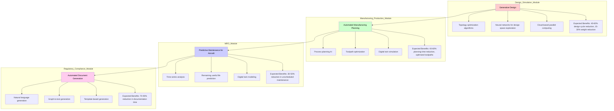

# GAIA-AIR

---
**Status:** Draft  
**Filename:** README.md  
**Version:** 0.9-pre-1  
**InfoCode:** GP-AIR-ROOT-README-0001-OV
**Optional Extensions:** F01 (Functional Modules), A01 (Architecture Layers)
---


## Introduction

Welcome to the **GAIA-AIR** division, a key area within the broader **GAIA Platforms** initiative. This division focuses specifically on the application of GAIA principles and technologies to atmospheric flight, encompassing civil aviation, general aviation, and related air traffic management systems and infrastructure.

Our mission within the GAIA-AIR division is to foster the development and integration of sustainable, safe, efficient, and intelligent solutions for air transportation, leveraging the core GAIA frameworks like COAFI, InaC, and BITT.

## Purpose & Scope

The primary purpose of the GAIA-AIR division is to orchestrate projects, define standards, and manage specifications related to atmospheric aircraft, operations, and supporting systems within the GAIA ecosystem.

The scope includes:

* **Commercial Aviation:** Development and integration of systems for large passenger and cargo aircraft, including advanced avionics, sustainable propulsion, optimized operations, and enhanced passenger experience modules.
* **General Aviation (Future Scope):** Planning for integration of smaller aircraft, personal air vehicles, and associated services.
* **Air Traffic Management (ATM) Integration:** Defining interfaces and data exchange protocols for interaction with next-generation civil ATM systems, focusing on efficiency, safety, and capacity.
* **Ground Support Infrastructure:** Specifications for intelligent ground operations, sustainable airport integration, and maintenance systems relevant to civil aircraft managed under GAIA principles.
* **Regulatory Compliance:** Ensuring all systems and specifications align with relevant civil aviation authorities (e.g., EASA, FAA) and international standards (e.g., ICAO).

## Key Subdirectories & Areas

This directory is structured to house specific projects and specifications related to different aspects of atmospheric aviation:

* **/COMMERCIAL**: Focuses on systems and specifications for commercial air transport (e.g., integrated avionics).
* **/ATM**: Specifications related to Air Traffic Management interfaces and integration.
* **/SUSTAINABILITY**: Projects and research focused specifically on sustainable aviation fuels, electric/hybrid propulsion integration, and operational efficiency improvements within the civil context.
* **/SAFETY_CERTIFICATION**: Documentation and processes related to meeting civil airworthiness and safety standards.

## Core Principles Alignment

The GAIA-AIR division adheres strictly to the overarching GAIA Platforms principles, with a particular emphasis on:

* **Safety:** Uncompromising adherence to the highest safety standards and certifications (e.g., EASA CS-25, DO-178C, DO-326A).
* **Sustainability:** Driving innovation in fuel efficiency, emissions reduction, noise pollution mitigation, and sustainable lifecycle management.
* **Efficiency:** Optimizing flight operations, maintenance schedules, and resource utilization through data integration and AI.
* **Traceability & Compliance:** Full integration with COAFI for documentation management and BITT for auditable compliance records.
* **Federation:** Ensuring seamless interoperability with other GAIA domains (GP-COM, GP-SUPL, GP-GRO) and external aviation stakeholders.

## Contribution & Development

We welcome contributions to the GAIA-AIR division. To contribute:

* Familiarize yourself with the existing projects and specifications in the relevant subdirectories.
* Follow the GAIA Platforms' standard Git workflow: fork the repository, create a clear feature branch, and submit pull requests with comprehensive descriptions.
* Engage actively through issue trackers and discussions to ensure alignment on technical standards, aviation regulations, and best practices.
* For questions, detailed collaboration, or specific domain insights, contact the GAIA-AIR division maintainers or utilize the official GAIA Platforms communication channels outlined in the main README.

---

*This README provides a high-level overview of the GAIA-AIR division. Please navigate to the relevant subdirectories for detailed project information and specifications.*


# 🌌 GAIA AIR Functional Modules & System Architecture

This document presents two comprehensive diagrams outlining the **functional modules** and **system architecture** of the GAIA AIR (General AI Architecture as Aerospace Infrastructural Requirement) initiative.

---

## 🧭 GAIA AIR Functional Modules



---

## 🏗️ GAIA AIR System Architecture

```architecture-beta
group interfaceLayer(cloud)[User Interface Layer]
    service UI(web)[Web/Desktop Interface] in interfaceLayer
    service VIS(eye)[3D Visualization] in interfaceLayer
    service COLLAB(share-alt)[Collaboration Tools] in interfaceLayer
    service DASH(chart-line)[Analytics Dashboard] in interfaceLayer
end

group applicationLayer(cloud)[Application Layer]
    service DES(desktop)[Design & Simulation Module] in applicationLayer
    service MFG(factory)[Manufacturing & Production Module] in applicationLayer
    service MRO(wrench)[Maintenance, Repair & Overhaul Module] in applicationLayer
    service REG(file-alt)[Regulatory Compliance Module] in applicationLayer
    service KM(book)[Knowledge Management Module] in applicationLayer
end

group aiServicesLayer(cloud)[AI Services Layer]
    service GEN(brain)[Generative Design Engine] in aiServicesLayer
    service SIM(server)[AI Simulation Accelerator] in aiServicesLayer
    service PRED(analytics)[Predictive Analytics Engine] in aiServicesLayer
    service NLP(language)[NLP & Document Processing] in aiServicesLayer
    service CV(camera)[Computer Vision Services] in aiServicesLayer
    service KG(graph)[Knowledge Graph] in aiServicesLayer
    service RL(robot)[Reinforcement Learning] in aiServicesLayer
end

group dataIntegrationLayer(cloud)[Data Integration Layer]
    service API(route)[API Gateway] in dataIntegrationLayer
    service ETL(cog)[ETL Pipelines] in dataIntegrationLayer
    service STREAM(exchange-alt)[Data Streaming] in dataIntegrationLayer
    service CACHE(database)[Distributed Cache] in dataIntegrationLayer
end

group dataSources(cloud)[Data Sources]
    service CAD(drafting-compass)[CAD/CAM Systems] in dataSources
    service PLM(project-diagram)[PLM Systems] in dataSources
    service ERP(layer-group)[ERP Systems] in dataSources
    service IOT(rss)[IoT & Sensor Data] in dataSources
    service DOC(file-archive)[Document Repositories] in dataSources
    service REG_DB(lock)[Regulatory Databases] in dataSources
end

group securityGov(cloud)[Security & Governance]
    service AUTH(user-lock)[Authentication & Authorization] in securityGov
    service AUDIT(clipboard-check)[Audit & Compliance] in securityGov
    service ENCRYPT(key)[Encryption Services] in securityGov
    service POLICY(balance-scale)[Policy Management] in securityGov
end

UI:R -- L:DES
UI:R -- L:MFG
COLLAB:R -- L:MRO
DASH:R -- L:REG

DES:T -- B:GEN
SIM:T -- B:PRED
NLP:T -- B:NLP

API:L -- R:ETL
ETL:T -- B:CAD
STREAM:L -- R:IOT

AUTH:L -- R:UI
ENCRYPT:L -- R:API
```

---

These diagrams map out the **interconnected intelligence** of the GAIA AIR project across its functional, operational, and governance layers.  
Let me know if you need this turned into **HTML**, **Notion**, **Slide Deck**, or **interactive documentation** format.

